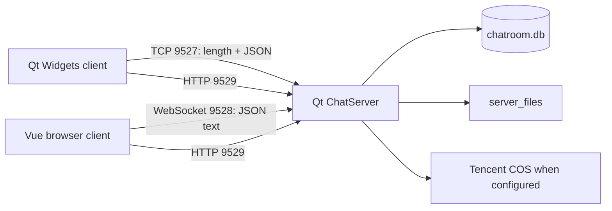

# Current V1 System Baseline

This document records the implementation as observed at M0. It is descriptive,
not a statement that the current behavior is the desired target.

Sources of truth:

- `Common/Protocol.h` for declared V1 message types and TCP framing;
- `Server/ChatServer.*` for ingress, dispatch, sessions, files, and routing;
- `Server/ClientSession.*` for connection lifecycle and heartbeat;
- `Server/DatabaseManager.*` for SQLite schema and queries;
- `Server/RoomManager.*` for in-process room presence;
- `Client/` and `WebClient/src/` for client behavior.

Regenerate or check the machine-readable inventory with:

```bash
python3 tools/m0_inventory.py --check
```

## Runtime Topology



Default ports are derived from the TCP port: WebSocket is TCP + 1 and HTTP is
TCP + 2. Nginx terminates public HTTPS/WSS in the documented deployment shape.

## Process and Thread Ownership

- `ChatServer` runs the application event loop and owns business dispatch,
  online-session routing, SQLite manager, room manager, HTTP listener, WebSocket
  listener, COS manager, and expiry timer.
- Every TCP connection creates a `QThread` and a `ClientSession`. The session
  parses frames in that thread and emits the parsed JSON to `ChatServer`.
- WebSocket sessions remain on the server/main Qt thread because their active
  socket notifier is not moved.
- `ChatServer` handlers execute in the server object's thread. Consequently,
  normal handler database calls are synchronous on the central business path,
  even though `DatabaseManager` supports a connection per calling thread.
- `RoomManager` and the online-session map use mutexes. Their state exists only
  inside one process.
- COS requests use Qt network callbacks, but file preparation and multiple
  local-file operations still originate from the central server component.

## Durable and Ephemeral State

| State | Current owner | Durability |
|---|---|---|
| Users, rooms, members, messages, friends, file metadata | SQLite | Durable single-host file |
| Online username to session | `ChatServer::m_sessions` | Process-local |
| Online room members | `RoomManager` | Process-local, rebuilt at login |
| In-flight uploads and reserved quota | `ChatServer` maps | Process-local |
| HTTP file tokens | `ChatServer::m_fileTokens` | Process-local, 24-hour expiry |
| File bytes | Local `server_files`, optional COS copy | Host/object storage |
| Web login credentials | Browser `sessionStorage` | Browser-session local |
| Web chat view state | Pinia | Page-memory local |
| Qt downloaded files | `FileCache` | Desktop local |

The server uses one active session per username. A successful login removes and
disconnects the previous session, so V1 is single-device/session rather than
multi-device.

## Main Data Flows

### Login

1. Client submits `LOGIN_REQ` with username and password.
2. Server hashes and checks the password through SQLite.
3. Server disconnects any previous session for the username.
4. Server stores authenticated identity on the session.
5. Server restores online room membership from durable room membership.
6. Server notifies rooms and friends of presence.
7. Server returns `LOGIN_RSP` with an HTTP file token.

### Room message

1. Session parses `CHAT_MSG`.
2. Server uses the authenticated session identity for persisted sender ID.
3. Server synchronously inserts the message into SQLite.
4. Server constructs a new JSON message with database ID and sender display data.
5. Server copies the in-memory room member list and queues a send to each online
   session.

V1 has no client send idempotency key, per-conversation sequence, durable
accepted acknowledgement, or reconnect delta protocol.

### Direct message

1. Server resolves and verifies the friendship.
2. Server synchronously inserts a `friend_messages` row.
3. Server echoes the committed message to the sender.
4. Server sends it to the recipient only when that username has an online
   session.
5. Offline presentation later derives from message history and read pointers.

### File

- Small files can travel as Base64 inside a JSON message.
- Large files travel as Base64 JSON chunks, with 4 MiB source chunks.
- The server writes local files and can upload a copy to COS.
- HTTP download tokens and presigned COS URLs are issued after authentication.
- File metadata is linked into room or friend messages.

## Client Baseline

### Qt desktop

- Qt Widgets and C++17, built with qmake.
- `NetworkManager` owns the TCP connection, frame parser, heartbeat, reconnect,
  and message signal distribution.
- `ChatWindow` coordinates a large amount of UI and application behavior.
- `MessageModel`/`MessageDelegate` implement list data and custom rendering.
- The current checked-in project is primarily exercised on Windows.

### Web

- Vue 3, JavaScript, Pinia, Vue Router, and Vite.
- One WebSocket service owns reconnect and heartbeat behavior.
- A large chat store owns rooms, messages, friends, file transfer, and much of
  synchronization orchestration.
- Credentials are saved in `sessionStorage` to automatically log in after a page
  refresh.
- Active message arrays are memory state; there is no IndexedDB message
  repository in V1.

## Known M0 Risks

These are recorded for prioritization, not silently fixed by this baseline:

1. **Unversioned migrations:** startup executes repeated `ALTER TABLE` statements,
   ignores expected duplicate-column errors, and has no schema version ledger.
2. **Credential storage:** password hashes use fast SHA-256 plus salt and the web
   client keeps plaintext credentials in browser session storage.
3. **Room password storage:** room passwords are stored and compared as plaintext.
4. **Reliability semantics:** message retries can duplicate messages; ordering is
   timestamp/row based; reconnect has no sequence delta sync.
5. **Central blocking path:** WebSocket parsing, business handlers, synchronous
   SQL, and fan-out coordination share the central application thread.
6. **Connection scaling:** TCP consumes one thread per connection.
7. **Slow consumers:** outbound queue limits and disconnect policy are not
   explicit.
8. **File amplification:** Base64 adds payload and allocation overhead; file data
   still crosses the chat protocol.
9. **Single-node presence:** session and online-room state cannot route across
    multiple server instances.
10. **Index coverage:** only two explicit time/history indexes are declared;
    other production query plans are not baselined.
11. **Documentation drift:** prior README/DESIGN message counts and database
    descriptions do not fully match the active implementation.

The previously observed first-start `friendships` read-pointer ordering defect is
covered by `Tests/DatabaseSchemaTest.cpp` and has been corrected so clean and
restarted schemas converge.
