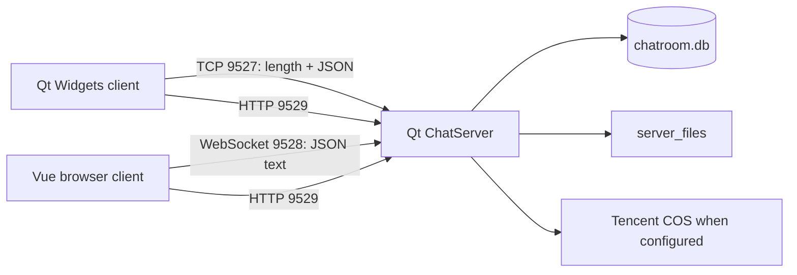

# Current V1 System Baseline

This document records the implementation as observed at M0. It is descriptive,
not a statement that the current behavior is the desired target.

Sources of truth:

- `Common/Protocol.h` for declared V1 message types and TCP framing;
- `Server/ChatServer.*` for ingress, dispatch, sessions, files, and routing;
- `Server/ClientSession.*` for connection lifecycle and heartbeat;
- `Server/DatabaseManager.*` for SQLite schema and queries;
- `Server/RoomManager.*` for in-process room presence;
- `Client/` and `WebClient/src/` for client behavior.

Regenerate or check the machine-readable inventory with:

```bash
python3 tools/m0_inventory.py --check
```

## Runtime Topology


```mermaid
flowchart LR
    Qt[Qt Widgets client] -->|TCP 9527: length + JSON| Server[Qt ChatServer]
    Web[Vue browser client] -->|WebSocket 9528: JSON text| Server
    Qt -->|HTTP 9529| Server
    Web -->|HTTP 9529| Server
    Server --> SQLite[(chatroom.db)]
    Server --> Files[server_files]
    Server --> COS[Tencent COS when configured]
```

Default ports are derived from the TCP port: WebSocket is TCP + 1 and HTTP is
TCP + 2. Nginx terminates public HTTPS/WSS in the documented deployment shape.

## Process and Thread Ownership

- `ChatServer` runs the application event loop and owns business dispatch,
  online-session routing, SQLite manager, room manager, HTTP listener, WebSocket
  listener, COS manager, and expiry timer.
- Every TCP connection creates a `QThread` and a `ClientSession`. The session
  parses frames in that thread and emits the parsed JSON to `ChatServer`.
- WebSocket sessions remain on the server/main Qt thread because their active
  socket notifier is not moved.
- `ChatServer` handlers execute in the server object's thread. Consequently,
  normal handler database calls are synchronous on the central business path,
  even though `DatabaseManager` supports a connection per calling thread.
- `RoomManager` and the online-session map use mutexes. Their state exists only
  inside one process.
- COS requests use Qt network callbacks, but file preparation and multiple
  local-file operations still originate from the central server component.

## Durable and Ephemeral State

| State | Current owner | Durability |
|---|---|---|
| Users, rooms, members, messages, friends, file metadata | SQLite | Durable single-host file |
| Online username to session | `ChatServer::m_sessions` | Process-local |
| Online room members | `RoomManager` | Process-local, rebuilt at login |
| In-flight uploads and reserved quota | `ChatServer` maps | Process-local |
| HTTP file tokens | `ChatServer::m_fileTokens` | Process-local, 24-hour expiry |
| File bytes | Local `server_files`, optional COS copy | Host/object storage |
| Web login credentials | Browser `sessionStorage` | Browser-session local |
| Web chat view state | Pinia | Page-memory local |
| Qt downloaded files | `FileCache` | Desktop local |

The server uses one active session per username. A successful login removes and
disconnects the previous session, so V1 is single-device/session rather than
multi-device.

## Main Data Flows

### Login

1. Client submits `LOGIN_REQ` with username and password.
2. Server hashes and checks the password through SQLite.
3. Server disconnects any previous session for the username.
4. Server stores authenticated identity on the session.
5. Server restores online room membership from durable room membership.
6. Server notifies rooms and friends of presence.
7. Server returns `LOGIN_RSP` with an HTTP file token.

### Room message

1. Session parses `CHAT_MSG`.
2. Server uses the authenticated session identity for persisted sender ID.
3. `RoomMessageService` verifies durable room membership, input, and the
   client-message idempotency key.
4. Server synchronously allocates a per-room sequence and inserts the message in
   one SQLite transaction, or recovers the original accepted result for a retry.
5. Server returns `CHAT_SEND_RSP` with the stable database ID and sequence.
6. Only a newly committed message is converted to server-authoritative
   `CHAT_MSG` data.
7. Server copies the in-memory room member list and queues a send to each online
   session.

The compatible V1 extension supports `clientMessageId`, durable acceptance,
per-room/per-friendship sequence, and `afterSequence` history resume for room
and direct text/emoji/attachment messages. Recall mutations use the same
conversation high watermark and can be recovered after disconnect.
Administrative deletion now records one durable, idempotent event on that same
room cursor and sequence history returns it through the additive `events`
array.

The schema contains nullable, indexed `mutation_sequence` columns for room and
direct messages. Runtime recall transactionally assigns them and sequence
history exposes `syncSequence = max(sequence, mutationSequence)` as specified by
ADR-0019.

ADR-0020 adds the indexed `room_message_deletion_events` table. The server
transactionally stores the event and physically removes matching rows, returns
the original result for exact retries, rejects conflicting operation-ID reuse,
and lets Web/Windows reconcile live or replayed deletion events. Attachment
object cleanup is an idempotent post-commit compensation.

### Direct message

1. `FriendMessageService` resolves and verifies the friendship and command.
2. Server transactionally allocates a per-friendship sequence and inserts the
   row, or recovers the original result for an exact retry.
3. Server returns `FRIEND_CHAT_SEND_RSP` with stable ID and sequence.
4. Only a newly committed message is echoed to the sender.
5. Server sends it to the recipient only when that username has an online
   session.
6. Offline presentation later derives from sequence-capable history and read
   pointers.

### File

- Small files can travel as Base64 inside a JSON message.
- Large files travel as Base64 JSON chunks, with 4 MiB source chunks.
- The server writes local files and can upload a copy to COS.
- HTTP download tokens and presigned COS URLs are issued after authentication.
- File metadata is linked into room or friend messages.

## Client Baseline

### Qt desktop

- Qt Widgets and C++17, built with qmake.
- `NetworkManager` owns the TCP connection, frame parser, heartbeat, reconnect,
  and message signal distribution.
- Successful credentials are retained only in process memory. A reconnect
  authenticates before publishing the restored connection, then the active
  room or direct conversation resumes from its in-memory cursor in bounded
  pages.
- `ChatWindow` coordinates a large amount of UI and application behavior.
- `MessageModel`/`MessageDelegate` implement list data, ordered sync-page
  reconciliation, and custom rendering.
- The first M2 `LocalConversationRepository` adapter defines a versioned,
  account-isolated SQLite cache for bounded message metadata, cursors, and
  drafts. `ChatWindow` now hydrates room snapshots before requesting history,
  persists authoritative live/history/recall/deletion changes, resumes from the
  durable room cursor, and evicts inaccessible rooms. Direct conversations now
  use the same cached-render, durable-cursor, mutation, relationship-eviction,
  and account/peer rename behavior. Room/direct composer drafts are bounded,
  debounced to the same repository, flushed on conversation switch/close, and
  cleared after dispatch. Text/emoji sends render optimistically, persist their
  local delivery state, retry unresolved sends with the same `clientMessageId`
  after authenticated list refresh, and reconcile ACK/live/history in place.
  Attachment upload commands are still memory-backed.
- The current checked-in project is primarily exercised on Windows.

### Web

- Vue 3, JavaScript, Pinia, Vue Router, and Vite.
- One WebSocket service owns reconnect and heartbeat behavior.
- A large chat store owns rooms, messages, friends, file transfer, and much of
  synchronization orchestration.
- Credentials remain only in page memory. The M2 repository stores
  account-partitioned, bounded room/direct message snapshots and sequence cursors
  in IndexedDB. Conversation selection renders that cache and then synchronizes
  forward; authoritative room/friend lists and live removal events evict
  snapshots after access is lost.
- Mixed room messages, recall state, and deletion events reconcile by
  `syncSequence`; direct messages and recall state use the equivalent friendship
  cursor. Bounded room/direct text drafts share the account-partitioned IndexedDB
  record. Text/emoji sends render optimistically, persist unresolved intent,
  retry with the same `clientMessageId`, and show accepted/failed state; binary
  attachment outbox behavior remains a later M2 slice.

## Known M0 Risks

These are recorded for prioritization, not silently fixed by this baseline:

1. **Unversioned migrations:** startup executes repeated `ALTER TABLE` statements,
   ignores expected duplicate-column errors, and has no schema version ledger.
2. **Authentication transport/session:** passwords are Argon2id at rest and the
   Web client keeps reconnect credentials only in page memory, but plaintext
   TCP/WS remains possible and V1 has no revocable device/refresh sessions.
3. **Room password compatibility:** room passwords are Argon2id for new/change
   operations and legacy plaintext upgrades after successful verification; a
   pre-ADR server cannot read migrated rows.
4. **Reliability semantics:** room/direct text and emoji plus upgraded
   upload-finalized room/friend attachments and administrative deletion are
   idempotent and have stable sequence metadata, but legacy inline/forwarded
   files can still duplicate. Room/direct recall is replayable through
   `mutationSequence`.
5. **Central blocking path:** WebSocket parsing, business handlers, synchronous
   SQL, and fan-out coordination share the central application thread.
6. **Connection scaling:** TCP consumes one thread per connection.
7. **Request abuse:** connection, critical-field, account, direct-peer-IP, and
   single-process gateway limits are explicit with structured denial logs;
   trusted-proxy identity, external alerting, and distributed enforcement are
   not yet implemented.
8. **Legacy file amplification:** supported Web/Windows normal upload/download
   paths use authorized HTTP, but old-server Base64 and WebSocket chunk fallbacks
   still add protocol surface and allocation cost when exercised.
9. **Single-node presence:** session and online-room state cannot route across
    multiple server instances.
10. **Index coverage:** seventeen explicit indexes cover current history, reconnect,
    unread, file quota, contact, idempotency, and sequence-resume paths with
    query-plan/constraint regression, but production-scale latency/write
    amplification still needs workload evidence.
11. **Documentation drift:** prior README/DESIGN message counts and database
    descriptions do not fully match the active implementation.

The previously observed first-start `friendships` read-pointer ordering defect is
covered by `Tests/DatabaseSchemaTest.cpp` and has been corrected so clean and
restarted schemas converge.

## M0 Automated Coverage

- `Tests/DatabaseSchemaTest.cpp` covers clean/restart schema completeness and
  integrity.
- `Tests/v1_smoke_test.py` drives the real V1 TCP framing against a headless test
  build of `ChatServer`. It covers registration, login, room creation/join,
  authenticated-sender enforcement, fan-out, history, file metadata, reconnect,
  persistent membership, recall, friend request/acceptance, friend lists, direct
  message delivery/history, and direct-message recall.
- `Tests/v1_room_message_reliability_test.py` covers room acceptance,
  idempotent/conflicting retry, sequence resume, restart, partial migration,
  deleted-high-watermark monotonicity, and structured outcome monitoring.
- `Tests/v1_friend_message_reliability_test.py` covers the equivalent direct
  text/emoji guarantees, explicit non-friend denial, and deletion-gap cursor
  advancement.
- `Tests/v1_recall_replay_test.py` covers room/direct recall mutation cursors,
  stable retry results, offline replay, restart durability, and deterministic
  backfill of legacy recalled rows.
- `Tests/v1_administrative_deletion_reliability_test.py` covers admin
  authorization, all four deletion modes, bounded selection, exact/conflicting
  retry, live event metadata, sequence pagination, offline replay, and restart
  durability.
- `Tests/v1_http_upload_test.py` covers the binary HTTP attachment bridge,
  including owner binding, integrity rejection, interrupted upload cleanup,
  room/friend idempotency, conflicts, explicit ACK identity, and restart retry.
- `Tests/HttpUploadTransportTest.cpp` and `HttpDownloadTransportTest.cpp` drive
  the Qt streaming HTTP adapters against real local sockets;
  `MessageModelTest.cpp` locks stable-ID authoritative state reconciliation; and
  `qt_attachment_source_test.py` prevents Windows
  composer and upgraded forwarding paths from restoring inline attachment
  bytes.
- `Tests/v1_file_forward_test.py` covers server-side room/friend attachment
  forwarding, byte integrity, source/target authorization, partial results, and
  live sequence/timestamp metadata. The smoke and HTTP-upload suites enforce
  the same metadata contract for inline and upload-finalized room files.
- `CHATROOM_DISABLE_IMAGE_THUMBNAILS` is defined only by the headless test target;
  it skips server-side `QImage` thumbnail generation so the core smoke binary
  does not require QtGui. Client-provided thumbnail fallback and the production
  server build remain unchanged.
