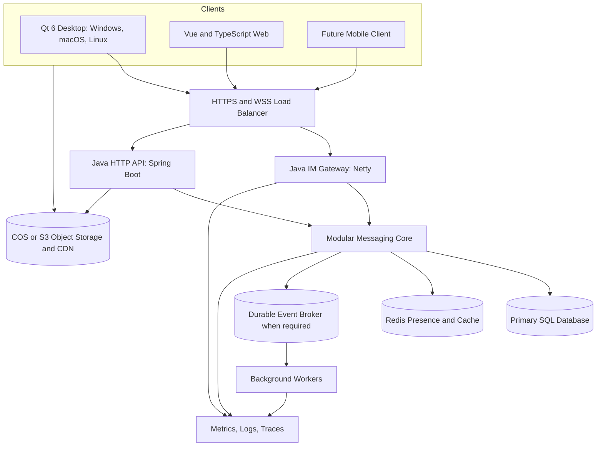
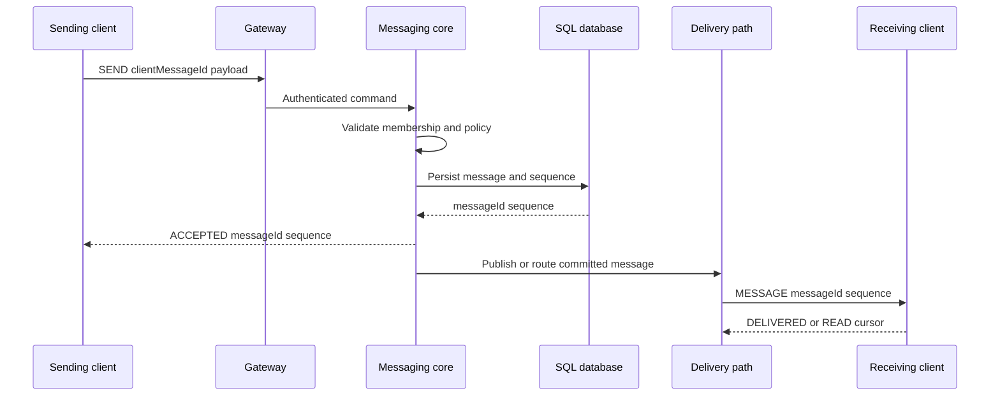

# Chat Room Target Architecture

## 1. Purpose

This document is the architectural source of truth for evolving Chat Room into a
modern instant-messaging product. It describes the desired boundaries and
invariants, not a requirement to create every component immediately.

The migration must keep the product usable after every iteration. Follow
[`ROADMAP.md`](ROADMAP.md) for sequencing and use ADRs in `decisions/` for
material changes.

## 2. Architecture Principles

Prioritize qualities in this order:

1. Message correctness and recoverability.
2. Authentication, authorization, and data security.
3. Perceived client responsiveness and offline behavior.
4. Operability and diagnosability.
5. Measured performance.
6. Horizontal scalability when measurements justify it.

Apply these principles:

- Start modular; distribute only where a boundary earns operational cost.
- Prefer compatibility adapters and vertical slices to wholesale rewrites.
- Keep durable facts separate from online/ephemeral state.
- Make retries safe through idempotency.
- Design failure and reconnection paths alongside the happy path.
- Use one conceptual product model across clients while respecting each OS.

## 3. Current Baseline

The active system is a single Qt/C++ server with three ingress paths:

- framed JSON over TCP for the Qt desktop client;
- JSON text over WebSocket for the browser;
- HTTP for file download;
- SQLite WAL for durable data;
- in-process maps for online sessions and room membership;
- local storage and optional COS integration for files.

The current implementation is a valid V1 product baseline. Its main growth
constraints are synchronous persistence on message paths, connection-per-thread
TCP handling, a main-thread WebSocket path, Base64 file transfer, single-process
presence, and the absence of explicit delivery/synchronization semantics.

## 4. Target Context



The initial Java implementation should be a modular monolith plus an IM gateway.
Gateway and application modules may run in one deployment for development, but
their ownership and APIs must remain explicit so that the gateway can scale
independently.

## 5. Server Modules

| Module | Owns | Must not own |
|---|---|---|
| Gateway | Connections, heartbeat, envelope validation, backpressure, routing | Business authorization or SQL |
| Identity | Users, credentials, devices, tokens, session policy | Chat message persistence |
| Conversation | Direct/group conversations and membership | Transport-specific objects |
| Messaging | Message validation, idempotency, sequencing, recall, sync | File bytes |
| Contacts | Friend requests, friendships, blocks | Online socket state |
| Groups | Group profile, roles, moderation policy | Client view state |
| Attachments | Upload authorization and attachment metadata | Proxying normal file bytes through IM |
| Notification | Offline push and notification preferences | Primary message truth |
| Administration | Audit, reports, bans, operator actions | End-user authentication shortcuts |

Keep module calls in-process at first. Split a deployable service only for one of
these reasons:

- an independently measured scaling profile;
- fault or security isolation;
- a distinct availability requirement;
- a stable ownership boundary;
- a background workload that must not block messaging.

## 6. Canonical Conversation Model

Unify direct messages and rooms around conversations:

```text
Conversation
  id
  type: DIRECT | GROUP
  profile
  members
  lastSequence

Message
  id
  conversationId
  sequence
  senderId
  senderDeviceId
  clientMessageId
  type
  content
  createdAt
  recalledAt
```

Required durable concepts:

- `users` and `devices`;
- `conversations` and `conversation_members`;
- `messages` with a per-conversation sequence;
- `read_cursors` rather than one read row per group message and member;
- `attachments` containing object metadata, not file bytes;
- an `outbox` when durable asynchronous publication is introduced.

Required constraints:

- unique `(conversation_id, sequence)`;
- unique `(sender_id, client_message_id)` or an equivalent device-scoped key;
- history queries by sequence cursor, not large SQL offsets;
- all membership and permission checks executed server-side.

The primary target database is PostgreSQL. Choosing MySQL instead is acceptable
only through an ADR that validates the same sequencing, indexing, migration, and
operations needs. SQLite remains appropriate for local clients and development,
not as the long-term multi-instance server database.

## 7. Reliable Message Flow



Semantics:

- `ACCEPTED` means the server has durably accepted the message.
- `DELIVERED` means at least one destination device acknowledged receipt.
- `READ` advances a user's conversation read cursor.
- retries with the same `clientMessageId` return the original result.
- clients request missing messages after reconnect by last contiguous sequence.
- clients deduplicate by stable server message ID and reconcile optimistic local
  messages by `clientMessageId`.

Do not promise exactly-once transport. Provide at-least-once delivery with
idempotent processing and deterministic client reconciliation.

## 8. Protocol Strategy

Maintain two explicit generations during migration:

- V1: current JSON messages used by existing Qt and web clients;
- V2: versioned envelope and generated schemas, preferably Protobuf over binary
  WebSocket frames.

The V2 envelope should carry:

```text
protocolVersion
messageType
requestId
sessionId
clientMessageId
sentAt
payload
```

Generate Java, C++, and TypeScript bindings from one protocol source. Keep V1
translation at the gateway boundary. Never leak V1 field quirks into the V2
domain model.

## 9. Presence, Cache, and Events

Use Redis for ephemeral and reconstructable data:

- user/device to gateway routing;
- online presence with leases;
- short-lived tokens and rate limits;
- hot metadata caches.

Do not use plain Redis Pub/Sub as the only durable message path. Introduce a
durable broker only when multiple gateway/application instances or asynchronous
consumers require it. Select Kafka, RocketMQ, Pulsar, or another broker through
an ADR based on operational capability and measured workload.

When a broker is introduced, use a transactional outbox or an equivalent
recoverable publication design so a committed message cannot disappear between
the SQL transaction and event publication.

## 10. Attachment Flow

Target flow:

1. Client requests an upload authorization with name, size, MIME type, and
   conversation ID.
2. Server checks membership, quota, type, and policy.
3. Server returns a short-lived, object-scoped upload authorization.
4. Client uploads directly to COS/S3 using multipart upload where needed.
5. Client completes the upload with the server.
6. Server verifies the object and creates an attachment message.
7. Recipients download through authorized CDN/object URLs.

Virus scanning, thumbnails, media metadata, and retention should run as
asynchronous jobs. A file message may remain in a processing state until required
checks finish.

## 11. Client Architecture

### Desktop

Keep Qt 6 and C++. Move toward QML for new or substantially redesigned screens
after extracting application services from the current Widgets window.

```text
QML or Widgets views
    -> View models
    -> Application services
    -> Sync engine and local repository
    -> WebSocket, HTTP, SQLite, media cache
```

Use local SQLite for conversations, messages, sync cursors, drafts, and pending
outbox commands. Keep file/media data in a bounded disk cache. Isolate Windows,
macOS, and Linux tray, notification, shortcut, startup, and updater behavior
behind platform interfaces.

### Web

Keep Vue 3 and move new code to TypeScript. Split the large chat store into
session, conversation, message, contact, transfer, and notification concerns.
Use IndexedDB for durable messages, cursors, drafts, and pending operations.
Pinia should represent live UI/application state, not be the only data store.

### Product consistency

Share these across clients:

- generated protocol schemas;
- semantic design tokens and product terminology;
- message type behavior and capability negotiation;
- test fixtures and compatibility cases.

Do not force identical window chrome, shortcuts, notifications, or navigation
behavior across operating systems.

## 12. Packaging and Distribution

| Platform | Primary artifact | Required release work |
|---|---|---|
| Windows | Signed `Setup.exe`; optional MSIX channel | `windeployqt`, runtime dependencies, Authenticode signing, timestamp, install/upgrade/uninstall tests |
| macOS | Signed and notarized `.dmg` containing `.app` | `macdeployqt`, Developer ID signing, hardened runtime, notarization, ticket stapling, launch test |
| Linux | AppImage first; optional deb/rpm/Flatpak | Bundle dependencies, desktop integration, clean-system launch test |
| Web | Versioned static assets | CSP, cache policy, source-map policy, rollback-ready deployment |

Build and sign each desktop artifact on its native operating system in CI. Keep
signing credentials in the CI secret store. Verify current platform and Qt
official documentation whenever release tooling changes.

The updater must use a signed manifest containing platform, architecture,
channel, version, minimum compatible version, hash, signature, and URL. Support
stable and beta channels and preserve rollback capability.

## 13. Security Baseline

- Replace fast SHA password hashing with Argon2id, scrypt, or bcrypt through a
  migration that upgrades hashes after successful login.
- Never persist plaintext passwords in browser storage or desktop settings.
- Use short-lived access tokens, revocable refresh/device sessions, and TLS on
  every public connection.
- Validate message size, rate, membership, and content type at the server.
- Scope file authorization to one user, object, operation, and short expiry.
- Maintain audit records for administrative and moderation actions.
- Protect authentication, search, friend requests, messaging, and uploads with
  abuse controls.

## 14. Operations and Quality

Every critical path should expose:

- request/message correlation IDs;
- connection counts and reconnect rates;
- accepted, delivered, failed, retried, and duplicate message counters;
- persistence and delivery latency distributions;
- event-loop or executor queue saturation;
- database, Redis, broker, and object-storage errors;
- per-connection outbound queue size and slow-consumer actions.

Define performance objectives from a recorded baseline and user scenario. Track
P50/P95/P99, not averages alone. Load tests must include reconnect storms, large
groups, slow clients, database contention, and partial infrastructure failure.

## 15. Explicit Non-goals

- Do not clone the infrastructure scale of WeChat or QQ before the product has
  the workload and team to operate it.
- Do not split every domain module into a network service initially.
- Do not rewrite all clients and the server in one release.
- Do not route normal file bytes through the messaging core.
- Do not use a cache or broker as undocumented primary truth.

