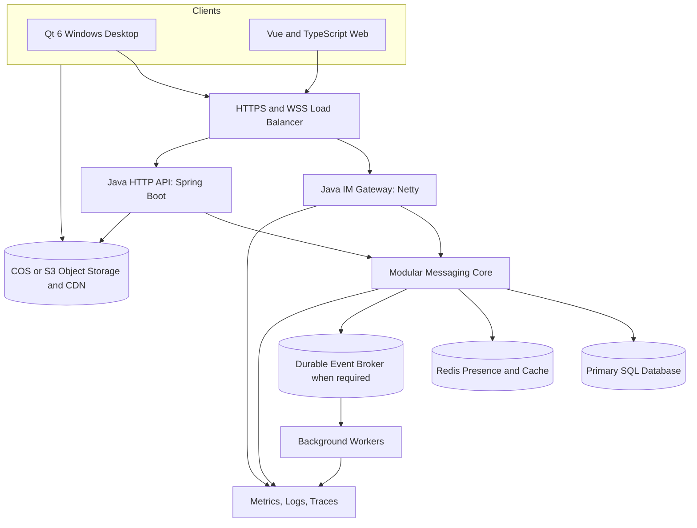
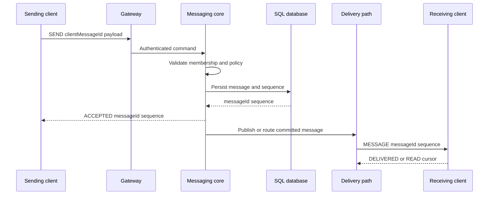

# Chat Room Target Architecture

## 1. Purpose

This document is the architectural source of truth for evolving Chat Room into a
modern instant-messaging product. It describes the desired boundaries and
invariants, not a requirement to create every component immediately.

The current committed client product scope is **Web and Windows desktop**.
macOS, Linux, Android, and iOS clients are outside the supported release scope
until a later ADR explicitly adds one of them. A platform used to develop,
compile, or test the server does not thereby become a supported client. See
[`ADR-0009`](decisions/0009-web-and-windows-product-scope.md).

For the implementation currently deployed as V1, read
[`CURRENT_SYSTEM.md`](CURRENT_SYSTEM.md),
[`../protocol/V1_PROTOCOL.md`](../protocol/V1_PROTOCOL.md), and
[`../data/V1_SQLITE_SCHEMA.md`](../data/V1_SQLITE_SCHEMA.md).

The migration must keep the product usable after every iteration. Follow
[`ROADMAP.md`](ROADMAP.md) for sequencing and use ADRs in `decisions/` for
material changes.

For current build commands and the native toolchain boundary, read
[`../BUILDING.md`](../BUILDING.md) and
[`SUPPORT_MATRIX.md`](SUPPORT_MATRIX.md). M0 acceptance evidence is stored in
[`../baselines/M0_ACCEPTANCE_2026-07-11.md`](../baselines/M0_ACCEPTANCE_2026-07-11.md).
M1 acceptance evidence is stored in
[`../baselines/M1_ACCEPTANCE_2026-08-11.md`](../baselines/M1_ACCEPTANCE_2026-08-11.md).

## 2. Architecture Principles

Prioritize qualities in this order:

1. Message correctness and recoverability.
2. Authentication, authorization, and data security.
3. Perceived client responsiveness and offline behavior.
4. Operability and diagnosability.
5. Measured performance.
6. Horizontal scalability when measurements justify it.

Apply these principles:

- Start modular; distribute only where a boundary earns operational cost.
- Prefer compatibility adapters and vertical slices to wholesale rewrites.
- Keep durable facts separate from online/ephemeral state.
- Make retries safe through idempotency.
- Design failure and reconnection paths alongside the happy path.
- Use one conceptual product model across the supported Web and Windows clients
  while respecting their presentation and operating-environment conventions.

## 3. Current Baseline

The active system is a single Qt/C++ server with three ingress paths:

- framed JSON over TCP for the Qt desktop client;
- JSON text over WebSocket for the browser;
- HTTP for file download;
- SQLite WAL for durable data;
- in-process maps for online sessions and room membership;
- local storage and optional COS integration for files.

The current implementation is a valid V1 product baseline. Its main growth
constraints are synchronous persistence on message paths, connection-per-thread
TCP handling, a main-thread WebSocket path, retained legacy Base64 compatibility
handlers, single-process presence, and the absence of durable client repositories
and delivered/read acknowledgement semantics.

## 4. Target Context


```mermaid
flowchart TB
    subgraph Clients
        Desktop[Qt 6 Windows Desktop]
        Web[Vue and TypeScript Web]
    end

    Edge[HTTPS and WSS Load Balancer]
    Gateway[Java IM Gateway: Netty]
    API[Java HTTP API: Spring Boot]
    Core[Modular Messaging Core]
    Worker[Background Workers]
    SQL[(Primary SQL Database)]
    Redis[(Redis Presence and Cache)]
    Broker[(Durable Event Broker when required)]
    Object[(COS or S3 Object Storage and CDN)]
    Observe[Metrics, Logs, Traces]

    Desktop --> Edge
    Web --> Edge
    Edge --> Gateway
    Edge --> API
    Gateway --> Core
    API --> Core
    Core --> SQL
    Core --> Redis
    Core --> Broker
    Broker --> Worker
    API --> Object
    Clients --> Object
    Gateway --> Observe
    Core --> Observe
    Worker --> Observe
```

The initial Java implementation should be a modular monolith plus an IM gateway.
Gateway and application modules may run in one deployment for development, but
their ownership and APIs must remain explicit so that the gateway can scale
independently.

## 5. Server Modules

| Module | Owns | Must not own |
|---|---|---|
| Gateway | Connections, heartbeat, envelope validation, backpressure, routing | Business authorization or SQL |
| Identity | Users, credentials, devices, tokens, session policy | Chat message persistence |
| Conversation | Direct/group conversations and membership | Transport-specific objects |
| Messaging | Message validation, idempotency, sequencing, recall, sync | File bytes |
| Contacts | Friend requests, friendships, blocks | Online socket state |
| Groups | Group profile, roles, moderation policy | Client view state |
| Profile image codec | Bounded image inspection and canonical PNG encoding | Identity ownership, SQL, object credentials, or transport routing |
| Attachments | Upload authorization and attachment metadata | Proxying normal file bytes through IM |
| Notification | Offline push and notification preferences | Primary message truth |
| Administration | Audit, reports, bans, operator actions | End-user authentication shortcuts |

ADR-0408 starts the V2 account-safety path inside Contacts without yet exposing
block management to products. A block is asymmetric durable desired state, the
authenticated session binds the actor, and one stable client operation ID makes
exact retries converge while conflicting reuse fails. Either direction now
denies new direct submissions and contact requests with a generic result, but
blocking does not rewrite message history, group membership, or shared-group
delivery. V052 persists the asymmetric graph and immutable desired-state
operation result atomically through its PostgreSQL port, including exact retry,
conflicting operation reuse, disabled-account denial, and database self-edge
constraints. PostgreSQL message, forward, V1 direct-message, and contact-request
adapters lock the account pair and enforce the graph inside their write
transaction, preventing both gateway precheck races and legacy bypasses while
preserving historical exact retries. The Java gateway can now compose the
mutation service only when exact `CHATROOM_GATEWAY_ACCOUNT_BLOCKING_ENABLED=true`
is supplied; it then negotiates capability 7 only with a requesting client,
binds the actor from authentication, serializes a bounded command queue, maps
private denials to a generic result, and exports fixed-cardinality outcomes.
Default Web and Windows clients still omit capability 7. Explicit Web and
Windows candidates can request it and expose accessible DIRECT-account
management; real endpoint activation remains a later gate. Types 134/135 now
reserve a bounded outgoing-block directory contract. The application query and
repeatable-read PostgreSQL adapter now reauthorize the enabled actor and return
only target-ordered outgoing edges with current display names. The same
exact-default-off gateway boundary now serves types 134/135 through its
connection-serialized bounded executor and fixed page/row telemetry. The Windows
candidate now composes bounded directory refresh/load-more into a separate
page-memory ViewModel, retaining visible rows during transient transport loss
but clearing them at authenticated account boundaries. A feature-gated global
Windows privacy dialog renders at most 500 of those server rows with bounded
pagination and without requiring an active conversation. Confirmed row-level
unblock reuses the same
idempotent desired-state command, waits for the correlated server result, then
refreshes the directory instead of treating local absence as durable truth. The
exact-gated Web protocol client can
now request and strictly validate a correlated page. Its application boundary
retains at most 500 page-memory rows, refreshes after authentication/resume and
successful mutation, and contains stale/disconnected requests. Its global
localized privacy dialog now renders the server list, bounded load-more and
confirmed per-row unblock while deriving current-DIRECT status only from a
complete page or operation result. IndexedDB never stores the block graph.
Keep module calls in-process at first. Split a deployable service only for one of
these reasons:

- an independently measured scaling profile;
- fault or security isolation;
- a distinct availability requirement;
- a stable ownership boundary;
- a background workload that must not block messaging.

## 6. Canonical Conversation Model

Unify direct messages and rooms around conversations:

```text
Conversation
  id
  type: DIRECT | GROUP
  profile
  members
  lastSequence

Message
  id
  conversationId
  sequence
  senderId
  senderDeviceId
  clientMessageId
  type
  content
  createdAt
  recalledAt
```

Required durable concepts:

- `users`, `devices`, and contact requests with explicit lifecycle;
- `conversations` and `conversation_members`;
- `messages` with a per-conversation sequence;
- `read_cursors` rather than one read row per group message and member;
- `attachments` containing object metadata, not file bytes;
- an `outbox` when durable asynchronous publication is introduced.

Required constraints:

- unique `(conversation_id, sequence)`;
- unique `(sender_id, client_message_id)` or an equivalent device-scoped key;
- history queries by sequence cursor, not large SQL offsets;
- all membership and permission checks executed server-side.

The primary target database is PostgreSQL. Choosing MySQL instead is acceptable
only through an ADR that validates the same sequencing, indexing, migration, and
operations needs. SQLite remains appropriate for local clients and development,
not as the long-term multi-instance server database.

The additive M3 foundation implements the `persistence-postgres` adapter,
forward-only Flyway history, and the constrained core identity/device,
conversation, membership, and message tables described in
`docs/data/V2_POSTGRES_SCHEMA.md`. It has no repository, imported V1 data, or
production traffic cutover, so V1 SQLite remains authoritative. The offline
migration path now imports identity, conversation metadata, retained messages,
recalls/deletion audit entries, and translated cursors in that explicit order;
it still grants no authority to the Java runtime.
The contacts foundation now includes constrained canonical contact requests and
an isolated V1 numeric-request mapping. A deterministic query-only reader now
validates the V1 user/friend/request graph and issues a re-verifiable import
capability only when the current source and protected whole-file backup match.
Only pending rows are planned: accepted relationships remain canonical DIRECT
conversations, while rejected/accepted history is counted but not fabricated as
terminal state without a trustworthy V1 resolution time. The PostgreSQL adapter
now previews exact target state, applies missing pending rows and numeric mappings
under a serialized transaction, re-verifies the source/backup proof, and commits
a constrained non-secret audit atomically. The importer remains detached from
runtime. The offline migration command now exposes explicit contact preview,
final fingerprint verification, and apply for maintenance-window rehearsal; no
runtime owner or product route exists.

The verified conversation path also preserves V1 self chat. Because a legacy
friend-list read creates a durable self friendship, V016 represents it as a
one-member DIRECT conversation with an equal canonical account pair; ordinary
direct pairs remain ordered and unique.

The detached V1 application boundary now defines a complete bounded friend-list
projection. Durable friend/unread/read/pending state, compatibility identifiers,
and rebuildable presence remain separate ports; missing mappings or partial
state fail the request rather than emitting an authoritative empty/pruning list.
The PostgreSQL adapter now supplies durable friend/unread/read/pending state from
one bounded repeatable-read snapshot, and account compatibility lookup is
batched. No transport handler or runtime route consumes it yet.

The detached V1 module now composes a strict friend-list JSON/Netty handler after
login, heartbeat, and room listing. It executes off-loop, derives presence from
the single-account connection registry, suppresses stale completions, and closes
without a pruning response on malformed input, saturation, or projection error.
The product listener still does not install this module.

The next detached contacts boundary now defines a recipient-scoped, bounded V1
pending-request list with exact numeric action IDs and requester identity. It
rejects duplicate/oversized results. Its PostgreSQL adapter reconciles the full
canonical pending count against rows with both V1 request and requester mappings,
so missing compatibility state cannot silently hide a request. Netty remains next.

The detached module now also serves strict pending-request lists after login.
Work runs off-loop, stale completions are suppressed, and malformed/saturated/
incomplete paths close without returning a partial action list. The product
listener remains unchanged.

Friend-request rejection is now a separate recipient-authorized application
boundary with a PostgreSQL adapter. The adapter resolves only a positive V1
request ID, locks the canonical row in a serializable transaction, and permits
only its enabled authenticated recipient to move `PENDING` to `REJECTED` using
database time. The same recipient's exact retry is idempotent; every other
identity or terminal-state case is a generic rejection. No route invokes it yet.

The detached module now composes that rejection boundary after pending-request
reads. Its strict bounded JSON/Netty handler binds authorization to channel
identity, runs one mutation at a time off the event loop, and suppresses late
results. Exact first and duplicate decisions both retain V1 `success=true`;
ordinary denial returns the existing generic failure without disconnecting,
while malformed, saturated, or failed infrastructure paths close safely. Fixed
telemetry contains no user or request identifiers. The product listener remains
unchanged.

Friend-request acceptance now has a separate transport-independent contract.
It binds the recipient to authenticated state and requires one future atomic
persistence decision to terminate the request, establish or reactivate the
canonical DIRECT relationship, and own one V1 FRIENDSHIP mapping. Exact retries
remain successful without repeating the requester notification; requester UUID
is internal routing context and never a wire field. No adapter or route exists
for this boundary yet.

The acceptance persistence adapter now implements that unit under a serializable
transaction. It creates or reuses the ordered DIRECT pair, requires exactly two
active memberships, attaches one FRIENDSHIP compatibility mapping, and commits
the request's database-timed `ACCEPTED` state last. V017 allocates runtime-only
positive V1 friendship IDs downward from the 32-bit maximum while imports retain
their historical upward IDs; occupied values are always skipped and rollback
gaps are harmless. Exact retries revalidate the complete relationship.

The detached module now composes strict acceptance handling. Existing clients
may still send the optional `fromUsername` hint, but it is ignored for identity;
the authenticated recipient and durable request row determine both authority and
requester. First apply sends the compatible response and schedules one notify to
the requester's current authoritative process-local V1 connection. Exact retry
succeeds without another notification. Fixed telemetry distinguishes scheduled
local routing, no local route, duplicate, denial, failure, and saturation without identifiers. This
does not provide multi-gateway routing and the product listener remains unchanged.

The next contacts boundary defines bounded V1 user search. It excludes the
authenticated account server-side, treats a trimmed keyword as a literal
case-insensitive substring, and returns at most 20 enabled identities that own a
V1 numeric mapping. Durable identity and process-local presence remain separate;
canonical UUIDs never cross the response. Invalid input and inconsistent partial
projections fail closed. No handler exists yet.

The PostgreSQL search adapter now joins enabled accounts directly to their V1
numeric mapping, excludes the authenticated account, escapes SQL wildcard text,
uses deterministic case-insensitive ordering, and enforces the result bound in
the query. V2-native and disabled identities are never projected. Presence is
still joined outside persistence.

The detached module now composes strict user-search handling on the bounded
directory executor. Server channel identity controls self exclusion, malformed
or dependency-failed paths cannot emit an authoritative empty list, and late
results are suppressed. Valid policy rejection keeps the connection usable.
Fixed telemetry contains no search text or identity. Real PostgreSQL verification
proves offline-to-online presence projection without UUID exposure. The product
listener remains unchanged.

The next group-lifecycle boundary defines authenticated V1 room search. It
accepts one bounded literal keyword, returns at most 20 completely mapped GROUP
results with active-member counts, and keeps canonical identities internal.
Positive decimal keywords may retain exact V1 room-ID lookup semantics; other
keywords use literal title matching. Its repeatable-read PostgreSQL adapter now
requires an enabled mapped actor,
orders and bounds results in SQL, counts only active members, and fails the
whole query when the active OWNER cannot be projected to a V1 creator. The
detached strict handler now binds authenticated
identity, executes off-loop, and returns bounded compatible UUID-free results.
Real PostgreSQL verifies login-to-search projection. The product listener
remains unchanged.

The room-creation boundary now binds the creator from authentication, uses the
bounded outer request ID for future idempotency, normalizes the room title, and
owns and zeroes the optional password bytes. Passwords must be hashed through an
application port before persistence. Because salted Argon2id output cannot
classify retries, that port also returns a dedicated server-keyed stable HMAC
tag; an unkeyed fast password digest is forbidden. V023 and the serializable
PostgreSQL adapter now create the
GROUP, OWNER, optional Argon2id credential, ROOM mapping, and keyed idempotency
record atomically, skip occupied imported room IDs, and converge concurrent
exact retries. The identity-crypto adapter now produces compatible salted
Argon2id plus fixed-domain HMAC-SHA-256 tags from an owned 32-byte runtime key
and zeros that key on close. The detached runtime key boundary now requires
canonical padded Base64 for
exactly 32 bytes, has no default, and owns deterministic cleanup. It is not yet
wired into the product listener. The detached strict handler now binds creator
and envelope request ID, clears every password copy, executes off-loop, and
returns compatible UUID-free creation responses. Real PostgreSQL verifies
first/duplicate/conflict behavior, protected credential storage, and replacement-
login room-directory recovery. The product listener remains unchanged.

The next room-membership boundary now defines authenticated V1 join semantics.
Existing active membership is idempotent and does not ask for the password
again. A first join resolves an exact GROUP/ROOM mapping and optional stored
credential, verifies owned bounded UTF-8 password bytes through the shared
credential port, then sends an exact access snapshot to an atomic membership
mutation. The persistence boundary must recheck account, target, credential,
and capacity under the write transaction so a password or policy race cannot
authorize a different room state. V024 now stores a GROUP-only bounded member
limit; creation and verified conversation import create the policy row. The
serializable adapter locks that policy, rechecks the exact credential snapshot,
and atomically inserts or reactivates membership. Concurrent contenders for the
last place converge to one admission and one `ROOM_FULL`; existing membership
is password-free and idempotent. Canonical identities and stored hashes never
cross V1 responses. Custom V1 `room_settings.max_members` is now a required
physically verified source column, is included in the deterministic import
fingerprint, and is validated in the supported 1..1000000 range. Fresh imports
write the exact value; databases backfilled by V024 may replace only the
untouched default 50 through a counted compare-and-set update. Any other target
value is a blocking conflict and post-write comparison must exactly reconcile.
The detached strict handler now accepts only numeric `roomId` and optional owned
password bytes, applies the existing process/peer/room admission boundary before
Argon2 work, and runs authorization off the event loop. Compatible responses
preserve `needPassword`, `isAdmin`, and `newJoin`. Only a committed first join
projects current mapped members and emits one process-local `USER_JOINED`;
duplicate and rejected attempts never notify. Routing failure cannot turn a
committed join into a client failure and is recorded separately. Real
PostgreSQL proves protected first/duplicate behavior and replacement-login
directory recovery. The product listener is unchanged.

The next room-membership boundary defines authenticated V1 leave semantics.
The client supplies only a positive legacy room ID; the server-bound actor and
persistence transaction own authorization. Exact retry after a committed leave
is idempotent, while a never-member is rejected. If an owner leaves a non-empty
room, one remaining administrator/member is promoted deterministically by role,
join time, and account ID. The last member dissolves the room instead of
physically deleting messages, attachments, mappings, and audit evidence.
Dissolved-room exclusion now uses V026 `group_lifecycle`, backfilled for existing
GROUPs and trigger-created for every future GROUP. The serializable leave adapter
locks and validates the complete active role graph, promotes deterministically,
retains inactive membership for exact retry, and timestamps last-member closure.
Generic directory/message/attachment authorization and every existing V1 room
adapter require an active lifecycle row, including under corrupt membership
reactivation. Real PostgreSQL proves migration/restart, succession, dissolution,
durable-row retention, retry, and read-path exclusion. The detached strict
handler accepts only integral `roomId`, executes off-loop, and emits
`USER_LEFT` plus optional successor `ADMIN_STATUS`/system notification only for
the first committed non-dissolving leave. Post-commit routing failure remains
observable but cannot reinterpret durable success. Real PostgreSQL proves exact
retry suppression and replacement-login directory exclusion. The product
listener remains unchanged.

The next room projection boundary defines authenticated `USER_LIST_REQ`.
PostgreSQL must authorize the actor in one active mapped GROUP and return a
complete deterministic active-member projection; process-local presence is
joined only afterward. The application caps the legacy all-at-once response at
1,000 members using an overflow sentinel, rejects partial/duplicate projections,
and exposes only username, display name, administrator, and online flags. The
repeatable-read PostgreSQL adapter now requires enabled mapped actor membership,
active GROUP lifecycle, and complete enabled mappings for every active member;
it orders deterministically and reads one overflow sentinel. Real PostgreSQL
proves member/admin projection plus outsider and dissolved-room denial. The
detached strict handler now binds actor from the
authenticated channel, runs the query off-loop, bounds output to 1 MiB, and
preserves `username`/`displayName`/`isAdmin`/`isOnline` without UUID exposure.
Real PostgreSQL gateway integration proves two logged-in mapped members are
projected online. The product listener remains unchanged.

Room entry also needs an authoritative settings projection. The application
boundary accepts only a server-bound actor and positive legacy room ID and never
synthesizes missing policy. V027 adds a trigger-backed GROUP resource policy for
per-file size, total space, and file-count limits; member capacity remains in
the admission policy. The verified SQLite conversation import now requires,
fingerprints, validates, and exactly reconciles all four `room_settings` values.
Only enabled active members of active mapped GROUPs can read the joined policy
snapshot. Mutation-shaped `ROOM_SETTINGS_REQ` remains outside this read slice
until its administrator, cleanup, audit, and key-management behavior is defined.
The detached strict handler accepts only an integral `roomId`, binds the actor
from authenticated channel state, executes off-loop, and returns the six
compatible response fields without UUIDs. Mutation-shaped, malformed,
concurrent, saturated, or infrastructure-failed handling closes generically;
stable access rejection remains usable. Real PostgreSQL integration proves
login-to-custom-settings output. The product listener remains unchanged.

Friend-request creation now has a transport-independent boundary. The requester
comes only from authenticated state and PostgreSQL will resolve the exact target
username; clients cannot supply canonical IDs. Missing/self/already-friend/
reverse-pending/invalid outcomes remain distinct. A same-direction pending row
is an idempotent success for response-loss recovery but never repeats online
notification. No handler exists yet.

The PostgreSQL creation adapter now resolves enabled mapped participants and
performs active-DIRECT, unordered pending-pair, request, and mapping decisions in
one serializable transaction. V018 allocates runtime V1 request IDs downward
from the signed 32-bit maximum and skips imported values. Serialization/unique
races retry in fresh bounded transactions so concurrent same-direction requests
become first plus duplicate, while the opposite direction sees reverse-pending.
The detached module now composes strict friend-request creation. The authenticated
channel owns requester identity, first apply schedules one notification to the
recipient's current local authoritative connection, and exact retry suppresses
notification. Typed legacy errors remain compatible; malformed, saturated, or
dependency-failed paths close safely. Fixed telemetry contains no usernames or
account IDs. Disposable PostgreSQL verification now proves first creation,
first-only notification, retry suppression, and mapped pending-list visibility
across real imported logins. The product listener remains unchanged.

Friend removal now has a transport-independent boundary. The authenticated
actor and exact target username are the only inputs. Its PostgreSQL adapter
atomically ends both active DIRECT memberships while retaining the conversation,
compatibility mapping, messages, entries, and cursors. Two inactive memberships
behind the retained mapping prove an exact retry; mixed membership state fails
closed. The detached strict handler returns compatible responses and only first
removal schedules an authoritative process-local peer notification. Real
PostgreSQL verification covers two imported logins, list refresh, and retained
history. Multi-gateway routing remains M5 and the product listener is unchanged.

The next messaging boundary defines V1 direct text/emoji submission without
letting legacy transport fields become authority. Authenticated state supplies
sender account/device identity and PostgreSQL will resolve the exact target
username to an active mapped DIRECT conversation. One future atomic decision
must create the canonical message and positive V1 message mapping; success may
not expose a UUID or leave either identity missing. Exact retry preserves the
same result and only first acceptance may fan out. No adapter or handler exists
for this boundary yet.

V019 reserves runtime V1 friend-message IDs downward from signed 32-bit maximum.
Imports keep their historical positive IDs; future writes must skip occupied
`FRIENDSHIP` values and commit the mapping atomically with the canonical message.
The PostgreSQL direct-message adapter now performs that complete transaction
after validating the authenticated device and both active memberships. Exact
retry recovers the original mapped result; conflicting reuse, missing mapping,
and relationship removal fail closed. The detached strict handler now returns
the compatible numeric ACK, echoes a first acceptance to the sender, and routes
one authoritative live message to the target's current local connection. Exact
retry emits no live message. Real PostgreSQL verifies both imported logins and
retained history; product routing remains inactive.

The V1 direct-history boundary is a bounded,
server-authorized projection rather than exposing canonical mixed entries.
Latest pages preserve the existing timestamp path; reconnect pages advance by
strict `syncSequence`. A recall entry is folded into its original mapped message
with a separate mutation sequence. Missing compatibility mappings or unsupported
entry state fail the whole page. Its PostgreSQL adapter now reads one
repeatable snapshot, verifies the complete conversation is representable, and
advances final pages to the durable high watermark. The detached strict handler
now binds authenticated identity, executes off-loop, emits only legacy message
identity and compatible sequence metadata, and has real reconnect proof. The
product listener remains unchanged.

The direct-message mutation boundary defines owner-only V1 recall from an
authenticated actor and positive legacy message ID. Its serializable PostgreSQL
adapter uses database time for the 120-second first-apply window and atomically
adds one canonical recall sequence. V021 requires a correctly typed entry and
at most one event per message. Concurrent or later exact owner retries recover
that event without another notification. Peer names and sequence values from
the wire are never authority. The detached strict handler returns authoritative
legacy fields and emits a process-local peer notification only on first apply.
Disposable PostgreSQL verification covers replacement login, first/duplicate
recall, peer notification, and mutation-sequence history recovery. The product
listener remains unchanged.

The group-messaging boundary defines V1 room text/emoji submission from an
authenticated account/device and positive mapped room ID. Its serializable
PostgreSQL adapter verifies active GROUP membership/device and creates canonical
type-1 plus V1 ROOM message identity together. V022 allocates collision-checked
runtime room-message IDs downward. Exact retry preserves the same result and
only first acceptance broadcasts. The detached strict handler now ACKs durable
acceptance, echoes the authoritative message to the sender, and batch-filters
the gateway's connected-account snapshot through current PostgreSQL membership
before process-local fan-out. Exact retry emits only the duplicate ACK. Client
sender/time/sequence fields are not authority; attachments, delivery claims,
and multi-gateway routing remain outside this path. The product listener remains
unchanged.

The room-history application boundary defines a UUID-free, server-authorized
projection for latest timestamp pages and forward sequence synchronization.
Sequence pages merge text/emoji messages, folded recalls, and administrative
deletion events under one cursor while retaining separate compatible
`messages` and `events` arrays. Pages contain at most 100 combined items;
deletion identity arrays are bounded, positive, and duplicate-free. Missing or
inconsistent compatibility state fails the whole read. Its repeatable-read
PostgreSQL adapter now resolves active membership, proves the complete room is
representable, merges messages/recalls/deletions before applying the combined
page limit, and advances a final page to the durable high watermark. The
detached strict handler now binds authenticated identity,
executes reads off-loop, returns bounded compatible `HISTORY_RSP`, and records
only fixed telemetry. Real PostgreSQL verifies a durable room message is
recovered by `afterSequence` after replacement login. The product listener
remains unchanged.

The room-message mutation boundary now defines owner-only V1 recall from an
authenticated actor plus positive mapped room/message IDs. It preserves the
120-second first-apply window, requires one atomic future mutation sequence,
and makes exact retry notification-safe. Room/resource denial remains distinct
from ownership/window rejection; client actor, time, and sequence fields are
not accepted. Its serializable PostgreSQL adapter now locks the mapped room
message, uses database time, creates one canonical recall entry, and converges
concurrent or later exact owner retries on the durable result. The detached
strict handler now returns compatible ACKs, emits a first-only
sender echo, and batch-filters connected accounts through current PostgreSQL
membership before process-local notification. Exact retry emits no notification;
replacement-login history recovers the mutation sequence. The product listener
remains unchanged.

The room-read boundary now defines server-authorized, monotonic advancement of
one active member's canonical `last_read_sequence` for a positive mapped V1
room. The future persistence adapter must advance to a transactionally observed
durable room high watermark, never decrease the cursor, and return the previous
and resulting values for fixed telemetry. V1 publishes no room read receipt.
Its serializable PostgreSQL adapter now locks the exact active member and GROUP
conversation, advances only that account to the observed high watermark, and
returns unchanged on exact repeat. No handler exists yet.
The detached strict response-free handler now binds authenticated identity,
executes off-loop, and emits fixed outcome/delta telemetry. Real PostgreSQL
verifies the subsequent room directory reports zero unread without updating
another member. The product listener remains unchanged.

The direct-read boundary now defines server-authorized, monotonic advancement
of one active participant's canonical `last_read_sequence` for a positive mapped
V1 friendship. Its adapter returns the V1 ID of the newest message by
canonical creation sequence at or below the cursor, plus the mapped peer for a
compatible `FRIEND_READ_NOTIFY`. It must not use numeric maximum because runtime
V1 message IDs allocate downward. Its serializable PostgreSQL adapter now locks
the exact active participant and DIRECT conversation, advances only that
account to the observed high watermark, and returns the sequence-ordered mapped
message ID; the friend directory uses the same ordering for restart recovery.
The detached strict response-free handler now binds authenticated identity,
executes off-loop, and schedules `FRIEND_READ_NOTIFY` only to the mapped current
local peer. Exact repeats re-publish the stable watermark for convergence, while
self-chat and offline peers create no route. Real PostgreSQL verifies live
notification and replacement-login directory recovery. The product listener
remains unchanged.

V020 keeps canonical text and emoji as UTF-8 message type 1 while retaining the
original `text`/`emoji` presentation value only in the V1 compatibility mapping.
Verified import can backfill a pre-cutover null mapping from the reverified
source; runtime mappings write it atomically. History fails closed if it remains
unknown.

The identity import foundation deterministically maps each positive V1 numeric
user ID to a stable V2 UUID, validates exact usernames, display bounds,
timestamps, Argon2id/legacy credential shape, duplicates, and empty input, then
produces a safe issue list and order-independent source fingerprint. It performs
WAL-aware query-only SQLite extraction now runs `quick_check`, requires the
current migrated users schema, and safely projects UTC timestamps. Verified
online backup now reconciles the copied identity plan and records source/file
hash, row count, size, and creation time without overwriting artifacts. The
PostgreSQL adapter now previews strict target conflicts, requires a reverified
source/backup proof, applies only to a dedicated compatible target in a
serialized transaction, reconciles every field, and persists a non-secret run
proof atomically. A separate offline command now creates and verifies versioned
proof files, previews without writes, and requires explicit fingerprint
confirmation for apply. The source-quiescence/final-fingerprint runbook exists,
but its manual full-server restore rehearsal remains required.

The fresh-login orchestration exists in the transport-independent `application`
identity package. Account lookup, dummy-capable password verification, and
device/session issuance remain outward ports.

The PostgreSQL identity adapter implements exact V1-compatible account lookup
plus transactional device/session issuance with raw-token digest-only storage.

The separate `identity-crypto` adapter verifies modern V1/libsodium Argon2id and
temporary legacy salted-SHA credentials. Correct legacy login creates a fresh
Argon2id hash and PostgreSQL applies it with compare-and-set semantics.

The V2 gateway now retains negotiated client metadata, dispatches fresh login
through a transport-independent use-case boundary, and binds only server-issued
account/device/session identity to the connection. Envelope session IDs cannot
grant identity. Its transport pipeline now provides bounded binary WebSocket
decode/encode and fixed safe close outcomes for invalid or oversized frames.
The deterministic post-upgrade composition now installs bounded frame handling,
phase deadlines, negotiation, authentication/resume, authenticated writer-idle
Ping, and reader-idle closure, and both endpoints require the fixed `chat.v2` WebSocket
subprotocol. The WSS component composes mandatory TLS,
bounded HTTP/WebSocket parsing, Host/proxy/endpoint policies, connection and
write-buffer limits, the post-upgrade application pipeline, and deterministic
shutdown. Its bounded drain now clears readiness, stops listener admission,
keeps the loopback admin endpoint observable while established children close,
then force-closes at timeout before reverse dependency shutdown (ADR-0346).
`GatewayMain` now validates and owns PostgreSQL, identity cryptography,
bounded workers, admin readiness/metrics, WSS, and reverse shutdown. Operator
restore rehearsal, conversation discovery, and supported-client V2 adoption
remain explicit cutover blockers. Process-local account/direct-peer/gateway
admission and
handshake/authentication deadlines are implemented but do not define deployment
defaults or multi-gateway protection yet. Fixed-label authentication telemetry
and sampled safe logs now have an exact-path, GET-only loopback health/metrics
server with explicit readiness and bounded workers. Runtime composition starts
it and installs the reusable pre-upgrade handler that freezes the
bounded trusted-CIDR/right-to-left forwarding result for authentication
admission in the required order. The endpoint policy now reserves exact Web/Windows paths, requires an
HTTPS allowlist for Web Origin, forbids Origin on the Windows route, and binds
that choice to the later `ClientHello.platform`. A separate exact Host authority allowlist protects both
endpoints, including Windows requests that carry no browser Origin.
The `im-gateway` runtime package now centralizes strict environment parsing with
numeric listener addresses, loopback-only administration, required TLS/database
material, bounded workers/queues/timeouts/connections/write buffers, and no
secret-bearing string form. Its PostgreSQL boundary now requires verified remote
TLS and defines a bounded fail-fast HikariCP pool. `GatewayMain` can now construct
the pool and bind when an operator supplies the complete strict environment, but
no product traffic is routed to it.

The application core and PostgreSQL adapter now also implement an inactive
durable-message boundary: authorized append atomically allocates a conversation
sequence, exact concurrent retries return one stable database-timestamped
outcome, conflicting idempotency reuse is denied, and active members can read
bounded ascending sequence pages. Permanent bounded V2 types 100..108 now cover
submit/accepted/history/page plus a server live-message event using the same
record projection, and a distinct reply-submit command with an additive
server-authoritative target reference, with generated Java/C++/TypeScript
compatibility. Its separate type prevents unsupported servers from silently
degrading a reply to a plain message, and its record metadata copies no target
body (ADR-0328). V044 and the Java gateway now preserve a server-authored reply
identity, serialize target validation with conversation mutations, reject
missing/cross-conversation/recalled targets opaquely, and return the same
reference on exact idempotent retry (ADR-0329). The default-off Web V2 product
now composes reply selection, optimistic send, isolated IndexedDB recovery,
fixed-target retry/replay, authoritative merge, and accessible unavailable/
recalled rendering without persisting copied quote text (ADR-0330). The
reaction wire contract adds six stable reaction identities, exact operation
idempotency, changed-only conversation sequencing, and explicit handshake
capability negotiation. Its PostgreSQL, gateway, local projection, and UI
slices are separately gated. V045 now atomically persists exact operation
results, current active state, and changed-only mixed-sequence events. The
gateway now requires explicit capability negotiation for mutation/history/live
details and publishes fixed-cardinality outcomes. The default-off Web V2
preview now advertises the capability and adds an account-scoped IndexedDB
projection, restart-safe operation replay, optimistic convergence, fixed
reaction aggregates, and keyboard-native accessible controls. The default-off
Windows V2 preview now also negotiates the capability and composes its isolated
SQLite projection/outbox, exact reconnect replay, correlated ACK and ordered
history/live convergence with six checkable, accessible Widgets controls
(ADR-0339).
The active V2 contract defines bounded shared message pins under a
separate capability. It stores only target identity, uses desired-state
idempotency and changed-only mixed sequencing, limits active pins to 50, and
requires group OWNER/ADMIN mutation authority. PostgreSQL V046 now stores exact
manual outcomes (including stable limit rejection), shared current state, and
changed-only events in the conversation sequence. Recall and V2 deletion append
ordered automatic unpin events in the initiating transaction; gateway routing
binds the actor/device to the authenticated session, requires the separate
capability, filters legacy V2 history detail while preserving its cursor, and
publishes live changes only to capable subscribers. Web now persists the shared
projection and bounded operation outbox in IndexedDB, applies optimistic intent,
replays stable keys after history repair, advances cursors only from ordered
history/live events, and exposes keyboard-native pin/retry controls. Windows now
provides the same boundary with an account-isolated SQLite projection and
bounded operation outbox, stable reconnect replay, optimistic convergence,
correlated ACKs that do not advance the cursor, ordered history/live repair,
and checkable accessible Widgets controls. Both ClientHello implementations
therefore advertise the separate capability (ADR-0340).
The default-off V2 preview now composes revision-safe message editing end to end
behind explicit `MESSAGE_EDITS` negotiation. PostgreSQL owns policy, revision,
database time and sequence; only changed edits consume a mixed conversation
sequence, the fixed window is 15 minutes, and one message is capped at 100
successful revisions. History omits unsupported or privacy-erased details
without stalling cursors. The gateway binds authenticated identity, returns
stable conflicts, routes live changes only to capable channels, and emits
fixed-cardinality metrics. V1-mapped messages remain immutable during
compatibility (ADR-0341).

Web IndexedDB and Windows SQLite now keep the authoritative body separate from
a bounded optimistic edit outbox, replay the exact operation after reconnect,
and never advance a cursor from an ACK. A stale revision preserves the proposed
text and requires explicit rebase or discard after history repair. Both clients
render an edited marker and accessible author-only edit/conflict controls, so
their V2 preview compositions advertise capability 3. Types 114--116, additive
message revision metadata, and mixed-history edit detail remain locked across
generated Java, C++, and TypeScript bindings. This activates the capability only
inside the opt-in V2 preview; it does not cut supported V1 product traffic over.

The active M6 slice is structured message mentions. ADR-0342 selects
canonical account targets plus bounded, non-overlapping UTF-8 byte spans rather
than parsing mutable display names. The server must validate active
same-conversation membership and bind mention metadata into submission/edit
idempotency; recall, deletion, and edit-history privacy erasure remove it with
the body. Capability 4 now exists in all generated schemas, PostgreSQL, and the
gateway. The gateway rejects unnegotiated mention metadata and filters it from
history/live events for unsupported peers without stalling their cursors. The
Web V2 preview now advertises capability 4 after its offline storage and
accessible composition/rendering gates passed. Windows source activation is
now composed but remains unreleasable until its Windows Release and interaction
gate passes. ADR-0343 adds the missing
capability-gated participant directory: active members are paged by stable
account ID and projected with current display names only after the caller's
membership is authorized, so clients do not build incomplete UUID-only pickers
from message history. The Java runtime now composes its PostgreSQL adapter into
the authenticated WebSocket pipeline, with bounded worker ownership and fixed
denial behavior. The Web protocol and transport
boundary now provides correlated participant paging with strict account-order,
role, display-name, bound, and cursor validation. The Web application state holds only a bounded, conversation-scoped
participant projection, abandons stale/disconnected requests, and treats it as
transient picker data rather than durable identity truth. Validated mention
spans flow unchanged through optimistic Web send/reply/edit records and their
retry transport paths. The build-gated Web V2 preview provides a keyboard-native
participant picker, Unicode-safe span maintenance, accessible loading/error
controls, identity-preserving rendering, and capability-4 negotiation.
The Windows boundary issues and validates the same participant
pages with stable cursor and Unicode policy. The authenticated Windows
controller composes its bounded conversation-scoped view model and routes the
type-117/type-118 command/response pair over the existing WSS transport only
after an explicit caller opens the picker. It excludes the authenticated account
from candidates, abandons correlations when transport submission fails, and
refreshes the active projection after session resume.
The Windows messaging protocol adapter also carries structured mentions through
send, reply, edit, authoritative history, and live projections. It enforces the
same 20-span/10-target canonical-ID, ordering, non-overlap, ASCII-`@`, and UTF-8
boundary policy as Java and Web, and preserves edit mentions in correlated
success and failure outcomes. Windows SQLite schema 6 stores authoritative and
pending-message spans in a normalized child table and pending-edit spans in a
separate outbox child table. Foreign-key cleanup, authoritative edit
replacement, and exact retry checks preserve the body/mention atomicity from
ADR-0342. The Windows messaging application service now maps these values at
the protocol/storage boundary for optimistic staging, reconnect replay,
authoritative history/live convergence, and edit conflict/rebase. The message
ViewModel now exposes identity-preserving spans on non-recalled rows and
accepts already-composed spans for reply/edit actions. A detached Qt Core
mention composer now performs
surrogate-safe insertion and reconciliation, converts Qt UTF-16 editor offsets
to exact protocol UTF-8 byte spans, restores persisted spans, and produces
identity-preserving render segments. The Widgets reply editor has a default-off
integration with an explicit-load, keyboard-native participant picker. Its
loading, denial, empty, refresh, and paging controls expose fixed accessible
text; selecting an authorized row inserts a stable account-backed anchor and
send serializes it without reparsing the display name. Message rows now escape
untrusted text before applying identity-backed mention emphasis and retain a
plain accessible name. Author edits restore the stored spans into the shared
inline editor, preserve them across non-overlapping changes, and submit the
updated body and spans atomically. The Windows source now enables that UI seam
and advertises capability 4, rejects a server that does not echo the full
requested set, and re-synchronizes both conversation and participant directories
after resume. This is a release candidate, not Windows release evidence: the
Windows Release build and native interaction gate remain open.

The current M6 slice is default-off, server-authoritative text forwarding under
ADR-0344. Capability 5 and command type 119 identify one source message, its
expected current revision, and one target conversation; the envelope client
message ID is the destination idempotency key. V049 stores an ordinary-message
destination marker plus a digest-only forward outcome. PostgreSQL authorizes
source read and destination write membership, locks current non-recalled text,
rejects revision races, and atomically allocates the destination sequence. Only
the `forwarded` presentation marker crosses the destination wire boundary;
source identity, reply metadata, and mention spans do not.

The authenticated gateway handler runs through the existing connection-local
bounded messaging executor and an additional bounded per-account forwarding
admission port. It maps opaque authorization, revision, idempotency, and rate
limit outcomes, publishes only new acceptance, and filters the marker from
unsupported history/live peers without stalling their cursors. Fixed-cardinality
signals contain no identities. Exact
`CHATROOM_GATEWAY_MESSAGE_FORWARDING_ENABLED=true` enables capability 5 only
for new connections that request it; absent or exact `false` remains disabled
and malformed values prevent listener bind.

Web uses the independent immutable build gate
`VITE_CHAT_V2_MESSAGE_FORWARDING=true`. The same validated boolean controls
protocol negotiation, the offline-safe IndexedDB outbox, application action,
keyboard-native authorized-target dialog, marker presentation, and retry
feedback. Unresolved rows retain only a validated local source triple;
acceptance or authoritative history erases it, and ACK-lost reconnect replay
reuses the stable destination client message ID. Missing/false keeps the entire
path off and malformed values invalidate the preview runtime.

Windows uses `CHATROOM_ENABLE_WINDOWS_V2_FORWARDING=ON`, which is rejected
unless the Windows V2 preview build is also enabled. One compiled immutable
value flows through session negotiation, the WSS transport, controller,
application service, SQLite outbox, ViewModel, accessible single-target picker,
and Widgets presentation. Schema 7 retains the private source triple only while
the command is unresolved and clears it on acceptance. A default transport
rejects type 119; an enabled client requires the server to echo the ordered
fifth capability before exposing the action. The native Windows Release build
and interaction gate remain open, so this is not yet release evidence.

The cross-endpoint rollout contract is gateway-first activation and
client-first rollback. Existing negotiated connections retain their capability
set until disconnect, durable destination messages are never rewritten during
disable, and V049 remains applied. The retained-evidence checklist and exact
sequence are in
[`MESSAGE_FORWARDING_ACTIVATION.md`](../deployment/MESSAGE_FORWARDING_ACTIVATION.md).

ADR-0404 starts the next M6 slice with server-authoritative, per-conversation
message search. Capability 6 and types 126/127 are allocated and locked across
Java, TypeScript, and C++ for bounded literal
UTF-8 queries and descending sequence pages. Active membership is rechecked at
query time; recalled, deleted, and non-text messages are excluded; edits replace
the searchable body. PostgreSQL remains truth and any index remains rebuildable.
An external search service is deferred until query evidence justifies it and
would have to reauthorize results plus consume durable sequence checkpoints.
The first PostgreSQL adapter now executes that application port in one
repeatable-read snapshot. It authorizes an enabled active member (and an open
GROUP lifecycle), scans only current type-1 text in descending conversation
sequence order, treats `%` and `_` literally, and excludes `deleted_at` or
recalled rows. Because edits replace `message.payload`, their current body is
the only searchable revision. The existing conversation-history index remains
eligible for the bounded ordered scan; no new index has been introduced.
The detached gateway handler now consumes only type 126 after authentication
and capability-6 negotiation. It binds the requester from channel identity,
serializes at most one search with eight queued commands on the bounded
messaging executor, maps denial/saturation/failure to fixed protocol outcomes,
and filters mention/forward markers unless those independent capabilities were
also negotiated. Capability 6 is now a strict default-off handshake policy:
ordinary constructors never enable it, while an explicitly constructed
candidate handshake can negotiate it only when the client also requested it.
The composition root now installs the PostgreSQL-backed handler and enables the
handshake policy only for exact
`CHATROOM_GATEWAY_MESSAGE_SEARCH_ENABLED=true`. Missing or exact `false` keeps
both absent; malformed values fail before bind. A disposable PostgreSQL test
drives a real TLS/WSS login, active-member query, and current-text result.
Default Web and Windows capability requests remain off, so this is not product
activation.
Web now has an independent immutable protocol-candidate gate,
`VITE_CHAT_V2_MESSAGE_SEARCH=true`. Its one validated boolean controls both
capability 6 in `ClientHello` and application `searchEnabled` state. The client
encodes only bounded stripped literal queries and rejects uncorrelated,
cross-conversation, non-descending, malformed-message, or invalid-cursor pages.
The default and current UI remain off; search results are not persisted.
The Web application boundary now retains at most 100 server-authoritative hits
in page memory, correlates each page to the active conversation, trims the user
query before protocol dispatch, and abandons ambiguous work on disconnect or
conversation switch. Queries and results are deliberately excluded from
IndexedDB. Protocol denial becomes a generic user-facing failure; no server
detail, identity, or query is logged. The capability-gated Web view now provides
a labeled native search form, polite result count/failure announcements,
keyboard-operable pagination, and focusable result reveal. Revealing a hit
merges its already validated server projection into page memory without
advancing or persisting the ordinary sync cursor. Adjacent context-history
repair now uses a separately correlated ordinary-history command anchored one
sequence before the hit. Its single bounded response merges validated messages
and mutation projections into page memory but never auto-pages, persists the
partial window, or advances the ordinary sync cursor. Disconnect, conversation
switch, denial, and late response paths abandon the context request safely.
Windows now carries an independent default-off search activation value from
CMake (`CHATROOM_ENABLE_WINDOWS_V2_SEARCH=ON`) through product configuration,
the composition root, WSS transport, and exact session negotiation. Ordinary
preview builds remain at capabilities 1–4. A search candidate appends capability
6 in canonical order and fails closed if the server omits, reorders, or adds a
capability. Binary diagnostic schema 4 exposes this immutable state together
with the independent notification gate. Reading the diagnostic has no network,
storage, or UI side effects.
The independent Windows search codec now validates bounded Unicode-stripped
queries before type 126 encoding and validates session/request correlation,
same-conversation descending current-text hits, optional negotiated markers,
and last-hit pagination cursors on type 127. Its four-request bound and session
clear behavior prevent ambiguous reconnect replay. The existing authenticated
WSS transport now admits type 126 only for an enabled candidate and routes its
correlated type 127 response under the shared 32-request bound; ordinary builds
reject the command and reconnect abandons it. Application state and UI remain
detached in this slice.
The detached Windows search ViewModel now owns a maximum of 100 transient hits,
deduplicates by stable message ID, correlates late pages to both conversation
and normalized query, and clears all query/result memory on disconnect. It has
no SQLite dependency and cannot advance the ordinary message synchronization
cursor. Controller composition and Widgets presentation remain separate.
The enabled Windows messaging controller now binds the search protocol only to
the authenticated session, activates the transient ViewModel with the opened
conversation, and projects correlated pages without a repository write. The
ordinary controller exposes no search state. Late pages are matched against the
captured conversation/query and disconnect clears both controller and protocol
correlations. Widgets presentation remains separate.
The enabled Windows conversation panel now renders a keyboard-native search
form, accessible status, bounded result list, pagination, and stable-ID reveal.
The entire surface is absent when the search ViewModel is absent. Revealing a
cached hit centers the ordinary message row. An uncached hit now uses a second,
independently correlated ordinary-history protocol instance anchored one
sequence before the hit. At most one 100-entry response is validated, folded
with its mutation records, and merged into the current message ViewModel by
stable message ID. It never calls the repository, persists the partial window,
advances the durable synchronization cursor, or auto-pages. Missing/deleted
targets fail generically; disconnect and conversation switch clear the
temporary context and its correlation.
The default-off cross-endpoint activation and rollback contract is recorded in
[`MESSAGE_SEARCH_ACTIVATION.md`](../deployment/MESSAGE_SEARCH_ACTIVATION.md).
CI now compiles independent search-enabled Web assets and a combined enabled
Windows candidate, then exercises the Windows transient-state, Widgets, and
controller/SQLite non-persistence tests. This is build and local correctness
evidence only; native Windows Release and endpoint canary evidence remain open.

Windows ordinary text and mention composition is now available only in the
default-off V2 preview. The Widgets panel sends a non-reply composition through
the same application boundary used by replies: the message, client-generated
identity, and canonical mention spans are committed to the isolated SQLite
outbox before an authenticated type-103 submission is attempted. Offline sends
remain optimistic and replay with the same client identity after reconnect;
reply/edit behavior and the V1 client path are unchanged. This reuses the
existing V2 schema and wire contract rather than introducing a new compatibility
surface.

The same Windows preview now completes its conversation-scoped draft path.
Widgets debounce ordinary/reply text for 400 ms and force a bounded write before
conversation switch or panel destruction. Opening a conversation restores only
its account-isolated text and places the caret at the end; restored display text
does not reconstruct mention identity. Editing an existing message temporarily
preserves the ordinary draft instead of overwriting it. Once a send is durably
accepted into the local outbox, the draft is cleared even if immediate view
refresh fails; a local clear failure is surfaced without retracting the already
accepted send.
The composer also provides a Windows keyboard contract without changing ordinary
text editing: `Ctrl+Enter` sends only when the existing send action is enabled,
Enter and modified Enter continue through `QPlainTextEdit`, and `Escape` cancels
only active reply/edit composition. Visible button tooltips expose the two
shortcuts, while mouse and assistive-technology actions remain unchanged.
The composer now also exposes the existing 65,536-byte V2 text invariant before
submission. Its accessible status reports the actual UTF-8 byte count (rather
than UTF-16 characters), names the overage when exceeded, and disables the same
send action used by keyboard and mouse. Text and drafts are not truncated, so
the user can edit back below the limit without silent data loss.
Web now uses the same shared UTF-8 budget helper in its V1 composer and V2
ordinary/edit forms. Enter and submit handlers recheck the budget rather than
depending only on disabled buttons, and the previous V2 `maxlength=65536`
character guard is removed because it did not represent the byte contract.
Available Windows V2 message rows now also expose a keyboard-focusable,
screen-reader-named copy action. It places the plain authoritative body on the
platform clipboard, not the rich HTML rendering or mention identity metadata.
Recalled/unavailable rows do not expose the action.
Web V1 and V2 now share the same local copy helper and available-content guard.
Both copy the exact plain message body, announce the result accessibly, and fall
back to a temporary readonly text control when the browser Clipboard API is
unavailable or denied. The fallback is removed immediately and a failed copy is
reported rather than treated as success; recalled/unavailable content is never
offered by either Web surface.
Web composition keeps its platform-idiomatic Enter-to-send and Shift+Enter
newline behavior. In the V2 surface, Escape now cancels only an active reply or
edit while focus remains in its text box; Escape on an ordinary draft is a
no-op, so keyboard navigation cannot silently discard draft text. Visible
control titles advertise the matching Enter and Escape shortcuts.
The V1 message context menu now completes the keyboard path that already opens
with the Context Menu key or Shift+F10. Focus enters the first available action,
Arrow keys wrap, Home/End reach the boundaries, and Escape closes the overlay
and restores focus to the invoking message. Pointer dismissal does not force a
focus jump, and touch invocation retains no stale desktop focus target.
When a V1 Web user is reading above the live tail, appended messages no longer
remain silent. A local-only counter accumulates at most 99 unseen additions
without changing server read state, while history prepends continue through the
existing scroll anchor and are not counted. Returning to the bottom, switching
conversation, or activating the accessible jump clears the counter; keyboard
activation restores focus to the message log after scrolling.
Web V2 now applies the same user-facing tail behavior through its own snapshot
boundary. It recognizes a server message only when an unknown stable ID has a
sequence above the previously known tail, recognizes local optimistic sends by
client message ID, and does not count the later authoritative ACK twice. Initial
history and search-context repair are suppressed, while genuine reconnect tail
additions above an existing cursor remain eligible. The count is local-only and
does not mutate read state, cache contents, or synchronization cursors.
The first explicit Web low-bandwidth policy now uses the browser `saveData` hint
only when the user has not made a stored choice. When enabled, existing cached
avatars remain visible but room-member, friend, message-row, login, and reconnect
surfaces stop issuing automatic avatar requests. Opening a person's profile is
an explicit action and may still fetch that avatar. The policy never disables
message delivery, history repair, attachment commands, or user-initiated file
access. A denied storage write leaves the choice effective for the page session
and reports that limitation instead of claiming persistence.
The Web profile surface now behaves as a modal keyboard boundary: it takes
programmatic focus, cycles Tab/Shift+Tab within enabled controls, closes on
Escape or overlay activation, and restores the previously focused trigger after
unmount. Avatar replacement is a native button backed by an accessibly named
file input rather than a pointer-only `div`. These are local presentation
semantics and do not change profile authorization or upload validation.
Nickname and account fields now have explicit label associations and announced
UID feedback. Password editing uses a native disclosure and required form with
browser password-manager hints; collapsing or closing the surface clears all
component-owned current/new password fields before unmount. The server remains
authoritative for UID and credential changes.
The corresponding chat-shell entry is now a native dialog trigger with expanded
state and a named avatar; it no longer wraps the theme action in a pointer-only
click region. Theme selection remains an independently named button, so keyboard
activation cannot accidentally open the profile dialog and returned modal focus
lands on a valid control.
The pinned Chromium/Firefox engine gate now drives the production bundle through
login Tab order and announced empty validation, authenticated friend/room Arrow
navigation, and profile Escape dismissal with trigger focus restoration. This
is browser keyboard interaction evidence, not assistive-technology or branded-
browser support evidence.
The focus behavior is now owned by a shared typed Web UI boundary rather than
copied inside profile code. V1 forwarding is the second consumer: it gains modal
naming, focus entry/wrap/restore, Escape handling, named search, selected tab
state, and fail-closed dismissal/submission while a forward is pending. The
helper owns browser focus only; each feature continues to own its business
cancel and authorization rules.
Its friend/room selector now exposes a complete tablist/tabpanel relationship
with one Tab stop and Left/Right/Home/End focus movement. Selection counts,
filters, chosen targets, pending-submit locking, and the emitted canonical target
identities remain owned by the existing forwarding flow.
Room-password entry is the third consumer and adds an explicit initial-focus
target to the shared boundary. The password control is labeled, uses native
required form submission, and disables account-credential autofill because a
room secret is not the user's login password. It rejects empty values and clears
component-owned plaintext before emitting it to the existing join flow. The
server remains authoritative for password verification and room membership.
User-information and avatar-preview dialogs also use the shared boundary. The
avatar is a named native button instead of a pointer-only image, while the
preview is a separate nested dialog whose Escape event is contained and whose
close restores focus to that button. Opening the preview remains an explicit
user action; role changes and room removal remain server-authoritative even
though their controls are exposed in this client dialog.
Room settings use the same keyboard boundary and expose associated form labels,
busy state, and duplicate-write guards. Operator-limit controls are shown only
to current room admins, matching the existing server policy, while the server
continues to recheck both current administration and the operator key. Room
passwords and operator keys disable account autofill; the UI clears their
component state after capture, response, cancellation, and unmount.
Room file management now labels its selectable table and uses the shared modal
boundary. Web retains the V1 deletion operation ID returned by transport and
accepts only the matching success or failure event as the current operation's
terminal result. Selection and duplicate deletion are locked while that request
is ambiguous, but close remains available so connection loss cannot trap the
user. This is an internal Web event bridge; the existing idempotent V1 request
and server-authoritative administrator check are unchanged.
The shared modal boundary now also supports repeatable active/inactive cycles
inside a long-lived component. Friend search and pending-request dialogs use
that mode, expose named native triggers and forms, contain keyboard focus, and
restore it on every close. Search completion received while its dialog is
closed is ignored, but V1 user search still has no request correlation; this
slice does not represent a stronger protocol guarantee.
Room search and creation use the same conditional boundary. Both have named
native triggers and forms; creation labels the room name and optional secret,
disables account-credential autofill, and clears component-owned secret state
before calling the existing transport. Cancel, overlay, and Escape share that
cleanup path. Closed search results are ignored, while V1 room search and room
creation remain uncorrelated request/response flows and gain no new guarantee.
Forced-offline state is a non-dismissible Web alert dialog rather than a normal
closeable overlay. The server event has already disabled socket reconnection;
focus enters and remains on its re-login boundary, and Escape cannot bypass the
revoked session. Re-login ends the attachment session, clears in-memory account
credentials, and navigates only after those local boundaries are clean.
V2 forwarding and device management now use the same conditional modal
boundary instead of one-time manual close-button focus. Both contain Tab and
restore their invoking control; forwarding rejects overlay, Escape, and close
actions while its durable operation is pending, while device management remains
exit-safe during connectivity changes. The adjacent mention picker deliberately
remains non-modal because it supplements an active composer. It now enters its
first option (or Close while empty), wraps Arrow Up/Down and Home/End through
the member options, and returns to the invoking draft/edit trigger on Escape or
explicit close. Selecting a member still returns to the original editor caret,
so identity-backed span composition and focus restoration do not conflict.
Repeated V2 message actions now include the authoritative message sequence in
their accessible names for reaction retry, pin/unpin, pin retry, copy, reply,
edit, and forward. A pre-acceptance failed send uses an explicit local-failure
name because it has no server sequence. The action routing and capability gates
are unchanged.
Web friend rows are now native buttons rather than pointer-only containers. The
active conversation is exposed through `aria-current`; Context Menu or
Shift+F10 opens a named native-action menu whose arrows and Home/End wrap,
Escape returns focus, and pointer dismissal avoids an unexpected focus jump.
Selection and friend-removal authorization paths are unchanged.
That repeatable menu behavior is now owned by a typed shared UI boundary rather
than the friend feature. Room rows consume the same boundary and are native
buttons with `aria-current`; room settings and administrator-only file
management are keyboard reachable without changing their server authorization.
The Web chat shell now exposes its friend/room switch as a named tablist with
selected tabs and matching tabpanels. Mobile conversation/member controls,
room settings, panel close, and theme actions are explicitly named native
buttons rather than icon/title-only actions. Layout and conversation state
ownership remain unchanged. Left/Right and Home/End move selection and focus
through the two-tab set, including the existing friend refresh behavior.
The Web member panel now exposes online and offline users as named lists of
native profile buttons. Each action has explicit identity, presence, and
administrator text plus a named avatar, so status does not depend on pointer
activation or colored dots. The opened profile still consumes server-projected
membership and role data; this presentation adds no authority.
The V1 Web composer now gives every upload action a native button and a filename-
specific accessible name, and labels each progress meter with the matching
file. Its emoji popover is a non-modal, named grid with one Tab stop plus
Arrow/Home/End navigation. Escape returns focus to the trigger, while choosing
an emoji returns focus to the composer after using the existing submission path;
file policy and message semantics are unchanged.
The floating V1 Web download manager is now a named collapsible region and
list. Each task exposes a filename-specific progress value, visible downloading
or paused state, and native filename-specific pause/resume/cancel actions. The
existing in-memory chunk assembly and transport lifecycle are unchanged.
The V1 Web file preview now uses the shared conditional modal keyboard boundary:
its named dialog focuses Close, contains Tab, handles Escape locally, and
restores the invoking message control. Download/close actions and image, video,
audio, PDF, and text surfaces expose file-specific names, while loading is
announced. File grants, fetching, decoding, and cleanup behavior are unchanged.
Image preview adds explicit native zoom-out, current-percentage reset, and zoom-
in controls with the same 10%--1000% bounds as wheel input. This makes the
existing local transform reachable without a pointer and does not resample,
upload, or mutate attachment bytes.
Every V1 Web message attachment entry is now a native, file-named button across
loaded image, thumbnail, video, generic file, and expired states. Browser-native
Enter/Space activation replaces duplicated pseudo-button handlers and opens the
same preview path; message authorization and attachment availability remain
server-projected.

A shared
single-gateway router now retains up to 100 active subscriptions per channel,
each established only through that conversation's final authorized history
page. It publishes non-duplicate durable acceptance and closes unwritable
subscribers for reconnect repair. The Web client validates,
merges, and history-repairs the event without skipping its contiguous cursor.
Authenticated gateway connections now dispatch registered UTF-8 text submission
and sequence-history reads through this boundary outside the Netty event loop,
using only server-bound identity and preserving per-connection command order.
Message database work and authentication now use independently configured
bounded worker pools so a message burst cannot consume password/session
execution slots; both pools still share bounded PostgreSQL connections.
The loopback metrics endpoint exposes fixed message outcome counters and current
message-worker active/queue gauges without identity or conversation labels.
Gateway liveness remains process-local, while readiness now also obtains and
validates a bounded-pool PostgreSQL connection on every probe. An unavailable
or saturated database therefore removes the instance from new load without
terminating existing sockets; readiness recovers automatically after the pool
can provide a valid connection, and dependency details never enter the HTTP
response.
The disposable Java gateway harness can distribute operations evenly across up
to 100 active GROUP conversations, requiring exact per-conversation sequences,
membership/subscription counts, and all-peer delivery. It also applies bounded
pressure to a real two-connection Hikari pool with multiple authenticated WSS senders. Its
throwaway-database-only delay trigger produces mixed initial acceptance and
retryable acquisition timeout, proves readiness withdrawal without socket
termination, then removes pressure and resubmits the original stable IDs until
the database and live subscriber converge on one sequence/publication per
operation. A separate scenario stops and restarts its disposable PostgreSQL
while the gateway and original WSS sessions remain alive, requiring liveness /
readiness separation and same-ID recovery. These are bounded failure evidence,
not production pool-sizing or availability claims.
The application/PostgreSQL boundary now also provides a bounded, descending
composite-cursor directory of only the authenticated account's active
conversations, including canonical kind, direct-peer or group display name,
role, sequence high watermark, and read cursor.
The authenticated gateway now dispatches that directory through the same
connection-local serial queue and isolated worker pool as message append/history,
using only server-bound account identity and a fixed outcome counter.
The detached V1 compatibility application boundary now pages that same
authorized directory, retains only group conversations, batch-translates their
imported numeric room IDs, derives unread counts from canonical sequences, and
fails the complete bounded request on any mapping inconsistency. It remains
transport-independent. A detached strict JSON/Netty adapter now executes it
off-loop for server-bound identities, permits one in-flight request, emits only
complete bounded V1 room lists, and closes generically without an empty list on
malformed input, saturation, or dependency failure. It is not installed in the
product runtime. The detached `V1CompatibilityModule` now composes it after
login/heartbeat with a separately injected directory executor, and the
disposable PostgreSQL gate proves imported membership/admin/unread projection
while excluding an unrelated room and canonical identifiers. No product
listener installs that module.
This remains a pre-cutover path: live fan-out is process-local and bounded to
caught-up conversations, while delivery/read state, multi-gateway routing, membership
invalidation, broader conversation discovery, and supported-client cutover are
still absent.

The application identity module now also owns a transport-independent session
resume command and atomic-rotation persistence port. The command destroys its
owned presented token after the use case returns and maps every persistence
denial to the same authentication rejection. PostgreSQL now implements that
port with digest-only verification, transactional row locking, fresh proof
rotation, device binding, and replay/expiry/revocation denial. The bounded V2
gateway resume path invokes it and binds only the returned server identity;
the runnable pre-cutover listener uses the path, but no production route does.

## 7. Reliable Message Flow


```mermaid
sequenceDiagram
    participant C as Sending client
    participant G as Gateway
    participant M as Messaging core
    participant D as SQL database
    participant E as Delivery path
    participant R as Receiving client

    C->>G: SEND clientMessageId payload
    G->>M: Authenticated command
    M->>M: Validate membership and policy
    M->>D: Persist message and sequence
    D-->>M: messageId sequence
    M-->>C: ACCEPTED messageId sequence
    M->>E: Publish or route committed message
    E->>R: MESSAGE messageId sequence
    R-->>E: DELIVERED or READ cursor
```

Semantics:

- `ACCEPTED` means the server has durably accepted the message.
- `DELIVERED` means at least one destination device acknowledged receipt.
- `READ` advances a user's conversation read cursor.
- retries with the same `clientMessageId` return the original result.
- clients request missing messages after reconnect by last contiguous sequence.
- clients deduplicate by stable server message ID and reconcile optimistic local
  messages by `clientMessageId`.

Do not promise exactly-once transport. Provide at-least-once delivery with
idempotent processing and deterministic client reconciliation.

The current V1 bridge implements this model for room/direct text and emoji plus
upgraded Web/Windows upload-finalized attachments: `clientMessageId`, durable
send acknowledgements, per-room/per-friendship sequence, and `afterSequence`
history resume are additive fields. Legacy inline attachment retirement remains
a compatibility-window obligation and durable client outboxes begin in M2;
room/direct recall and administrative
deletion are replayable through the shared conversation cursor under ADR-0019
and ADR-0020. This compatibility slice is not the completed V2 model. Web
room/friend uploads and Windows composer uploads now use the
authorized binary HTTP bridge from ADR-0013. Upgraded Windows multi-target
forwarding submits server file identity and target conversations under
ADR-0014; old-server and old-client compatibility handlers still use legacy V1
paths. ADR-0015 closes the live delivery metadata gap: inline, HTTP-uploaded,
and forwarded attachment notifications now expose their durable conversation
sequence and database timestamp just like history rows. ADR-0016 adds explicit,
restart-safe finalization acceptance and suppresses duplicate room/friend upload
messages on identical retries. ADR-0018 makes Windows attachment downloads
HTTP-first and streams them to disk; legacy Base64/WebSocket downloads remain
compatibility fallbacks only.
ADR-0020 makes selected/predicate administrator deletion retry-safe and exposes
durable `messagesDeleted` events to upgraded Web/Windows clients after
reconnect; older clients continue to receive the existing live notification.

## 8. Protocol Strategy

Maintain two explicit generations during migration:

- V1: current JSON messages used by existing Qt and web clients;
- V2: versioned envelope and generated schemas, preferably Protobuf over binary
  WebSocket frames.

The V2 envelope should carry:

```text
protocolVersion
messageType
requestId
sessionId
clientMessageId
sentAt
payload
```

Generate Java, C++, and TypeScript bindings from one protocol source. Keep V1
translation at the gateway boundary. Never leak V1 field quirks into the V2
domain model.

## 9. Presence, Cache, and Events

Use Redis for ephemeral and reconstructable data:

- user/device to gateway routing;
- online presence with leases;
- short-lived tokens and rate limits;
- hot metadata caches.

Do not use plain Redis Pub/Sub as the only durable message path. Introduce a
durable broker only when multiple gateway/application instances or asynchronous
consumers require it. Select Kafka, RocketMQ, Pulsar, or another broker through
an ADR based on operational capability and measured workload.

When a broker is introduced, use a transactional outbox or an equivalent
recoverable publication design so a committed message cannot disappear between
the SQL transaction and event publication.

ADR-0348 selects the first measured M5 topology. PostgreSQL gains a
transactional, conversation-partitioned outbox while Redis owns only expiring
gateway/route leases and bounded per-gateway live-event streams. A gateway
repairs missing, duplicate, or out-of-order hints from authoritative PostgreSQL
sequence history. Redis is therefore reconstructable and its loss cannot erase
a committed message. A separate Kafka/RocketMQ/Pulsar-class broker remains
deferred until asynchronous worker or sustained relay evidence justifies a
second new operational dependency.

V050 starts that topology without activating it. A payload-free outbox row now
commits atomically with each new V2 message and reuses the stable message UUID
as its initial event identity. Exact message retries create no second row. The
V051 adds an inactive PostgreSQL relay port with bounded `SKIP LOCKED` leases,
an independent fencing token, expired-lease reclamation, delayed retry, and
strict per-conversation head-of-line ordering. No scheduler invokes it and no
component publishes to Redis yet; other conversation event kinds still need
their own atomic writers before distributed routing can replace the local router.
ADR-0350 adds the application-level bounded relay pass around that port. It
standardizes lease validation, fixed failure classes, exponential retry, stale
ownership accounting, and fixed-cardinality run totals while remaining absent
from product runtime composition.
An aggregate PostgreSQL status port and fixed-name Prometheus renderer now define
the activation telemetry without leaking event, conversation, or account IDs.
They report ready conversation heads rather than every nominally available row,
so head-of-line blocking remains visible in backlog versus ready gauges.
A default-uncomposed lifecycle loop now serializes relay passes, drains full
batches without an idle pause, applies bounded dependency backoff, cancels
pending work on close, and accumulates identity-free counters. Redis and product
runtime composition remain absent.
ADR-0351 now isolates Redis behind one-minute gateway/conversation route leases
and bounded per-gateway hint streams. The application publisher refuses partial
target discovery and retries the whole stable event after any target failure;
the hint contains no body and never authorizes access.
The standalone `routing-redis` adapter implements that boundary with Lettuce,
short expiring keys/sorted sets, atomic lease-conditional Lua operations, and
exact-length Streams. Production configuration requires TLS and credentials;
the module remains absent from gateway runtime composition pending TLS/ACL and
consumer-repair gates (ADR-0352).
The same adapter can now read its boot-specific stream in bounded, non-blocking
batches with strict hint shape validation. Redis IDs are ephemeral read
positions only; ADR-0353 requires local authorized-subscription matching and
PostgreSQL sequence repair before any hint affects a connected client.
ADR-0354 encodes the route visibility race closure: catch up first, publish the
expiring route, then repair again from the exact contiguous sequence. A failed
or backwards second repair removes the route before surfacing failure.
A default-off renewal loop now maintains the boot lease before half-life, retries
failures before expiry, and exposes an identity-free validity snapshot suitable
for later readiness composition. It never keeps an expired lease locally valid.
ADR-0355 adds fail-closed hint-consumer cursor semantics. Only completed local
repair classifications advance the ephemeral Redis position; a repair failure
stops at that hint and returns the preceding cursor for retry.
ADR-0356 implements that local repair for the only current outbox event kind,
new messages. Every behind connection reauthorizes through PostgreSQL using its
server-bound account, loads the exact stable message, applies existing client
capability filtering, and suppresses already observed sequence hints.
ADR-0357 wraps that path in a default-off, non-overlapping consumer lifecycle.
Strictly increasing boot-stream IDs, failed-cursor retention, bounded idle/
failure delays, and identity-free lease/consumer metrics are enforced before
runtime composition.
ADR-0358 adds the first real cross-adapter vertical proof. One PostgreSQL
message/outbox commit is relayed through Redis to two distinct gateway boot
streams; each gateway reauthorizes and reads the exact message from PostgreSQL
before local delivery, and repeated hints produce no second socket output. The
scenario is opt-in and uses disposable dependencies. It does not activate the
product listener or satisfy Redis TLS/ACL, dependency-loss, rolling-deployment,
or non-message-event gates.
ADR-0359 adds one default-off resource owner around the three distributed loops,
their scheduler, gateway lease release, and shared Redis adapter. It starts
lease renewal before consumption and relay, exposes readiness only while the
boot lease is valid, and performs bounded ordered cleanup after normal or
partial startup. `GatewayMain` still does not construct this owner.
ADR-0360 moves the process-local live router from hidden listener construction
to `GatewayRuntime` ownership. The injected instance remains the product's
single local publish/subscription authority and can later be shared with the
PostgreSQL-backed Redis hint repair adapter. No Redis component is constructed
by this ownership-only change.
ADR-0361 adds the immutable activation policy: distributed routing is false by
default; enabling it requires a Redis endpoint, production TLS/authentication,
bounded command timeout/request queue, and redacted configuration rendering.
Plaintext is accepted only for explicit loopback tests. The Redis adapter is now
on the gateway runtime classpath but is still not instantiated.
ADR-0362 establishes the only complete component factory. When disabled it
touches no Redis, PostgreSQL, scheduler, or router dependency. When enabled it
shares one Lettuce adapter across route/stream ports, composes PostgreSQL outbox
relay and authoritative hint repair against the product's local router, owns
bounded named scheduling, and closes partial construction safely. It returns
fixed-cardinality telemetry but remains uncalled by `GatewayRuntime`.
ADR-0363 closes the subscription visibility race without reordering the client
stream. The handler flushes the authoritative history response before a
distributed router publishes its Redis route; that router then performs bounded
server-authorized PostgreSQL repair and fails the connection closed if activation
cannot be trusted. A last-subscriber departure removes the reconstructable
route. The decorator remains unconstructed until periodic route renewal and
runtime readiness composition are complete.
ADR-0364 extends the same renewal pass from the gateway boot lease to every
active local conversation route. The immutable snapshot carries the maximum
locally observed sequence, refreshes 30-second routes every 10 seconds, and
causes lease validity/readiness to fail closed if any refresh fails. Empty or
unsubscribed snapshots write no conversation routes. Runtime composition is
still not activated.
ADR-0365 composes that graph into the Java product runtime behind the unchanged
default-off flag. Enabled startup observes admin first, starts lease/consumer/
relay before product admission, and reports ready only while PostgreSQL and the
Redis lease pass are valid. Shutdown drains product connections before releasing
routes and Redis. The admin endpoint exposes identity-free routing, relay, and
outbox signals. A real PostgreSQL/Redis/TLS-WSS run caught and fixed a race where
Redis repair preceded local publication: exact already-observed messages are now
suppressed, while noncontiguous sequences never advance the server high
watermark. Production deployment remains gated on real Redis TLS/ACL and
multi-gateway failure/rolling evidence.
ADR-0366 closes the Redis transport and least-privilege capability gate with a
repeatable disposable TLS-only instance. The gate generates a one-day test CA
and IP-bound server certificate, imports only that CA into the isolated test JVM,
disables Redis's default user, and restricts the routing account to
`chat:v2:*` plus the exact route/Stream command set. It proves successful real
Lettuce operations and fail-closed behavior for an outside key, a wrong password,
and a hostname mismatch without printing credentials. This evidence does not
cover credential rotation, managed-service policy, Redis outage recovery,
load-balancer withdrawal, or rolling multi-gateway availability.
ADR-0367 makes lease timing explicit without making it arbitrary. The enabled
runtime keeps a 30-second default and accepts only 5–60 seconds through
`CHATROOM_REDIS_ROUTE_LEASE_SECONDS`; renewal is derived between one and ten
seconds and never exceeds half the lease, while retry delay is capped at the
same safety boundary. This allows fast disposable outage drills and deliberate
production tuning while preserving the default-off graph and fail-closed expiry.
ADR-0368 proves that policy against process death rather than a mocked adapter.
One product gateway keeps two authenticated TLS/WSS sessions alive while its
disposable Redis is stopped. After the five-second test lease expires,
`/health/ready` returns 503 while `/health/live` remains 200; a message still
commits atomically to PostgreSQL/outbox and reaches the local peer. Redis then
restarts empty at the same endpoint, Lettuce reconnects, routes rebuild,
readiness returns, the outbox becomes published, and Redis repair emits no
duplicate client message. This single-gateway proof does not yet establish
load-balancer withdrawal or availability while one of several gateways dies.
ADR-0369 moves the same topology through two complete product runtimes. A sender
authenticated only on gateway A commits the message/outbox row; a receiver that
caught up and activated its route only on gateway B receives the resulting
payload-free Redis hint. Gateway B binds that hint to its local authorized
subscription, re-reads the exact body from PostgreSQL, and emits one WSS event.
The published outbox row and B's non-zero hint-applied counter prove the message
did not arrive through the process-local router. Gateway removal and client
placement during rolling deployment remain the next gate.
ADR-0370 adds the first cooperative rolling-topology rehearsal. After A sends
sequence 1 across Redis to a receiver held on B, the sending client completes a
normal WebSocket close and A drains/removes its boot lease. B stays ready and its
peer remains connected. Replacement C then starts, the same client device logs
in, restores sequence 1 through authoritative history, and sends sequence 2 back
across Redis to B exactly once. This proves same-build topology replacement and
client recovery, not load-balancer readiness propagation, mixed-version
compatibility, crash loss, or forced drain-timeout behavior.
ADR-0371 establishes the remote load-balancer health boundary without widening
the loopback admin/metrics listener. The TLS product port now answers only
`GET`/`HEAD /health/ready` with the same PostgreSQL-and-Redis-dependent value,
after Host and proxy policy, and otherwise continues into the WSS endpoint
policy. The Redis outage gate proves 200→503→200 on that exact port. A strict
renderer produces HAProxy 3.2 least-connections configuration with frontend and
backend TLS, CA plus hostname verification, sanitized forwarding headers, and
active product-port checks; a pinned official container accepts the generated
syntax. ADR-0372 then drives two complete gateways through that real proxy. It
proves least-connections placement, health-driven removal from new-session
routing while an established WSS session drains, delivery during that drain,
reconnect history repair, and continued ordered delivery on the surviving
gateway. Abrupt crash, mixed-version rollout, reload/certificate rotation, and
reconnect-storm capacity remain unproven.
ADR-0373 removes the graceful-shutdown assumption by running each gateway in a
separate JVM and force-killing the sender's process. HAProxy removes the refused
backend, the stale Redis conversation route expires, the client reconnects on
the survivor, PostgreSQL history repairs the committed message, and ordered
delivery continues without a duplicate peer event. This remains a single-host,
same-build proof rather than correlated-failure or reconnect-storm evidence.
ADR-0374 adds the first bounded measurement on that failure topology. Twelve
sessions are split evenly across two independent JVMs; after one is force-killed,
its six sessions resume through HAProxy on the survivor in three batches of two
scheduled 100 ms apart. Versioned evidence records resume latency, scheduling
jitter, reconciliation, environment, revision, and worktree state. It is a
local comparison curve, not a safe fleet reconnect rate or capacity claim.
ADR-0375 closes the other bounded-drain branch with real WSS and HAProxy. A
non-cooperative authenticated session holds past a disposable one-second window;
the gateway first withdraws admission, then forcibly terminates the connection
and completes within the bounded timing envelope. After health propagation, the
same durable session resumes on the survivor. Production keeps the 15-second
default and must add load-balancer propagation to its termination grace.
ADR-0376 verifies edge configuration evolution without restarting the public
listener. HAProxy atomically reloads from two backends to one: the former worker
stops accepting but preserves its established WSS tunnel for ordered sequence 1,
while a new connection and sequence 2 use only the retained gateway. This proves
same-certificate master-worker reload, not certificate rotation or mixed-version
application compatibility.
ADR-0377 applies the same reload path to frontend TLS material. Two independently
generated leaf/keypairs have exact fingerprints verified through real HTTPS
before and after reload; the old WSS tunnel finishes ordered delivery while new
connections see only the replacement certificate. Backend gateway certificate
and CA rotation remains a distinct trust-migration concern.
ADR-0378 closes that backend trust gap with an expand-migrate-contract gate. The
old-only verifier rejects the new gateway, the overlap bundle proves both old
and new certificate generations, and the contracted verifier rejects the old
certificate while accepting the new gateway. Former-worker WSS delivery remains
ordered across both reloads; production multi-edge secret distribution remains
outside this proof.
ADR-0379 introduces the release-identity prerequisite for the remaining
mixed-version gate. Each runtime now reports paired SemVer/source revision, its
non-overridable V2 protocol version, and a reviewed compatibility epoch through
exact loopback `GET /identity`. Development reports itself honestly as
`development`/`unknown`; this identity enables, but does not itself prove, safe
cross-revision rollout.
ADR-0380 then supplies that exact-pair proof with two independently built Git
revisions and JVM classpaths. Their runtime identities match their commits, a
real additive metrics difference distinguishes the artifacts, messages flow in
both directions, and after the previous JVM leaves HAProxy the candidate repairs
history and continues the conversation sequence. This is not a claim for an
arbitrary future version pair.
ADR-0381 makes the edge itself a tested failure domain. Two independent HAProxy
containers terminate separate WSS entry points and deliberately reach different
gateways. After sequence 1 crosses both boundaries, the primary edge is killed;
the Java gateways remain ready, the same device session explicitly resumes on
the secondary edge, repairs PostgreSQL history, and continues with sequence 2.
Automatic Web/Windows endpoint selection, DNS/GSLB convergence, multi-host
partitions, and secure production secret distribution remain unproven.
ADR-0382 closes the first client-side part for the default-off Web V2 preview.
An immutable build may carry one primary plus three unique exact WSS fallback
URLs; connection failure rotates through them under the existing bounded jitter
policy while offline events consume neither endpoint position nor retry budget.
All authorities remain subject to build review, CSP and gateway Origin/Host
policy. Windows parity, V1 cutover, dynamic discovery, degraded-edge eviction,
and production multi-host evidence remain pending.
ADR-0383 adds that parity to the default-off Windows V2 preview. A reviewed
binary may contain one primary and one distinct fallback exact WSS endpoint;
disconnect rotates through the pair under the existing bounded jitter policy,
then protocol negotiation resumes the memory-only durable session. Canonical
diagnostic schema 2 exposes the compiled pair for Windows release evidence.
Native Windows CI, signed candidate testing, V1 cutover, dynamic discovery, and
degraded-but-connectable edge eviction remain separate gates.
The normative cross-client behavior and deliberate Web/Windows configuration
bounds are summarized in
[`CLIENT_EDGE_FAILOVER_CONTRACT.md`](CLIENT_EDGE_FAILOVER_CONTRACT.md).
ADR-0384 adds a bounded concentration measurement below that client contract:
twelve sessions leave a killed primary HAProxy in four scheduled batches while
six sessions remain on the secondary edge and gateway. A strict JSON record
binds identity recovery, latency, jitter, topology, revision, and dirty state.
This is a local comparison curve; multi-host fleet capacity, saturation signals,
real product-client arrival distributions, and production discovery remain open.
ADR-0385 adds the first missing saturation explanation to the loopback
operations surface: fixed-name active-worker and queued-work gauges now expose
the bounded authentication/session-resume executor without identity labels.
They do not alter readiness or admission and do not replace in-window sampling,
database-pool, event-loop, CPU, or memory observations.
ADR-0386 consumes those gauges during the dual-edge reconnect window at a fixed
five-millisecond interval. Schema version 2 records successful sample count and
active-worker/queued-work peaks, while the validator continues to accept the
committed schema version 1 history without silently extending that schema.
The first clean schema version 2 baseline at `4d9574f8...` completed all 12
resumes and observed 38 samples, active-worker peak 1, and queue peak 0. This is
not a saturation knee or production-capacity result.
ADR-0387 adds the next resource boundary to loopback operations: fixed-name
Hikari active, idle, total, maximum, waiting-thread, and management-view
availability gauges expose the gateway-owned PostgreSQL pool without SQL or
identity labels. They are diagnostic only and do not change readiness or size
the pool.
ADR-0388 incorporates those gauges into the same reconnect-window snapshots as
authentication saturation. Schema version 3 binds pool availability, active,
total, waiting-thread, and configured-maximum observations to one target
five-millisecond cadence while retaining schema versions 1 and 2 as history.
The first clean schema version 3 result at `b46768e5...` observed 68 shared
samples, authentication active/queue peaks 3/0, and PostgreSQL
active/total/waiting peaks 1/3/1 while all 12 sessions resumed. The observed
waiter is diagnostic, not a production pool-sizing conclusion.
ADR-0389 makes the next gateway resource boundary visible: each owned Netty
worker runs a lifecycle-bound 50 ms fixed-rate lag probe, while loopback metrics
export latest/since-start maximum lag, aggregate samples, worker count, and
pending tasks without per-thread labels or readiness side effects.
ADR-0390 incorporates event-loop availability, fixed worker count, probe
progress, lag, and pending-task observations into schema version 4 of the shared
dual-edge recovery evidence. It preserves schema versions 1 through 3 and does
not interpret the since-start maximum as necessarily belonging to the window.
The first clean schema version 4 result at `14e03b67...` observed 28 advancing
probe samples across four workers, 2.759 ms maximum latest lag, no pending tasks,
and no increase from the 24.897 ms since-start maximum while all 12 sessions
resumed. One noisy local curve remains unsuitable for an SLO.
ADR-0391 adds portable Java process CPU time, heap used/committed/maximum,
uptime, and processor-count gauges to loopback operations without native or
macOS-specific dependencies. RSS, off-heap memory, GC pauses, and container
limits remain explicit gaps.
ADR-0392 incorporates portable process CPU time and heap state into schema
version 5 of the shared recovery evidence. It reconciles cumulative CPU and
uptime deltas, permits committed-heap growth, and preserves schemas 1 through 4
as historical contracts.
The first clean schema version 5 result at `841b9680...` consumed 314.183 ms of
gateway CPU time across 334 ms uptime and observed gateway heap used grow from
304 to 318 MiB, with all 12 sessions resumed. The evidence distinguishes the
measured gateway JVM from the Gradle test JVM and remains a local curve.
ADR-0393 upgrades new evidence to schema version 6 and fixes three named
comparison steps. Each keeps six survivor sessions and four batches scheduled
100 ms apart, while affected sessions and batch size increase together from
12/3 through 24/6 to 48/12. The validator rejects arbitrary or drifting
profiles and continues to accept schemas 1 through 5. These are inputs for
repeated local comparison, not a production capacity ladder or saturation
knee.
ADR-0394 makes that comparison repeatable: three fresh runs of every fixed
profile are embedded in one aggregate. A two-of-three majority is required for
peak queue/waiter/backlog, one-probe-period lag, or normalized CPU pressure;
the latency heuristic requires both 2x baseline P95 and a 10 ms increase. The
contract can report a first observed pressure step or candidate knee, but never
safe capacity. Peak duration, RSS, GC and isolated-host evidence remain gaps.
The clean exact-revision ladder at `af020e6c...` completed all nine scenarios.
Its median P95 values were 42.011, 47.650, and 68.626 ms, while the majority
pressure rule first triggered at `step-24` through sampled PostgreSQL waiter
and Netty pending-task peaks. Authentication queues remained empty and no
latency-knee candidate was declared. Duration-aware sampling is required before
interpreting those instantaneous peaks as sustained contention.
ADR-0395 adds that missing raw context in schema version 7. The shared sampler
now records positive-sample counts and longest consecutive streaks for the
authentication queue, PostgreSQL waiters, and Netty pending tasks, with strict
peak/count/streak reconciliation. A real `step-12` verification observed a
PostgreSQL waiter peak of 2 in only one of 68 samples and no consecutive
extension, demonstrating why a peak alone must not be called sustained
pressure. Aggregate classification remains on the ADR-0394 rule until a
versioned duration-aware successor is added.
ADR-0396 adds that successor as aggregate schema version 2. It retains
one-sample peaks for diagnosis but requires two consecutive positive samples
before authentication queue, PostgreSQL waiter, or Netty pending work counts as
sustained; the existing 50 ms probe-delay and 0.8 normalized-CPU rules remain.
Historical schema-1/schema-6 aggregates retain their original interpretation,
and a schema-2 conclusion still cannot establish safe production capacity.
The clean schema-2 ladder at `f5400819...` completed all nine scenarios. Peak
signals appeared in 2/3, 2/3, and 3/3 runs across the fixed profiles, but only
one `step-24` run contained a two-sample streak; no profile met the sustained
majority and no latency candidate triggered. This reverses the peak-only local
classification without claiming safe capacity. Independent gateway RSS and GC
pause evidence are the next resource gaps.
ADR-0397 closes the first part without platform-native code: loopback metrics
now export fixed-name JVM GC availability, cumulative collection count, and
cumulative collection elapsed seconds. Values are aggregated across collectors
and fail closed if any bean reports undefined data. Collection elapsed time is
not relabeled as stop-the-world pause, and it has not yet been incorporated into
the reconnect evidence window. Portable RSS remains unavailable through the
selected standard JDK boundary.
ADR-0398 incorporates those GC counters into raw evidence schema version 8 and
aggregate schema version 3. Each run reconciles collection count/time before,
after, and delta in the shared window; historical aggregate/raw schema pairs
remain valid and mismatched pairs are rejected. A real `step-12` verification
observed no counter advance across 68 available samples. That excludes observed
collection activity in that window at JMX resolution, not every possible JVM
pause. RSS and exact pause distribution remain gaps.
The clean schema-3 ladder at `7e9e7ba0...` completed all nine scenarios. Seven
runs observed no GC counter delta; two runs each observed one collection with
1 ms or 3 ms collection-time growth, neither at `step-48`. No sustained or
latency knee triggered. The sparse collection activity therefore does not
explain the local profile curve, while exact pauses and RSS remain unmeasured.
ADR-0399 defines the missing RSS boundary without pretending Java 21 exposes a
portable value. The contract is resident/working-set bytes plus availability,
sample age, and failures from a lifecycle-owned cache refreshed no faster than
250 ms. Linux `/proc` is the first dependency-free server provider; macOS local
evidence and any future Windows Java server support require separate native
provider review. Windows client product support does not imply Windows server
deployment support.
The first ADR-0399 implementation slice now provides strict bounded Linux
`VmRSS` parsing, overflow-safe KiB conversion, explicit unsupported fallback,
and a lifecycle-owned daemon cache with a 250 ms minimum interval, sample age,
failure count, and recovery. It performs no native/file read from a metrics
snapshot call. The subsequent composition slice connects that cache to the
loopback metrics response and
`GatewayRuntime` ownership. Metrics expose fixed availability, bytes, sample
age, and cumulative failures; admin scrapes perform no platform read. Runtime
shutdown and partial-construction cleanup close the daemon sampler. Unsupported
macOS reports unavailable/zero, while Linux availability still requires native
host integration evidence.
ADR-0400 carries the cached provider into reconnect evidence without confusing
the five-millisecond observation loop with native sampling. Raw schema 9 records
availability, configured 250 ms refresh, bytes before/after/maximum, maximum
sample age, and failure-counter movement; aggregate schema 4 retains these per
run. A fully unavailable macOS window is explicit valid evidence, but cannot
support an RSS or capacity claim.
The first clean aggregate-schema-4 ladder at `5c50a0b...` completed all nine
profiles without a sustained-pressure or latency knee. Every macOS child
reported RSS unavailable with zero byte fields, so it verifies compatibility
and honest absence only. A digest-pinned Linux JDK 21 container subsequently
passed the native `/proc/self/status` integration test with a positive,
failure-free cached snapshot. A full Linux raw-schema-9 reconnect ladder remains
the next RSS measurement gate.
ADR-0401 adds a separate portable direct-buffer dimension from the standard
Java buffer-pool MXBean: availability, count, estimated used bytes, and total
capacity. It helps distinguish a major Netty/TLS off-heap category from heap
and RSS, but deliberately does not claim complete native-memory accounting.
ADR-0402 carries that dimension into raw reconnect schema 10 and aggregate
schema 5. Each run retains availability plus before/after/maximum count,
estimated used bytes, and total capacity from the shared observation window.
No pressure threshold or complete native-memory claim is attached.
The first clean aggregate-schema-5 ladder at `0c50614...` completed all nine
profiles with direct-buffer metrics available in every sample. Per-run maximum
estimated used memory was about 8.62–10.12 MiB; no sustained-pressure or latency
knee triggered. This local curve is not a leak, limit, or capacity result, and
RSS remained unavailable on the macOS host.

ADR-0403 closes the M5 engineering foundation by mapping its four exit
conditions to real cross-gateway, abrupt-loss, duplicate-suppression, failure,
and repeated-load evidence. This does not activate distributed routing in a
production environment. Redis TLS/ACL and secrets, edge policy, alerts,
rollback, and representative environment load remain release-owned gates. A
durable broker, database partitioning, and independent feature workers remain
evidence-triggered follow-on decisions rather than hidden M5 prerequisites.

## 10. Attachment Flow

Target flow:

1. Client requests an upload authorization with name, size, MIME type, and
   conversation ID.
2. Server checks membership, quota, type, and policy.
3. Server returns a short-lived, object-scoped upload authorization.
4. Client uploads directly to COS/S3 using multipart upload where needed.
5. Client completes the upload with the server.
6. Server verifies the object and creates an attachment message.
7. Recipients download through authorized CDN/object URLs.

Virus scanning, thumbnails, media metadata, and retention should run as
asynchronous jobs. A file message may remain in a processing state until required
checks finish.

V028 now supplies the missing durable attachment-message relation. Content type
2 requires one same-conversation canonical attachment and an empty message
payload; one attachment cannot be reused by multiple messages. A separate typed
V1 file-ID map preserves ROOM and FRIENDSHIP namespaces without retaining local
paths or provider URLs. This is only the expand phase: historical V1 file import
remains fail-closed until a verified object-evidence input reconciles the SQLite
file/message/uploader graph with size, SHA-256, MIME, lifecycle, and a real
target object key. No fabricated hash or local path can become durable V2 truth.
The deterministic source planner now validates the complete typed file/message
graph before object work: exactly one retained message per file, matching
conversation/uploader/name/size/cleared metadata, supported media message type,
safe basename, bounded size, and consistent lifecycle timestamps. Its logical
fingerprint includes legacy locators for drift detection, but candidates and
fixed-code issues omit paths and URLs. Passing this stage does not prove bytes,
hash, MIME, target object existence, or sealed state.
The SQLite adapter reads both room and friendship file/message namespaces under
one read transaction with `query_only`, `quick_check`, and an exact
migrated-column gate. It does not repair an old source schema, and fixed failures
contain neither database paths nor attachment content.
V029 adds a terminal `UNAVAILABLE` state for cleared historical V1 files. Such a
row keeps safe message metadata and an unavailable reason but must have no object
key, asserted MIME, SHA-256, ready/revoked timestamp, or deletion confirmation.
Pending, ready, and revoked objects retain the existing exact-evidence rules;
upload and cleanup paths cannot mistake unavailable history for a stored object.
ADR-0302 binds every active-file candidate to an immutable evidence manifest for
the exact source fingerprint. It accepts only `attachments/{deterministicId}`
keys, exact size and 32-byte SHA-256, validated MIME, and a seal time after file
creation. Missing, duplicate, unknown, stale, or cleared-file evidence blocks the
whole plan; fixed issues omit all locator and object metadata.
The attachment import capability also verifies the protected backup artifact,
requires the live and backup graphs to be exactly equal, and repeats source plus
manifest reconciliation at the target commit boundary.
Because text and file messages share the V1 conversation sequence, ADR-0303
keeps attachment payloads as explicit deferred identities and composes them with
the verified message-state and attachment plans under one physical backup proof.
The legacy text-only importer remains strict; only the unified path may preserve
mixed text/file history in one serializable target transaction.
V030 completes that target boundary: canonical attachments, ordered messages,
message/file compatibility mappings, recall/deletion entries, read cursors,
conversation high watermarks, and linked message/attachment audits commit
together. Exact reruns reconcile without duplicate durable rows; any target drift
rolls back before a new audit. No source path or legacy object URL is persisted.
ADR-0304 adds the read side needed by the V1 administrator file manager. Only an
enabled mapped OWNER/ADMIN of an active mapped group can list complete READY
attachment-message mappings. The bounded projection returns legacy numeric IDs,
safe metadata, exact active-byte usage and canonical quota; unavailable, pending,
revoked, unmapped, or partial rows are never synthesized into a response.
The detached compatibility module now exposes that projection through a strict,
authenticated `ROOM_FILES_REQ` handler. The handler performs no authorization
or storage logic, emits no canonical attachment identifiers or object keys, and
is covered from V1 login through PostgreSQL projection and compatible response.
ADR-0305 closes the corresponding room-history gap: complete READY and
UNAVAILABLE attachment messages now retain their shared sequence and legacy
file/message identities in V1 history. Cleared history carries only its safe
reason; object keys, hashes, MIME evidence, provider URLs, paths and canonical
UUIDs remain outside the compatibility response. Partial or pending attachment
state fails the page instead of silently skipping a synchronization sequence.
ADR-0306 applies the same complete-state rule to V1 direct history while keeping
its historical wire quirk at the gateway boundary: PostgreSQL and application
ports retain a positive typed FRIENDSHIP file ID, and only JSON serialization
emits the negative `fileId` expected by existing Web and Windows clients. READY
and UNAVAILABLE metadata preserve reconnect order without granting object access
or exposing canonical storage identity.
ADR-0307 completes the corresponding V1 room-file deletion write boundary. A
server-bound OWNER/ADMIN command is fingerprinted and committed in one
serializable transaction: READY attachments become REVOKED, their messages and
obsolete recall entries are removed, quota is recalculated, and one mapped
deletion event receives the next shared conversation sequence. Exact retry
returns the durable result without another notification; operation-ID conflict
is rejected. Room history accepts complete mapped runtime V2 deletion events so
reconnect replays the same sequence. Object removal remains in the existing
revoke-delete-confirm retry path, outside the command transaction and inactive
until the external-provider gate passes.
ADR-0308 begins the remaining room-administration boundary. The authenticated
actor and exact target username enter a typed application command, while a
serializable PostgreSQL adapter authorizes active mapped roles and performs a
convergent compare-and-set mutation. OWNER remains protected, promotion requires
OWNER/ADMIN, and demotion is ADMIN self-service only. Repeating an attained role
returns `changed=false` and suppresses duplicate notifications. The detached
compatibility module composes this path and real PostgreSQL proves
login-to-promotion, target notification, directory refresh, and
replacement-login role recovery. No product listener is changed yet.
ADR-0309 defines the next moderation boundary. A server-bound OWNER/ADMIN may
kick only an active mapped MEMBER. V032 records an append-only kick event in the
same serializable transaction as membership `left_at`; exact retry must match
conversation, actor, target, and that precise membership-generation timestamp.
Voluntary leave, another operator, or rejoin cannot impersonate the retry.
PostgreSQL proves protected roles, first/retry behavior, rejoin separation, and
audit retention. The detached compatibility module now composes the strict
handler; real PostgreSQL proves login-to-kick, target/remaining-member effects,
audit linkage, retry suppression, and immediate directory exclusion. The
product listener remains unchanged.

ADR-0099 adds an inactive `object-storage-s3` simple-PUT adapter. It signs exact
create-only, length, type, and SHA-256 constraints and reads checksum-enabled
HEAD metadata without putting provider types in the application core. It rejects
objects above 5 GiB until a restartable multipart design exists. COS/S3-compatible
deployment still requires real-bucket capability and Web CORS acceptance; SDK
compatibility or a mocked unit test is not release evidence.

The inactive cleanup path now persists revocation before external deletion,
uses an indexed retry set, deletes only server-owned `attachments/` keys, and
confirms deletion afterward. PostgreSQL uses bounded `SKIP LOCKED` selection so
multiple future workers do not revoke the same pending row; repeated deletion of
an already-revoked object remains safe after process or database failure.

ADR-0103 adds a manually activated, single-process non-overlapping cleanup loop
with bounded exponential dependency backoff and fixed-cardinality Prometheus
metrics. The admin endpoint exports this metric family, but `GatewayRuntime`
does not construct or start the loop, so no cloud credential, provider request,
or cleanup side effect is introduced before real-bucket acceptance.

ADR-0104 adds an explicitly confirmed, operator-only real-provider probe for
create-only replay rejection, checksum HEAD, Web CORS, and delete-after-failure.
It creates only a random object in the dedicated capability-probe prefix, never
creates durable attachment metadata, and always verifies cleanup. The command is
not part of startup or ordinary verification. A PASS does not cover signed-URL
expiry, policy review, lifecycle safety, or capacity and therefore does not by
itself authorize runtime composition.

ADR-0105 permanently allocates inactive V2 attachment register, upload-
authorization, and completion messages. Account/device authority remains bound
to the authenticated connection, file bytes remain outside Protobuf, and signed
URLs are transient response data that clients must not persist or log. The
gateway still rejects these types until provider acceptance and a later handler
slice explicitly activate them.

ADR-0106 maps those commands to the existing application boundaries in a
separate inactive Netty handler. It uses only server-bound account/device
identity, bounded serialized off-event-loop work, non-enumerating denials,
redacted dependency failures, deterministic grant headers, and fixed-cardinality
telemetry. The handler is deliberately absent from the runnable pipeline until
real-provider evidence and supported-client rollout gates are satisfied.

ADR-0107 implements the matching inactive Web application service and protocol
transport. It keeps file bytes, SHA-256, and signed authorization in one
cancelable memory-only call, performs direct credential-free PUT, refreshes a
near-expiry grant, correlates each stage by exact request ID with bounded
cancellation tombstones, and completes only matching stable attachment identity. The
whole-buffer simple-PUT preview is capped at 100 MiB pending a restartable
multipart/incremental-hash design; it is not connected to Vue routes or durable
storage and does not change the default-off V2 runtime.

ADR-0406 adds the matching detached Windows protocol client without activating
an upload path. It bounds and correlates types 120--125, validates metadata and
HTTPS grants, returns signed authorization only as transient event data, and
clears all state on disconnect. It is compiled only by its protocol test; root
product CMake, WSS routing, handshake capabilities, SQLite, and Widgets remain
unchanged until provider and supported-client gates are complete.

## 11. Client Architecture

### Windows desktop

Keep Qt 6 and C++ for the supported Windows desktop client. Move toward QML for
new or substantially redesigned screens after extracting application services
from the current Widgets window.

```text
QML or Widgets views
    -> View models
    -> Application services
    -> Sync engine and local repository
    -> WebSocket, HTTP, SQLite, media cache
```

Use local SQLite for conversations, messages, sync cursors, drafts, and pending
outbox commands. Keep file/media data in a bounded disk cache. Isolate Windows
tray, notification, shortcut, startup, installer, and updater behavior behind
platform interfaces. Keep the core portable where inexpensive, but do not add
macOS or Linux product work without a support-scope ADR.

ADR-0412 starts Windows localization behind a Qt Core boundary rather than
letting Widgets read settings. Exact `zh-CN` and `en-US` catalogs use Chinese as
the fail-closed default; only the bounded non-secret code is stored under
`ui/locale`. Invalid or differently-cased values do not select a catalog. This
foundation is exercised on the macOS development host, but no selector is shown
until one complete surface can switch without mixed catalog-owned strings, and
native Windows accessibility evidence remains required.
The first presentation migration covered the static V2 conversation directory,
accessible shell names, and composer controls before runtime and child-dialog
copy was admitted to the same boundary.
Messaging ViewModel projections now use that same boundary for local failures,
reply state, delivery/recall labels, and unavailable reply previews. User text,
account names, role labels, and server diagnostics remain data and are never
used as catalog lookup keys.
Directory, participant, and search ViewModels apply the same rule to locally
generated request and disconnected states. Supplied safe server reasons remain
opaque presentation data; localization never changes their meaning or uses
them to select a catalog entry.
The message panel itself now sources search, participant, edit/reaction/pin,
mention, timeline action, and accessibility copy from the exact catalog.
The authorized forward-target child dialog now consumes that boundary too,
including privacy/access explanation and fail-closed states. Conversation
names, kinds, and roles remain authorized server data rather than catalog keys.
The direct-account block child path now uses the same locale for its ViewModel,
confirmation wording, fail-closed status, actions, and accessible names.
That product composition is now present for the V2 conversation surface.
`ChatWindow` is the composition root for `QSettings`, the preference repository,
and the locale ViewModel; Widgets never read settings. The exact two-value
selector recomposes the directory, messaging/search/participant projections,
composer, timeline actions, and forward/block child dialogs. A failed write
leaves both the current locale and stored value unchanged and exposes only a
fixed local diagnostic. The rest of the legacy Windows UI remains Chinese and
will migrate as separate complete surfaces rather than inheriting partial copy.
The selector has an explicit label relationship and description, and its first
tab transition is fixed at Refresh. Persistence failure restores the selected
value and emits an accessibility Alert as well as updating visible status text.
These are portable composition guarantees, not native Windows screen-reader
evidence.
The conversation shell also owns two bounded Windows keyboard commands.
`Ctrl+F` delegates to the message panel and changes focus only when negotiated
search is present, visible, and enabled; `F5` clicks the existing Refresh
control, preserving its busy-state guard and request ownership. Shortcut code
does not construct transport requests directly.
ADR-0413 establishes the Windows low-bandwidth boundary separately from message
sync. Its bounded QSettings preference defaults off on missing or malformed
input, while a pure policy permits automatic avatar requests only for a nonempty
uncached account when the preference is off. Message history, reconnect repair,
search, and user-initiated transfers are explicitly outside this suppression.
The policy is not exposed until product composition can prove dispatch behavior
and persistence-failure rollback.

ADR-0405 starts that isolation for V2 message notifications. Only a validated,
locally persisted remote live publication becomes a notification candidate;
ACK, history/repair, mutation, search, and self-echo paths remain silent. A
portable policy remembers a bounded stable-message set, suppresses the currently
visible conversation, and emits only a generic privacy-safe summary with an
optional structured-mention title. The presenter consumes those decisions
through injected platform and navigation ports. The tray adapter retains only
the newest activation identity and consumes it once on a notification click,
preventing a stale click from reopening an older conversation. Exact
`CHATROOM_ENABLE_WINDOWS_V2_NOTIFICATIONS=ON` now composes this path only inside
an enabled V2 preview build. Ordinary builds keep it absent; binary diagnostic
schema 4 exposes the immutable state. Native Windows Release presentation and
activation evidence remains open. Transient reconnect retains the bounded
process-local duplicate set; only the active V2 conversation window suppresses
its exact conversation, so another foreground dialog cannot hide new-message
feedback.

The first extracted application boundary is `OutgoingMessageService` under
ADR-0025. It owns stable text/emoji submission intent, restart recovery gates,
and terminal local delivery transitions while `ChatWindow` adapts commands and
responses to the V1 transport. `ConversationSyncService` under ADR-0026 now
owns snapshot/cursor persistence and stable-key promotion. The
`V1HistoryPageAdapter` from ADR-0027 normalizes bounded legacy/sequence pages,
while the sync service stops stalled continuation loops. Restartable attachment
commands remain the next extraction and do not belong in Widgets.

### Web

Keep Vue 3 and move new code to TypeScript. Split the large chat store into
session, conversation, message, contact, transfer, and notification concerns.
Use IndexedDB for durable messages, cursors, drafts, and pending operations.
Pinia should represent live UI/application state, not be the only data store.
Responsive browser layouts may serve phones or tablets, but they do not create
native Android or iOS application support.

ADR-0407 establishes the detached Web V2 notification boundary. Its pure policy
accepts only stable remote-live identity, bounds duplicate memory, suppresses an
active visible conversation while remembering the event, and classifies a
structural mention without accepting message text. The browser presenter uses
injected permission, creation, and stable-conversation activation ports with
generic localized copy and one-shot click consumption. The strict default-false
`VITE_CHAT_V2_NOTIFICATIONS` gate controls both post-IndexedDB candidate
publication and the user-visible composition. The native enable button is the
only permission-request path; a non-secret boolean preference is restored only
while permission remains granted, storage denial is reported as session-only,
and disable or permission revocation fails closed. Notification clicks focus the
existing page and open only the stable validated conversation ID. Chromium and
Firefox fixtures prove this path without granting host notification permission.
Duplicate live events, self echoes, history repair, save refusal, and a stale
account generation do not emit candidates. The default build remains unchanged.

ADR-0409 defines closed-browser Web Push as a separate Notification-module
pipeline, not an IM-gateway side effect. Message acceptance will eventually
produce a stable PostgreSQL outbox event in the same transaction; a bounded
worker will reauthorize current recipients and invoke an injected provider port.
Subscription endpoints and key material are encrypted credentials managed by an
authenticated HTTP API, never chat-envelope fields or diagnostic labels. Push
payloads use versioned opaque identity plus generic copy and are not message
truth. The detached Java application boundary now defines a default-disabled
policy, encrypted-storage subscription port, stable idempotent outbox port,
owned/zeroed credential model, canonical HTTPS and browser-key bounds, and a
payload-free notification intent whose lifetime cannot exceed 24 hours. Nothing
in the gateway calls these ports, so HTTP, provider delivery, and the exact-
gated Service Worker remain unimplemented and default-off. Migration V053
expands PostgreSQL with ciphertext-only browser subscriptions, a keyed endpoint
lookup tag, and a payload-free notification
outbox whose expiry, claim lifecycle, mention cardinality, and retention indexes
are database constrained. The detached subscription adapter now accepts only an
injected protection result bound to the same account/installation/expiry, writes
ciphertext plus a keyed endpoint tag, clears protected working copies, and
transfers endpoint ownership or erases one account/install atomically. Account-
row locking serializes quota decisions, disabled/missing accounts fail closed,
and the server caps each account at 10 installations while allowing an existing
    installation to rotate credentials. No provider worker is composed. The
message adapter now has an explicit enabled-policy constructor that inserts one
payload-free notification row inside the new-message
transaction. Its ordinary constructor remains disabled; exact idempotent replay
does not enqueue again, and notification insertion failure rolls back message,
conversation entry/sequence, and both outboxes. No gateway composition currently
selects the enabled constructor. The detached PostgreSQL lifecycle adapter now
uses bounded `SKIP LOCKED` batches and owner/claim/expiry fencing for claims,
lease-bound terminal or retry transitions, idempotent expiry, and capped
retention deletion. It has no scheduler, recipient resolver, provider caller, or
runtime composition. The identity-crypto module now supplies an injected
AES-256-GCM protector: every field has a fresh 96-bit nonce and account/install/
purpose/key-ID AAD, while endpoint uniqueness uses a separate HMAC-SHA256 key.
Authenticated unprotection resolves the stored encryption key ID, so an old key
can remain decryptable during rotation. Key material is supplied only through a
short-lived callback custody port. ADR-0411 adds a detached mounted-file custody
adapter: raw keys never enter environment values, each file is a non-link exact
32-byte POSIX-protected file, one active key coexists with prior decryption keys,
the lookup key must be cryptographically distinct, and callback/owned copies are
cleared. Path-only runtime configuration now selects a protected key directory,
one active key ID and at most eight active/prior IDs without carrying secret
values; custody is closed after listener and worker shutdown. Lookup-tag rewrite
now has an offline PostgreSQL primitive: while the gateway is stopped it takes
an `ACCESS EXCLUSIVE` table lock, enforces an operator row ceiling, authenticates
every value with source custody, rewrites encryption and lookup protection with
target custody, and commits all rows or none. Disposable PostgreSQL proves
undersized-limit refusal, successful rewrite, mid-stream rollback, and account-
deletion cascade. The offline `migration-cli` now composes real source and
target mounted-file custodies only after exact gateway-stopped, restorable-backup
and destructive-command confirmations; it validates schema and bounded inputs,
prints no credential/path data, and closes both custodies. Those confirmations
are operator assertions. The disposable PostgreSQL gate independently executes
a custom-format `pg_dump`, forward rotation, isolated `pg_restore` rollback,
source-key read, restored-copy forward rotation, target-only read/source-key
refusal, old-file deletion, and account-erasure cascade. This closes the local
procedure rehearsal; production backup durability/RTO, traffic drain, and
external custody audit remain deployment release evidence.
The detached subscription mutation use case now consumes an account-free,
zeroable request and binds identity only from its authenticated caller. Its exact
default-off policy and account/install/action admission boundary run before
protection or persistence; fixed results represent disabled, rate-limited,
quota, unavailable-account, replace, delete, and unchanged outcomes. Success,
rejection, and exceptions all close request and registration secrets. Exact
runtime composition now supplies the PostgreSQL token store and a bounded
per-process account/installation/action fixed-window admission adapter.
The detached HTTP transport contract is exact-default-off and accepts only one
exact member of a bounded canonical-HTTPS Origin allowlist. Its synchronous
server-issued session boundary returns only a fixed session/CSRF decision and
an authenticated account/session actor. The strict streaming JSON decoder
accepts only the browser subscription subset, detects duplicate and unknown
fields, caps body/nesting/string/number sizes, validates Base64URL material via
the application credential model, and clears its transport and decoded byte
copies on success or rejection.
The detached Netty subscription handler now consumes only the stable
installation path and never accepts an account in JSON. Default-off, exact
Origin, method, media type, one-request-per-connection, and 8 KiB body checks
precede copying any credential. Server session/CSRF verification, strict decode,
admission, protection, and PostgreSQL mutation execute through an injected
worker rather than the event loop. Bearer, CSRF, body, and decoded-key working
bytes are cleared; responses use only fixed status mappings and fixed outcome
counters, and telemetry failure cannot fail the request. Under exact
`CHATROOM_GATEWAY_WEB_PUSH_SUBSCRIPTIONS_ENABLED=true`, and only while the parent
WSS issuer gate is also true, runtime installs the handler before WebSocket
endpoint processing, adapts the PostgreSQL HTTP credential authority, encrypts
through mounted-file custody, and uses the shared bounded messaging pool. The
ordinary configuration installs none of this; the provider worker and Web
client lease bridge remain off. ADR-0410 owns the token issuer/store.
The PostgreSQL notification read boundary now resolves only a committed,
non-deleted, non-recalled source message and rechecks current active membership,
enabled accounts, sender exclusion, and bilateral block policy. Results are
canonical-string UUID ordered and use `limit + 1` to return explicit saturation
instead of truncating; mention state comes only from the durable intent. The
subscription reader returns at most the complete 10-row account quota, filters
browser expiry and disabled accounts, exposes ciphertext only, and closes the
whole batch as one secret lifecycle; JDBC working copies are cleared immediately
after construction. Recipient mention state is joined from the authoritative
notification outbox rather than trusted from a caller projection. No runtime-
composed worker consumes it yet.
The detached provider-worker application service is now exact-default-off and
bounded to the complete 1,000-recipient by 10-installation server limits. It
reauthorizes the specific account before every provider attempt, unprotects one
registration only for that synchronous call, sends only versioned stable
navigation IDs plus the mention boolean, deletes invalid installations, and
fences terminal or retry mutations. Policy/storage/credential/provider failures
become fixed failure codes and event-sink methods without exception text or
identity labels. The gateway operations package now supplies lock-free,
fixed-name worker counters, label-free Prometheus text, and exponential retry
from 1 second to 15 minutes with bounded 50%--150% jitter. Retry is clipped
strictly before the durable event expiry and rejects an already exhausted
window. An explicitly started delivery loop now schedules only a trigger and
moves the bounded PostgreSQL claim plus sequential claim processing to an
injected worker executor. It permits one pass in flight, validates the returned
claim owner and 100-row cap, isolates individual claim failures, drains full
batches with a nonzero cadence, backs off dependency/worker rejection, and
cancels pending schedules on close. Its counters and scheduling gauges are
fixed-name and label-free. These pieces are detached operational policy only:
no provider is runtime-composed, and no owned scheduler/worker pool, readiness
policy, metrics endpoint, or runtime composition exists.
A detached identity-crypto slice now produces the provider body defined by RFC
8291 and RFC 8188: one bounded `aes128gcm` record with a fresh ephemeral P-256
key and salt, an exact content-coding header, and code-owned generic identity
payload input. The complete RFC Appendix A output is locked byte-for-byte and
invalid key/auth shapes fail closed. This is encryption evidence only; HTTP
delivery/status mapping, owned executors, readiness, and runtime activation
remain open. A following detached signer now implements
the RFC 8292 VAPID assertion itself with a distinct injected P-256 key: exact
provider-origin `aud`, bounded `exp`, reviewed contact-URI `sub`, ES256 raw JOSE
signature, X9.62 public key parameter, and an owned redacted/clearable
Authorization value. A strict file adapter now loads separate bounded PKCS#8/X.509 DER
mounts, rejects links and group/other access, verifies that the public/private
pair matches, clears file/signature buffers, exposes only defensive public-key
copies, and closes the signer. Because the OpenJDK EC provider can refuse
physical `Destroyable` erasure, process termination is still required for
file-key rollback; stronger custody remains an HSM/KMS concern. A detached
gateway adapter now composes the encoder and signer into one synchronous RFC
Web Push POST with fixed deadlines, no redirects, bounded TTL, discarded
response bodies, fixed provider-status classification, and clearing of owned
byte copies. It accepts only endpoints whose canonical HTTPS origin is in an
exact configured allowlist before encryption or signing, while production
network egress policy remains a required second SSRF boundary. Java's HTTP
request retains its immutable Authorization header string until the synchronous
call returns. Token reuse policy, readiness/backlog policy, provider canary,
and runtime activation remain open. A following
detached runtime resource now owns the loop's single named scheduler thread and
single named blocking worker, with a one-entry worker queue and bounded graceful-
then-interrupt shutdown. These bounds match the existing non-overlap invariant
and expose only identity-free local counts. Readiness/backlog policy, provider
canary, configuration, and `GatewayRuntime` composition remain open.
A separate durable PostgreSQL status adapter now partitions every incomplete
push event into ready, actively leased, delayed, or expired backlog and reports
retry count, maximum attempt count, and oldest committed age. Its application
record enforces a complete partition, and fixed-name label-free Prometheus
gauges avoid account, conversation, message, claim, and installation identity.
A detached fail-closed readiness probe now applies reviewed limits to sustained
loop failures, expired/total backlog, and oldest age, with fixed failure
precedence and label-free one-hot reason metrics. A stopped worker does not read
PostgreSQL. This health state belongs to the optional push component and does
not make core chat traffic unready. Configuration, admin/runtime composition,
and the real-provider canary remain open.
An exact-default-off delivery configuration is now part of the gateway config
graph. Enabling it requires the subscription API gate plus distinct canonical
absolute VAPID key paths, a reviewed `mailto:`/HTTPS subject, exact provider
origins, and bounded token, lease, batch, polling, failure, shutdown, and
readiness values. It contains paths rather than key bytes and rejects incomplete
or non-exact activation. The config is not yet composed into `GatewayRuntime`.
A detached factory now turns that config into the complete PostgreSQL recipient/
outbox plus shared protected-subscription, RFC provider, worker, retry, loop,
component-readiness, and metric graph. Disabled configuration constructs
nothing; enabled construction loads and owns only the separate VAPID custody
and delivery runtime, which remain stopped until explicitly started. Failure
cleanup and normal close stop delivery before closing signing custody. Main
gateway lifecycle now activates this graph only under the exact gate, after the
product listener starts and before core readiness is published. It reuses the
same subscription protector/store, exposes fixed push metrics on the loopback
admin endpoint, and closes delivery before subscription custody and PostgreSQL.
Push component unready state remains observable but cannot make core chat
unready. Disposable PostgreSQL plus TLS/WSS proves the empty healthy lifecycle;
the external provider canary remains open.
The Web client now has a pure Service Worker payload boundary. It accepts only
schema version 1, three canonical stable UUIDs, and the structural mention
boolean within 2 KiB; unknown fields, message text, malformed identity, and
future versions fail closed. Presentation uses only injected generic localized
copy and a stable opaque tag. Click targets are constructed beneath one exact
HTTPS product origin and carry only conversation/message/notification identity
to the V2 hash route. No global Service Worker event, registration, PushManager
subscription, HTTP upload, or UI composition exists yet.
An injectable Service Worker runtime now owns `push` and `notificationclick`
semantics without installing global listeners by default. Invalid pushes are
dropped without notification; valid pushes use the generic presentation. Click
data is validated again, the notification is closed, and exactly one supported-
origin window is navigated and focused before `openWindow` is considered.
Cross-origin or malformed click data cannot navigate. The global worker entry,
registration gate, PushManager and HTTP/UI composition remain absent.
The detached browser subscription controller is exact-default-off: a disabled
build needs neither installation identity nor VAPID public key and touches no
permission, worker, PushManager, or server port. The enabled path requests
permission only from its explicit user-gesture method, registers before reading
or creating a subscription, supplies a defensive public-key copy, and uploads
only through an authenticated API port. A failed upload best-effort rolls back
a newly created browser subscription. Disable deletes server state before local
unsubscribe, preserving the local subscription when server authority refuses
the mutation. Operations are serialized and expose only fixed UI states. No
credential provider, fetch adapter, global registration, or view is composed.
The Web subscription HTTP adapter now requires a short-lived credential lease
for every replace/delete and never accepts a stored credential. It validates the
installation, canonical HTTPS endpoint, browser expiration, uncompressed P-256
key and 16-byte auth secret before acquiring credentials. Fetch is pinned to the
exact HTTPS origin and stable installation path with omitted ambient
credentials, same-origin mode, no redirects, no cache, and no referrer. Only
fixed HTTP outcomes and bounded Retry-After metadata escape; response bodies are
cancelled and never reflected. The subscription HTTP route is now available
behind its exact server gate. A detached Web V2 lease bridge now requests
capability 8 only when explicitly constructed, correlates type 136/137, validates
the fixed Base64URL shape and one-hour server bound, intercepts the secret
response before general application observers, and clears source and borrowed
buffers before resolving its one active callback. No default runtime constructs
that bridge. Exact `VITE_CHAT_V2_WEB_PUSH=true` now constructs it only with a
valid public uncompressed P-256 application-server key, an exact HTTPS page
origin, and a persistent browser installation identity. The same gate lazily
resolves the reviewed worker asset and composes the subscription
controller/HTTP adapter; denied browser storage leaves capability 8 absent to
avoid an orphan installation. The V2 view presents that candidate as a separate
localized offline-notification preference: permission remains behind an
explicit native button, server mutation remains authenticated, pending and
fixed failure states are announced accessibly, and no contact or message body
appears in its copy. The default build still constructs no push UI.
The Web platform now has a Vite-bundled classic-worker entry and a detached browser
adapter. Capability requires a secure context plus Notification, ServiceWorker,
and PushManager support. Registration accepts only a fixed local worker asset
path and reviewed local scope, reuses an existing registration
subscription, and passes `userVisibleOnly: true` with a defensive VAPID public-
key copy. The entry installs the already-tested push/click runtime with generic
fallback copy. Vite may emit the inert hashed worker asset in an ordinary build,
but only the exact candidate resolves/registers it; the default product performs
no Service Worker or PushManager action. The candidate now bridges only a
validated `zh-CN`/`en-US` identifier through a versioned same-origin Cache
Storage entry. The worker resolves code-owned generic copy inside the push
lifetime and falls back to Chinese when storage or content is unavailable; it
never stores account, message, endpoint, or credential data in that bridge.
The release policy and preview now supply `Service-Worker-Allowed: /`, because
the hashed `/assets/` script owns the reviewed root scope. A loopback secure-
context Playwright gate proves actual registration, activation, exact script
identity, unregistration, and locale-cache cleanup in Chromium and Firefox.
PushManager/provider delivery evidence remains open.

ADR-0410 defines the missing Web Push HTTP credential issuance boundary without
reusing the WSS resume proof. Capability 8 and permanent types 136/137 carry an
empty authenticated command and a correlated, short-lived bearer/CSRF response;
account/device/session authority comes only from the established connection.
The detached application service is exact-default-off and returns only a fixed
disabled, unavailable-session, or owned-secret result through an issuance port.
Issued secrets use bounded unpadded Base64URL ASCII, redact rendering, and are
zeroable by the caller. Migration V054 adds one cascading verifier row per
device session with unique bearer SHA-256, CSRF SHA-256, and a database-enforced
one-hour maximum lifetime. The detached PostgreSQL adapter generates independent
random tokens, clips their default ten-minute lifetime to the current session,
atomically replaces the prior pair, and authenticates only while the account,
device, session, and HTTP credential all remain current. Plaintext is returned
only through the owned response and all adapter working buffers are cleared. No
default client requests capability 8. The runtime installs its issuer only
under exact `CHATROOM_GATEWAY_WEB_PUSH_ENABLED=true`; the default remains an
additive inactive contract rather than product activation.
The detached gateway boundary now understands that contract without activating
it. Handshake policy can negotiate capability 8 only when its explicit server
policy is true, the client requested it, and the negotiated platform is Web.
The type-136 handler rejects unauthenticated, unnegotiated, nonempty, or client-
operation-bearing commands; captures account/device/session only from channel
state; serializes a bounded queue off the event loop; and returns secrets under
the server-bound session before closing their owned application buffers. Fixed
unavailable, saturated, and internal outcomes expose no exception detail. The
HTTP bridge maps the application authentication actor/decision to the existing
transport contract and retains no token. Runtime composition now places the
type-136 handler on the Web WSS pipeline only under the exact-default-off flag,
using the shared bounded messaging executor and PostgreSQL authority. Fixed,
identity-free issuance/denial/saturation/failure counters are exposed on the
admin metrics endpoint. A second exact gate can install the subscription HTTP
handler only with protected key custody and the issuer enabled. The exact Web
candidate can now request capability 8 and compose the controller plus localized
authenticated V2 preference, while the default client remains absent; enabling
server flags alone still cannot register or deliver Web Push.

ADR-0408 now also has an exact-default-off Web candidate. Only
`VITE_CHAT_V2_ACCOUNT_BLOCKING=true` adds capability 7 to `ClientHello`, enables
the application operation, and exposes the localized privacy dialog. The view
never derives an account identity from a display name: it first loads the
server-authorized participant page, removes the authenticated account, and
accepts only the unique remaining member of a DIRECT conversation. The protocol
client binds the stable operation UUID into envelope correlation and rejects a
result whose actor, target, desired state, or operation identity differs. A
disconnect changes an ambiguous send to an explicit retry using the same
operation UUID. The dialog confirms destructive intent, contains keyboard focus,
and labels its status from the current server directory or correlated operation.
A global privacy entry now renders the bounded outgoing-only list, explicit
refresh and load-more, plus confirmed unblock without requiring an active
conversation. No browser persistence exists; a fresh authenticated page reads
server truth, and an incomplete or failed page keeps absent targets unknown.
Default Web and all ordinary Windows builds remain unchanged.

The pinned V2 generator now publishes reviewed TypeScript bindings directly to
the Web source tree, and the protocol gate rejects stale committed output. An
additive TypeScript protocol/session state machine now validates negotiation,
authentication, request correlation, server-bound sessions, directory/history
pages, and idempotent text submissions without changing the live V1 path. Live
Web traffic remains on V1. The V2 WebSocket adapter now fixes the
secure endpoint/subprotocol, bounds connection phases, rejects non-binary data,
clears per-connection protocol state, and performs cancellable jittered
reconnects. Browser network events now pause futile attempts while offline and
trigger an immediate ordinary handshake on recovery; the signal is not treated
as gateway reachability proof. Production rollback rehearsal still requires
verification before any cutover. The protocol
and transport boundaries can now send an explicitly supplied resume proof and
accept its rotated session result. The transport retains only the latest rotated
proof in page memory, redacts it from application observers, automatically
resumes after transient reconnect, and clears it on rejection or explicit stop.
No proof is persisted across a reload.

The supported V1 WebSocket transport now also consumes browser offline/online
signals. It creates no socket and burns no reconnect budget while explicitly
offline, closes active transport timers on loss, and starts one immediate
replacement connection on recovery unless logout or forced-offline disabled
reconnect. A login first submitted while already offline requires explicit retry
after recovery. The UI announces offline state while leaving cached content visible;
an online signal is not treated as server reachability proof. See ADR-0215.

The additive V2 cache uses a separate `chat-room-client-v2` IndexedDB database
instead of upgrading the live V1 database. It partitions snapshots by V2 account
and conversation UUID, stores bounded text metadata only, and encodes exact
server sequences as canonical decimal strings so values above JavaScript's safe
integer range are not rounded. Removing the V2 code leaves the V1 database and
rollback path untouched.

An unconnected `V2WebChatApplication` now sits above those protocol, transport,
and cache ports. It loads cached messages before requesting sequence history,
owns bounded directory/history pagination, creates idempotent optimistic text
messages, maps ACK/errors by validated correlation metadata, and deduplicates a
later at-least-once history replay. ACK alone never advances the last contiguous
history cursor. The application exposes immutable view snapshots but is not yet
wired into Pinia or the supported V1 screens.

After authentication or same-session resume, the coordinator waits for the
active conversation's history to reach its current page boundary before
replaying cached `sending` commands. Replay is strictly one-at-a-time and uses
the original client message ID; a history copy suppresses an ACK-lost retry.
Errors stop the automatic queue and expose explicit failed states. Local V2
retention is bounded to 500 accepted plus 100 unresolved messages.

The Web entry point now exposes that stack through a default-off Vue composition
boundary. Only an exact `VITE_CHAT_V2_PREVIEW=true` build with a valid WSS route
and bounded app version dynamically loads the separate V2 chunk; an ordinary
build retains the V1 initial asset graph. Composition creates no connection by
itself. The build-gated `/preview/v2` screen explicitly starts and authenticates
the route-owned connection, and stops it on route exit. It renders the current
directory, cache-first history, optimistic text, acceptance, and retry slice;
V1-only registration, attachments, administration, and other missing behavior
remain visible cutover blockers. A stable random device hint may use the isolated
`chat.v2.device-id` browser key, while credentials and resume proofs remain in
memory. Deployment and rollback rules are in
[`WEB_V2_PREVIEW.md`](../deployment/WEB_V2_PREVIEW.md).
The preview directory now renders as a named navigation list with native
conversation actions and an explicit `aria-current` marker for the active
conversation. Connection color remains decorative and the existing live text
label carries state, so neither directory selection nor connectivity depends on
color alone. This changes presentation only; directory identity and selection
remain application-owned.

Web localization now has a typed `zh-CN`/`en-US` catalog boundary and a bounded
non-secret `chat.web.locale` preference. Invalid or denied storage defaults to
Chinese, selection updates the document language, and the login/registration
surface is the first completely migrated vertical slice. Local login failures
retain stable catalog keys across language changes; server-provided errors stay
verbatim. The authenticated shell is the second migrated slice: navigation,
network/reconnect state, mobile panel controls, empty states, theme/profile
entry, and forced-offline recovery update immediately from the same preference.
The authenticated profile owns the post-login language selector and is the
third migrated slice: avatar, identity, password, low-bandwidth, local feedback,
and session actions update from stable catalog keys. Raw server-provided profile
errors remain verbatim. The friend sidebar is the fourth migrated slice:
directory state, presence, search/request dialogs, context actions, and
local destructive confirmation use the live catalog while user names and
server data stay untouched. The room sidebar is the fifth migrated slice:
directory state, search/create forms, member counts, contextual administration,
and accessible names use the same preference while room names, IDs, and server
results remain data. The room member sidebar is the sixth migrated slice: live group
counts, online/offline landmarks, administrator roles, avatar descriptions,
and compound member action names all derive from the locale catalog without
altering server-authoritative identity or role state. This boundary does not
claim complete product localization. The V1 message composer is the seventh
migrated slice: toolbar/input/send semantics, UTF-8 byte-budget presentation,
upload/recovery state, and local file-limit feedback use the catalog while the
existing draft, attachment, and transport state machines remain unchanged.
The emoji picker is the eighth migrated slice: its dialog, grid, and per-emoji
action names follow the live preference while the shared 96-emoji ordering and
roving keyboard behavior stay unchanged. The message timeline is split into
smaller slices. Its first core-semantics slice is now migrated: log/loading landmarks,
recall and sender/profile descriptions, delivery/retry/read states, bounded new-
message history feedback, copy announcements, and compound message summaries
use catalog-owned punctuation. The attachment-card slice is now migrated: image/video/file
defaults, preview action names, thumbnails, expiry presentation, and local
expired-file preview/download/forward denials use catalog keys. File metadata,
authorization, byte lifecycle, and transport behavior are unchanged; the action
menu's copy, preview, download, forward, recall, and administrator deletion
labels plus local confirmation/validation feedback now also use catalog keys.
The existing server-authoritative commands, private-conversation restrictions,
and menu keyboard behavior are unchanged. The file-preview dialog is migrated
as its own slice: zoom, download, close, loading, embedded-media descriptions,
unsupported-file state,
expiry feedback, and the DPlayer language follow the active locale. Its HTTP/
WebSocket fallback, chunking, timeout, and Blob lifecycle are unchanged. The
forwarding picker is also migrated as a separate slice: tabs, search, presence,
empty state, selection count, and submit state follow the active locale. It
continues to emit only stable room IDs and usernames, preserves roving tabs and
modal focus containment, and blocks dismissal or duplicate submission while a
forward is pending.
The download-management panel now follows the same locale for its region,
collapse control, task/progress descriptions, transfer state, and actions. Its
progress calculation and the store-owned pause, resume, and cancel commands are
unchanged; no transfer bytes or authorization state enter the localization
catalog.
The user-information and nested avatar-preview dialogs now localize identity
labels, presence and role presentation, administrator actions, confirmation,
and preview controls. Display names and usernames remain server data, and
administrator/kick commands continue to carry the unchanged room ID and
username for server-side authorization.
The protected-room password prompt now follows the locale while preserving
native password submission, empty-input rejection, and clear-before-emit. Its
parent captures the server-provided room ID, clears stale prompt state on both
cancel and submit, then sends the unchanged room ID/password pair through the
existing transport; authorization remains server-side.
The administrator room-file dialog now localizes storage summary, accessible
table names, file categories, empty/pending state, actions, and destructive
confirmation. File names, timestamps, room/file IDs, server usage values, and
operation IDs remain data. One correlated delete may be pending at a time, and
only its matching success/failure unlocks the dialog; server-side authorization
and deletion semantics are unchanged.
The complete room-settings dialog now follows the locale across room metadata,
avatar/name/password controls, member administration, history and room danger
actions, limit forms, cleanup summaries, validation, and success feedback.
Passwords and developer keys remain component memory only and are cleared on
send/unmount; pending guards still reject duplicate writes. Room, user, and
operation identities plus all authoritative permission and mutation decisions
remain on the existing server boundary.
The default-off V2 preview now starts its own localization migration. Its first
slice covers the engineering/runtime state, transient authentication form,
connection-state text, account conversation navigation, directory kinds and
empty/pagination state, plus the no-conversation message panel. It consumes the
same bounded locale preference without changing the exact preview build gate,
WSS configuration, runtime lifecycle, in-memory credential handling, directory
identity, or V1 initial asset graph. The capability-gated search slice now also
localizes its controls, live status, result count/list and paging plus a bounded
adapter for known application failures. Search still delegates byte validation,
bounded retention, context loading and sync ownership to the V2 application;
the view does not advance a sequence cursor. The read-only timeline slice now
localizes its log landmark, immutable message markers, reply fallbacks,
delivery state, locale-aware timestamps, and bounded new-message announcements
without changing live-tail classification or focus restoration. Basic copy,
reply entry, and failed-send retry controls now also follow the active locale;
their accepted/available guards, clipboard boundary, focus behavior, and stable
retry identity are unchanged.
The reply/send composer now also follows the locale for reply context, input,
UTF-8 budget, mention trigger, and send controls. It reuses the shared 65,536-
byte calculation and preserves exact Enter/Esc behavior, structured mention
serialization, and the application-owned `sendText`/`sendReply` split. V2
participant selection now also follows the locale for dialog semantics, roles,
loading/paging, and known application failure presentation. Stable account IDs,
application paging, Unicode/UTF-8 mention construction, roving keys, caret and
trigger focus are unchanged. The independently capability-gated forwarding
slice now localizes its trigger, privacy description, stable target list,
pending state, and durable-outbox failure feedback. It still forwards the
stable source message ID to one stable target conversation ID, cancels when the
outbox cannot persist, and blocks duplicate actions/dismissal while pending. V2
device management now also follows the locale for security guidance, platform
and current-device presentation, recent activity, connection restrictions,
revoke confirmation, and known application failures. Authentication state,
stable device IDs, current-device protection, one revocation at a time, and all
server-authoritative refresh/revoke decisions remain unchanged. Optimistic
reactions now localize their fixed names, compound counts, retry and local
failures while preserving protocol enums, current-account pressed state,
per-message/per-reaction pending identity, and stable operation-ID retry. V2
optimistic pinning now also localizes pin/unpin compound labels, failed-command
retry, and local failures while preserving stable message identity, per-message
pending state, accepted/available gating, and stable operation-ID retry. V2
message editing now also localizes its author action, form and UTF-8 budget,
save/cancel state, conflict-preserved draft, server-version rebase, retry,
discard, and local failures. Author/availability gates, local proposed-content
overlay, `contentRevision`, structured mentions, and stable operation IDs across
retry/rebase/discard are unchanged. The current V2 preview Vue boundary now has
no fixed Chinese UI literals. Known legacy application failure strings are
adapted inside the localization module, unknown runtime/server diagnostics stay
verbatim, and a source guard prevents presentation literals from returning to
the view. This completes catalog migration of the current default-off V2
surface; it does not remove its product-cutover blockers or constitute an
authenticated V2 browser run.
The V2 authenticated sidebar now also exposes the shared persisted
low-bandwidth preference with a native checkbox and localized browser-default
or session-only status. It deliberately changes only optional automatic media
fetch policy: V2 connection startup, incremental synchronization, conversation
opening, message submission, and user-initiated operations remain enabled. The
current text-only preview issues no automatic avatar request, so this is an
explicit policy/control boundary rather than a bandwidth-capacity claim.
For keyboard users, the V2 conversation directory now adds wrapping Arrow
Up/Down focus movement plus Home/End boundaries while retaining native buttons.
Focus navigation is intentionally separate from activation: only the button's
native Enter/Space action opens the stable conversation identity, and
`aria-current` continues to describe the application-owned active conversation.
V2 no longer requires a detour through V1 to change language. Its always-visible
header selector delegates to the same validated, persisted user preference and
document-language boundary as the stable client. The V2 runtime, protocol, and
cache remain locale-independent; only presentation catalogs are switched.
An opt-in Chromium/Firefox browser fixture now verifies both pre-authentication
locale persistence and a bounded authenticated V2 journey. It routes the exact
configured WSS authority to a deterministic responder built from the generated
Protobuf schemas, then drives the production view, application, transport, and
protocol client through rejection, negotiation, authentication, directory and
device synchronization, history rendering, optimistic text submission, and
acceptance. The authenticated journey also persists the native low-bandwidth
control and then sends successfully, guarding the rule that optional-media policy
cannot gate messaging or synchronization. The same authenticated browser
boundary verifies that two server-authoritative
conversation buttons expose a named navigation landmark, Arrow/Home moves focus
without mutating selection, and the opened timeline is a named polite-live log.
The authenticated device-management dialog is exercised as an actual modal
interaction: focus enters on Close, reverse Tab wraps to Done, the current device
has no revoke action, and Escape restores the signed-in-devices trigger.
Leaving the V2 route is also a verified ownership boundary: it closes the only
socket normally, returns to stable V1, and does not create a background retry.
After authenticated history and send acceptance, switching to English updates
the document, navigation, log, and message-action semantics in place without
emitting another protocol command; locale therefore remains a presentation-only
preference across the live V2 state machine.
A controlled socket restart additionally verifies memory-only session resume and
sequence-based active-history
repair while keeping the authenticated shell available. Browser offline/online
simulation separately proves that the transport creates no retry socket while
offline, preserves a failed optimistic message for user-controlled retry, resumes
once on recovery, and submits that
stable message identity once. This browser boundary exposed and now guards two
composition defects: deep-readonly proxying of mutable application instances and
unbound browser timer functions. The fixture is skipped for the default-off
bundle and is not real TLS/gateway/PostgreSQL, physical network/edge failover,
deployment-compatibility, or capacity evidence.
Independent search, forwarding, and account-blocking candidate builds now extend
that same local browser boundary. Search covers capability-6 query/result/context behavior,
disconnect clearing, explicit post-resume resubmission, and a disabled rollback
candidate. Forwarding covers a distinct authorized target, type-119 acceptance,
privacy-safe destination history, and a disabled rollback candidate. Account
blocking covers the authoritative unique DIRECT participant, localized modal
focus, explicit confirmation, types 128/129, and both desired states in Chromium
and Firefox. These
generated-Protobuf routes remain below real gateway/PostgreSQL, endpoint-canary,
and release evidence. Baseline CI rebuilds the same-revision flag-off candidate
and proves in both Chromium and Firefox that the Web action and command disappear
again before restoring the ordinary bundle. This closes only local composition.
The standard V2 candidate also exercises structured mentions through generated
type-117/118 participant paging and type-25 submission. Its authoritative page
deliberately includes the authenticated account, proving the application removes
self before presenting candidates; Chromium and Firefox then select a Unicode
display token by keyboard, send the stable target identity with the exact
half-open UTF-8 span, accept the optimistic message, and render the identity span
without parsing display text. This is client-composition evidence, not a live
membership-authority or release-gateway result.
The mention fixture also drops the first acceptance only after recording the
submission, closes the socket, and returns that same `client_message_id`, target,
and span through post-resume authoritative history. Both browsers converge the
optimistic row without another type-25 command or loss of identity rendering.
Participant selection now owns its asynchronous focus transition explicitly.
An empty picker first focuses its always-available close action; when the first
authorized page arrives it advances to the first option only if focus is still
on that initial action. A user move, close, or stale response cancels the pending
transition. Delayed-response Chromium and Firefox paths verify both the automatic
advance and the no-focus-steal branch.

### Product consistency

Share these across clients:

- generated protocol schemas;
- semantic design tokens and product terminology;
- message type behavior and capability negotiation;
- test fixtures and compatibility cases.

Do not force identical window chrome, shortcuts, notifications, or navigation
behavior across the Windows desktop and browser environments.

## 12. Packaging and Distribution

| Platform | Primary artifact | Required release work |
|---|---|---|
| Windows | Signed `Setup.exe`; optional MSIX channel | `windeployqt`, runtime dependencies, Authenticode signing, timestamp, install/upgrade/uninstall tests |
| Web | Versioned static assets | CSP, cache policy, source-map policy, rollback-ready deployment |

Build and sign the Windows artifact on native Windows CI. Build the Web bundle
from its lockfile and retain a rollback-ready versioned deployment. Keep signing
credentials in the CI secret store. macOS and Linux jobs, when retained for
development or portability feedback, must not publish supported releases.

ADR-0108 establishes the pre-installer boundary: root `VERSION` is the Windows
desktop version source, native CI uploads only the `windeployqt` client payload,
and deterministic JSON/SHA-256 metadata binds every file to the exact source
revision and toolchain. The metadata is deliberately labeled
`unsigned-verification-only`; it is integrity and traceability evidence, not
publisher authentication or installation evidence.

ADR-0110 adds the next Windows delivery boundary: pinned NSIS compiles a
per-user, client-only Setup/uninstaller from that verified payload. Native CI
checks silent install, canonical executable/version/SQLite runtime and HKCU
uninstall metadata, then silent uninstall while account-local data survives.
The artifact remains named and manifested as unsigned verification output;
Windows 10/11 launch/upgrade, Authenticode/RFC 3161 timestamping, updater, and
rollback remain release gates.

ADR-0116 strengthens the unsigned installer upgrade boundary. An owned marker
guards recursive program-directory operations; the complete new payload is
validated in a sibling staging directory, the old tree is renamed to backup,
and activation failure restores it. Native CI is configured for a synthetic
0.9.0-to-current transition that removes stale program files while retaining
AppData, then rejects a direct older-Setup downgrade without mutation. This does
not replace real old-binary, locked-process, signing, or Windows 10/11 release
evidence.

ADR-0117 defines the default-off signed update protocol: canonical JSON plus a
dedicated detached Ed25519 signature binds channel, monotonic sequence, expiry,
rollout, source, exact production Setup bytes, and expected Authenticode signer.
Ephemeral keys prove signing, verification, and tamper rejection, but no product
public/private key is committed and no client update path is active.

ADR-0118 compiles the corresponding default-deny verifier into the Qt client.
It requires exact canonical bytes and an injected key-ID ring, rejects empty or
unknown trust, and packages the pinned libsodium runtime on Windows. No key is
embedded and no network/update action calls the verifier, so activation remains
an explicit future release decision.

ADR-0119 adds the inactive application decision boundary after verification. It
requires the exact `x86_64` schema and UTC window, monotonic per-channel replay
state across key rotations, numeric Windows versions, deterministic cross-client
rollout, and bounded HTTPS installer metadata. It performs no persistence,
network I/O, Authenticode validation, launch, or UI action.

ADR-0120 adds the inactive payload trust boundary. Exact local-file size and
SHA-256 are portable; Windows additionally locks the regular file against
replacement, asks WinTrust for the Authenticode chain with revocation policy,
requires a validated counter-signature, and matches the leaf certificate's
SHA-256 thumbprint to signed metadata. No downloader or launcher calls it.

ADR-0121 adds inactive durable update state outside chat/account data. One
owner-only UUIDv4 keeps staged rollout stable across launches, while atomic,
locked stable/beta sequence-plus-digest watermarks reject rollback and
equivocation across signing-key rotations. Malformed state fails closed; no
application path creates it yet.

ADR-0122 makes the trust order non-bypassable behind one inactive application
service: canonical signature verification precedes state load and semantic
decision, which precede atomic replay acceptance. Invalid trust creates no
state. The service still has no configured product key/path, network, UI, or
installer action.

ADR-0123 adds a separate inactive installer transport rather than reusing chat
attachment downloads. It accepts credential-free HTTPS only, never follows a
redirect, shares a 2 GiB signed bound with authoring/decision code, uses bounded
streaming plus timeout/cancel, and removes every failed partial. Successful
bytes still require ADR-0120 trust verification before any use.

ADR-0124 composes signed eligibility, bounded download, and installer trust into
one inactive preparation service. Non-eligible policy never reaches the network;
WinTrust runs off the UI thread; and rejected, cancelled, exceptional, or
destroyed work deletes its file. Only verified bytes can become `Ready`, but no
product key/configuration, discovery, UI, or installer launch exists.

ADR-0125 closes the known running-client directory-lock path. The Windows client
holds a session-local liveness mutex and becomes single-instance; NSIS probes the
same name in `.onInit` and rejects interactive or silent install before mutation.
It never kills the app. Graceful consent, shutdown/wait, verified Setup launch,
and post-install restart remain separate boundaries.

ADR-0126 adds the inactive update-discovery transport. It fetches only an exact
credential-free HTTPS `manifest.json` and same-origin `manifest.json.sig` pair,
never follows redirects, bounds the responses at 64 KiB and exactly 64 bytes,
and discards both after any failure or cancellation. The returned bytes remain
untrusted until ADR-0122 verifies and accepts them; no product origin, key,
scheduler, UI, or product invocation is configured.

ADR-0127 makes the complete pre-launch trust order non-bypassable behind one
inactive check service: bounded discovery precedes ADR-0122 acceptance, and only
signed `Eligible` policy reaches ADR-0124 download and background installer
trust. Invalid signatures and deferred rollout never request Setup bytes. The
service exposes explicit product-facing outcomes but still has no production
configuration, scheduler, consent UI, launcher, or restart behavior.

ADR-0128 closes the verified-path replacement gap at the final process boundary.
The Windows verifier can re-open Setup read-only without write/delete sharing,
repeat integrity and Authenticode/timestamp/publisher checks on that locked file,
and retain the handle through `CreateProcessW`. It launches only NSIS silent
mode, waits with a fixed caller bound, and returns the real exit code. No client
product path invokes the helper that owns this primitive yet.

ADR-0129 adds that independently built helper to the Windows payload. A strict
UUID-bound command names the live parent, exact signed installer metadata,
restart executable, new result path, and one-shot ready event. The helper opens
the parent before signaling readiness, waits up to two minutes for normal exit,
uses ADR-0128, atomically records the result, deletes Setup only when no process
can still use it, and restarts only after exit code zero. The client does not yet
copy or invoke the helper, so updates remain inactive.

ADR-0130 replaces the path-only `Ready` payload with a typed prepared-installer
handoff carrying the exact signed size, SHA-256, and publisher thumbprint that
passed background trust. The complete check service preserves those bytes with
the target version, allowing the future helper adapter to repeat ADR-0128
without reconstructing or weakening manifest evidence.

ADR-0131 adds the inactive client-side handoff. After background trust, the
`.exe.part` file is atomically activated to a random `.exe`; a worker copies the
installed helper and matching `Qt6Core.dll` to an owner-only run directory
outside the program tree, builds the UUID command from `PreparedInstaller`, and
waits up to 15 seconds for the helper's parent-handle handshake. Only that
success returns `readyToQuit`; no product UI calls the service yet.

ADR-0132 defines the inactive result-consumption boundary. The client accepts
only the exact schema-1 launcher fields, the pending request UUID, coherent
outcome/exit-code pairs, and a bounded UTC timestamp; unknown or contradictory
records fail closed before they can become product state.

ADR-0133 adds the inactive durable lifecycle around that parser. One atomic
pending UUID/version/time record binds the derived result and run names across
client exit and restart; valid evidence is consumed once, while missing or
invalid evidence is never promoted to success.

ADR-0134 combines handoff and persistence behind one inactive coordinator. It
authorizes normal client quit only after both the helper owns the parent wait
and the exact pending UUID/version/time is durable; persistence failure leaves
the client running.

ADR-0137 closes the pre-UI persistence race by making handoff two-phase. The
helper reports that it owns the parent wait, but cannot proceed until the client
atomically persists pending UUID/version/time and signals a second UUID commit
event. Missing commit produces `handoff-aborted` without starting Setup; only
ready, durable persistence, and commit together authorize normal client exit.

ADR-0135 activates only the post-restart product boundary. Windows derives
owner-local update paths, consumes the UUID-bound result before login, reconciles
reported success with the running binary version, and presents a friendly
success/failure warning. A recent missing result exits before login so a manual
launch cannot reacquire the client mutex and obstruct Setup; stale pending state
warns without permanently locking the user out. Discovery and installation
remain default-off.

ADR-0136 adds the explicit release-trust activation boundary. Ordinary builds
remain disabled; an enabled build must compile a canonical stable/beta HTTPS
manifest URL and one or two reviewed Ed25519 public-key IDs into the client.
Writable user settings cannot select update trust, and no private key is an
accepted build input.

ADR-0138 instantiates the complete product flow only for those explicitly
configured Windows builds. One automatic check follows the first login and a
visible Help action supports manual checks. Signed eligibility alone may reach
bounded download and Authenticode verification; installation remains default-No
user consent. Decline/failure deletes prepared Setup, while successful
two-phase handoff requests the chat window's existing draft-flush, disconnect,
and normal quit path. Production trust values and native signed install/restart
evidence remain M4 release gates.

ADR-0139, as amended by ADR-0167, defines the provider-neutral post-signing
release boundary. A protected release job must present the exact client, update
helper, standalone uninstaller, and canonical Setup; all four need valid
Authenticode, the reviewed publisher-certificate SHA-256, and a timestamp
certificate before atomic schema-2 evidence is written. The
verifier accepts no private material. Current native CI proves only that renamed
unsigned verification artifacts are rejected without evidence; positive
signing, timestamping, and Windows 10/11 installation remain M4 gates.

ADR-0140 independently consumes that Windows evidence in Python before future
publication. It enforces the closed schema, release identity and freshness,
rejects links, and recomputes the size/SHA-256 of the exact client, helper,
uninstaller, and Setup paths. The protected release order is therefore Windows trust observation,
independent final-byte verification, then publication; fixture JSON is never
treated as positive signature evidence.

ADR-0141 makes the full deployed runtime the release unit. Only fresh evidence
and a complete Qt/SQLite/libsodium payload can be copied into an immutable
stable/beta candidate; server binaries, debug/build outputs, environment files,
keys, links, undeclared files, and later byte changes fail validation. The
candidate is assembled in a temporary sibling, reverified after copy, and
atomically renamed. Its Setup is the only byte source allowed for later update-
manifest signing, but clean-host and publication gates remain outstanding.

ADR-0109 establishes the corresponding pre-deployment Web boundary without
coupling Web and Windows release cadence. Matching Web package/lock versions,
the exact Git revision, every built file's SHA-256/size, local hashed entrypoint
references, absence of map files/trailing map directives, and intended
no-store/immutable cache class
are captured in an explicitly `not-deployed` verification artifact. Hosting,
CSP/HSTS, browser compatibility, rollout health, and rollback are still
separate acceptance gates.

ADR-0111 establishes the production network boundary needed by those gates.
The V1 Web client now resolves WebSocket `/ws` and HTTP `/api/` on the exact
HTTPS page origin, removes legacy persisted server overrides, and reserves
direct port 9528 only for loopback development. A deployment must provide those
same-origin reverse-proxy routes before activation. This permits a narrow
`connect-src 'self'` policy but does not claim the headers are deployed yet.

ADR-0112 binds the exact provider-neutral CSP/HSTS/cache/source-map and release-
identity response contract into schema-2 Web artifact metadata. The policy
keeps scripts and connections self-only, exposes active version/source headers,
and documents the current inline-style exception. Artifact verification labels
the policy `required-not-observed`; isolated deployment and live header
observation are still required before a release claim.

ADR-0113 adds immutable `version-sourceRevision` release directories and an
atomically replaced active-release pointer. The integrity-aware status command
and isolated tests rehearse A-to-B activation and rollback to the unchanged A
bytes without rebuilding. A provider adapter must still apply and observe the
bound headers and probe HTTPS, `/ws`, and `/api/` before public promotion.

ADR-0114 adds the external HTTPS half of that gate. It verifies certificate
trust, forbids redirects, fetches every declared static file, compares immutable
bytes, and observes exact security/cache/release-identity headers. CI runs it
against an ephemeral trusted localhost server; production DNS/certificates,
provider routing, backend path health, staged traffic, and browsers remain open.

ADR-0142 turns those observations into closed, write-once release records bound
to the exact artifact-manifest bytes. A record can be independently reread and
reprobed against the same HTTPS origin. Rollback evidence binds the hashes and
strict time order of prior A, current B, and restored A observations, requiring
the restored bytes, response policy, paths, and identity to match the originally
verified A. This proves the release mechanism in isolation; public provider
promotion, `/ws` and `/api/` health, branded browsers, and real incident rollback
remain M4 gates.

ADR-0143 adds the credential-free application-routing half of the Web release
gate. Exact query-free `GET /api/health` returns only canonical V1 process/route
identity with no-store and nosniff headers; it performs no database work and
exposes no readiness, user, file, build, or dependency detail. Path variants,
queries, and non-GET methods fail closed. The public HTTPS probe still needs to
consume this contract and verify the `/ws` upgrade before promotion.

ADR-0144 implements that public-boundary observation without mixing it into the
static byte result. One trusted HTTPS origin must return the exact V1 health
contract and a valid random-challenge RFC 6455 upgrade on the reviewed
same-origin paths. Redirects, unsafe paths, untrusted TLS, wrong response bytes
or headers, cookies, wildcard CORS, duplicate critical headers, and malformed or
oversized upgrade responses fail. This proves routing and upgrade reachability,
not authenticated chat, storage health, file access, load, or availability.

ADR-0145 adds the fail-closed join between those independent gates. A technical
promotion record binds a fresh candidate static observation, a fresh same-origin
route observation, the exact immutable candidate, and a different retained
rollback artifact plus its prior observation. Candidate observations share a
bounded promotion window; all input JSON hashes and artifact-manifest identities
are retained and independently reconstructable. Its status is explicitly
`technical-gates-observed-not-published`: provider mutation, staged traffic,
branded browsers, monitoring, business authorization, and bootstrap of the first
release remain outside the record.

ADR-0146 starts the Qt build migration at a deliberately narrow boundary. The
root CMake project compiles the exact V1 HeadlessServer production sources with
Qt 6, libsodium, C++17, and AUTOMOC, and the unified verifier starts that binary
for a real HTTP health test. At that migration slice qmake remained authoritative
for the Windows client, updater, installer payload, and Qt unit tests; ADR-0159
later promotes the native-equivalent CMake payload while retaining qmake as a
temporary fallback.

ADR-0147 makes that CMake seam reusable without changing runtime ownership.
`chatroom_v1_persistence` contains the existing `DatabaseManager` and
`PasswordHasher`; `chatroom_v1_server_core` consumes it, and the executable is a
thin `main.cpp`. The unchanged SQLite schema test now links only persistence and
runs through CTest, covering clean/restart identity, required columns, integrity,
and indexed query plans. SQL remains inside the V1 manager; these build targets
do not pretend the legacy class is already the target Java repository model.
The same persistence target now runs the unchanged password migration suite,
covering modern hashes, legacy SHA upgrade after successful authentication,
wrong-password denial, password change, room-password migration, and restart.

ADR-0148 establishes the matching non-UI Windows client CMake boundary without
touching Widgets or packaging. Shared V1 message types compile once in
`chatroom_v1_common`; message projection, local SQLite, outgoing commands,
conversation synchronization, attachment outbox, and history normalization form
`chatroom_client_local_data`. Six unchanged focused suites now join schema and
password coverage under the executed `v1_*` CTest gate. This changes neither the
client database format nor supported platforms.

ADR-0149 establishes the next Windows client layer as
`chatroom_client_transport`: V1 TCP/session lifecycle plus raw HTTP upload and
download, depending only on Qt Core/Network and shared V1 types. Existing tests
now execute exact upload bytes/token paths, streamed download and denial
cleanup, and three-connection memory-only session restoration with rejected-
restore clearing.

ADR-0150 closes the optional TLS path's legacy trust defect. TLS now requires
peer-chain and exact-host verification, and the application sees `connected`
only after `QSslSocket::encrypted`, never after the underlying TCP handshake.
Runtime negative/positive fixtures prove an untrusted certificate is rejected
while the same hostname-valid certificate succeeds when explicitly installed
only into the test process's CA set. The current Qt V1 server still does not
provide public TLS; endpoint/proxy deployment remains a release gate.

ADR-0151 establishes the updater's portable CMake root of trust without pulling
in network or platform mutation. `chatroom_windows_update_trust_core` owns
canonical Ed25519 verification, semantic update decisions, atomic device/channel
high-watermarks, and their enforced application order. Four unchanged focused
suites run as `m4_update_*` beside the V1 gates. No product key, channel,
download, WinTrust call, process launch, or UI is introduced by this boundary.

ADR-0152 adds two adjacent but separate CMake boundaries. Update transport owns
credential-free bounded HTTPS fetch/staging and exposes only untrusted results;
installer trust owns exact integrity plus Windows Authenticode/timestamp/
publisher verification and locked launch. Off Windows, tests require explicit
`UnsupportedPlatform` rather than manufacturing positive trust. Native Windows
signing and clean-host results remain the only product evidence for those paths.

ADR-0153 composes those boundaries without collapsing them. The CMake
`chatroom_windows_update_orchestration` target owns preparation and complete
check sequencing: untrusted discovery must pass manifest signature, semantic
decision, and atomic replay acceptance before installer download; downloaded
bytes must pass background installer trust before a typed `PreparedInstaller`
is exposed. Focused tests also prove zero-rollout and invalid-signature paths do
not download, parallel preparation is refused, and cancellation/destruction
cleans staging. The target contains no UI, product key, process launch, or
positive non-Windows Authenticode shortcut.

ADR-0154 adds the post-preparation boundaries without merging process mutation
into durable state. `chatroom_windows_update_lifecycle` owns the closed launcher
result parser, atomic pending state, one-time evidence consumption, runtime
paths, and startup reconciliation. `chatroom_update_launcher_protocol` owns the
strict one-shot helper command. `chatroom_windows_update_handoff` stages the
helper runtime and coordinates ready, durable pending-state authorization, then
commit. Tests require persistence before normal quit and retain invalid evidence
for diagnosis instead of treating it as success. Injected handshakes exercise
the portable two-phase protocol; actual Windows event/process behavior remains
a native product gate.

ADR-0155 assembles those libraries into Windows-only CMake verification
executables for `ChatClient` and `ChatRoomUpdateLauncher`. The graph uses the
canonical repository version for compiled PE metadata and icon resources, and a
source-parity policy prevents the qmake fallback and CMake target from silently
drifting. Native MSVC CI builds both targets with product updates disabled.
Packaging intentionally continues to consume the exercised qmake payload until
the CMake `windeployqt`, runtime inventory, installer, and unsigned-rejection
evidence is equivalent; this keeps the migration reversible.

ADR-0156 establishes that first deployment-equivalence gate. Native Windows CI
deploys the CMake executables into a separate directory and compares it with the
qmake payload. The two executable byte streams may differ by build system, but
the relative file inventory and every Qt/SQLite/libsodium runtime size and
SHA-256 must match exactly. Closed evidence records both inventories and is
itself hashed into the uploaded unsigned artifact manifest. The NSIS input still
remains qmake until native installer and helper-negative paths exercise the
CMake payload directly.

ADR-0157 adds that first executable-behavior gate without changing the uploaded
installer. A separate temporary NSIS is compiled from the CMake payload on the
native Windows runner, installed into an isolated root, and checked for
canonical PE versions, SQLite/libsodium presence, and a client process that
remains alive. Its CMake helper must complete the ready/commit parent handshake,
reject and delete an unsigned Setup with closed UUID-bound evidence, and the
installer must uninstall program files while preserving account-local data.
Upgrade/downgrade equivalence and the canonical packaging switch remain later
gates.

ADR-0158 completes installer-mechanics parity before the packaging switch. The
CMake gate now first installs a synthetic `0.9.0` predecessor, upgrades it to
canonical `VERSION`, proves stale program and transaction files are removed,
and validates source/version/install registration while preserving account
data. With the CMake client running, the same installer must return the locked-
client refusal code without mutation; the predecessor must then fail to
downgrade the current installation. This remains synthetic installer evidence,
not proof that a real historical binary/database can upgrade.

ADR-0159 performs the reversible packaging switch. qmake still compiles and
deploys into a fallback directory for byte/inventory comparison, but the
canonical artifact and NSIS input are copied from the already parity-checked and
fully exercised CMake directory. Artifact-manifest schema 4 records
`buildSystem: cmake`, hashes the parity evidence, and independently requires its
CMake candidate inventory to equal the final canonical payload. Signing,
timestamping, and protected release publication remain separate gates.

ADR-0160 restores the reviewed public update-configuration seam on the canonical
CMake client. Configuration remains default-off and rejects any channel/URL/key
residue unless explicitly enabled. Enabled builds accept only stable/beta, a
restricted HTTPS manifest literal, one required lowercase-ID/32-byte Ed25519
public key, and an optional complete secondary pair. CMake emits the same runtime
macros already validated by `WindowsUpdateProductConfiguration`; disabled and
enabled fixtures now run as the 28th and 29th CTests. No private key or production
endpoint enters the repository.

ADR-0161 separates ordinary build infrastructure from future protected signing.
`verify_windows_unsigned_artifact.py` independently reopens the uploaded schema-4
artifact and requires exact version/revision/Qt/CMake identity, sorted closed
payload declarations, client/helper/Qt/SQLite/libsodium runtimes, unsigned Setup
identity, parity-evidence metadata, matching `SHA256SUMS`, exact bytes, no links,
and no undeclared files. A signing runner may consume only an artifact that
passes this gate; native Authenticode absence is checked separately on Windows.

ADR-0162 makes environment approval concrete through a closed protected-signing
intent. It binds the canonical version/commit, exact unsigned artifact run/name,
stable/beta channel, certificate-store SHA-1 selector, expected certificate
SHA-256 identity, credential-free HTTPS RFC 3161 URL, fixed protected environment
and runner class, and a two-hour-bounded UTC record. It contains no certificate,
private key, password, token, or publication authorization. A future signing
workflow must verify it again and bind it into candidate evidence.

ADR-0163 completes that binding; ADR-0167 advanced the candidate to schema 3 so
the externally signed uninstaller is also a closed candidate file. It requires
`evidence/protected-signing-intent.json`; assembly verifies it before copying,
hashes it into the sorted candidate file list and `SHA256SUMS`, and candidate
verification revalidates both final bytes and intent semantics. Rewriting the
intent plus candidate hashes cannot turn an unprotected environment, different
artifact, stale approval, channel, revision, or signer into an acceptable
candidate.

ADR-0164 makes the signed installer filename an explicit packaging mode rather
than a post-build rename. The shared NSIS policy emits
`ChatRoom-<version>-Setup.exe` only with `RELEASE_BUILD`; ordinary builds retain
the `unsigned-verification` identity. NSIS still contains no finalize/signing
command, certificate, credential, or provider logic. A protected workflow must
sign the client/helper first, compile release-mode Setup from those final payload
bytes, and then sign/timestamp Setup explicitly.

ADR-0166 amends only ADR-0164's uninstaller-finalization rule. NSIS release mode
now supports a two-pass external-signing boundary: an export build uses
`!uninstfinalize` only to copy the generated PE through a fail-closed Python
tool, the protected layer signs that standalone `Uninstall.exe`, and an import
build embeds those exact bytes instead of generating another uninstaller. NSIS
still receives no certificate, key, password, timestamp URL, or signing command.
Ordinary CI behavior is unchanged. The boundary compiles on the macOS
development host, but protected-workflow integration, four-subject evidence,
and native installed-signature proof remain unfinished M4 gates.

ADR-0165 added that protected execution boundary without declaring a release.
The manual workflow has read-only repository/artifact permissions, serializes
signing, requires the `windows-production-signing` environment and a dedicated
`self-hosted-windows-signing` Windows/x64 runner, and never installs build
dependencies. It validates dispatch strings through environment variables,
now downloads the exact channel-specific product-trust artifact, reruns required-
trust intake verification, and requires all three intake subjects to be
`NotSigned`. A unique valid
code-signing certificate with private key is selected only from
`LocalMachine\My`, bound by SHA-1 selector and SHA-256 identity; `signtool` uses
SHA-256 and a reviewed HTTPS RFC 3161 timestamp endpoint. The client/helper are
signed before NSIS exports the uninstaller; that PE is signed and imported into
release-mode Setup before Setup is signed. Provider-neutral evidence
and the current schema-6 candidate are independently verified. Only a seven-day
`signed-not-published` workflow artifact is uploaded. The repository contains no
positive execution evidence yet, so signed Windows support and publication
remain M4 gates.

ADR-0167 connects the two-pass uninstaller boundary to protected signing. The
workflow exports the generated PE, signs it explicitly, imports those final
bytes into Setup, signs Setup, then records client/helper/uninstaller/Setup in
closed schema-2 signature evidence. ADR-0167's schema-5 candidate retained the standalone
signed uninstaller beside Setup and independently revalidates all four hashes,
signer identities, timestamps, intent, native install evidence, and final bytes.
ADR-0190 advances the current candidate to schema 6 without weakening that rule.

ADR-0168 adds the native install/uninstall acceptance boundary. On the dedicated
protected runner, signed Setup must install into a previously absent absolute
path with no existing product registration. The installed client, helper, and
`Uninstall.exe` must match the signed sources byte-for-byte, retain valid
timestamped Authenticode from the reviewed publisher, and register the exact
version/revision/location. The signed uninstaller must then return success and
remove both program directory and registration. Closed schema-1 evidence is
independently rebound to all four source files and retained by candidate schema
5. Static tests exist, but no repository evidence claims this native run has
already succeeded.

ADR-0169 separates operational freshness from durable audit verification.
Assembly still validates the protected intent and native observations against
the current UTC second, then records an immutable `assembledAt`. Later candidate
verification replays inner freshness checks against that assembly instant while
rejecting a candidate assembled in the verifier's future. Consequently an
unchanged retained candidate remains verifiable after two or 24 hours without
weakening the live signing boundary. The CLI also normalizes its current clock
to whole UTC seconds, matching the intent contract used in real workflow runs.

ADR-0170 separates technical readiness from production mutation for Web. A
write-once authorization is created only after independently reconstructing the
candidate/route/rollback technical promotion. It binds the exact production
origin, candidate and rollback release IDs, source identity, and promotion-file
SHA-256 to the fixed `web-production` environment for 60–900 seconds. Technical
approval may itself be no more than 15 minutes old. The record contains no
provider credential or command and is explicitly `approved-not-executed`;
provider execution and post-switch observation remain the next M4 boundary.

ADR-0171 provides the first authorization consumer for pointer-based Web
hosting. It requires the active pointer to be the authorized rollback target,
persists a non-replay marker before mutation, switches atomically to the already
staged candidate, verifies local status, and restores the old pointer if status
or evidence persistence fails. Its write-once result is explicitly
`pointer-switched-awaiting-external-observation`; CDN/public HTTPS and
application-route probes must still bind what users actually received.

ADR-0172 closes that post-switch evidence gap. Fresh static and route
observations must identify the authorized origin and candidate, occur after the
pointer execution, finish within a bounded ten-minute window, and remain within
five minutes of one another. The write-once completion record binds execution
and both observations by SHA-256 and is durably reconstructed at its recorded
completion instant. It is point-in-time production delivery evidence, not a
claim of continuous availability or branded-browser compatibility.

ADR-0173 defines the incident rollback consumer. Durable execution evidence,
not a new arbitrary version input, pre-authorizes the exact B→A transition. The
adapter requires B to be active, persists a non-replay marker, and atomically
restores A. It never switches back to B when rollback evidence persistence
fails. The result remains pending until external probes observe restored A and
the existing A-before/B/A-restored rollback record is completed.

ADR-0174 hardens the still-offline Windows update-manifest authoring boundary.
Strict JSON parsing now rejects duplicate keys before canonical comparison, and
detached Ed25519 signature output is write-once with link/unsafe-directory
rejection. The existing fixture PEM flow remains test-only/offline; production
update-key custody and protected execution are still separate M4 work.

ADR-0175 adds the production-compatible private-key operation boundary without
provisioning a key. The PowerShell adapter accepts only a credential-free
PKCS#11 object URI from protected runner configuration, preinstalled OpenSSL 3,
and a reviewed public PEM/key ID/file digest. It accepts no PEM private key, PIN,
password, provider installation, or secret workflow input; HSM authentication
is owned out of band by the runner service. The detached signature is verified
immediately and created once. Workflow orchestration, product public trust, and
channel publication remain separate gates.

ADR-0176 closes the handoff between the two independent Windows trust domains.
One immutable unpublished candidate now contains the complete schema-6
Authenticode-accepted Windows candidate, canonical Ed25519 update manifest,
detached signature, and reviewed public PEM. Independent verification requires
the manifest to authorize the exact inner Setup bytes, publisher, version,
revision, and channel, and rejects any undeclared material. Its assembly instant
supports durable audit after manifest expiry; it contains no private key and
does not provision client trust, upload bytes, or mutate stable/beta state.

ADR-0177 orchestrates that boundary in a second protected trust domain. A
manual, read-only workflow downloads exactly one candidate from the prior
Authenticode workflow, revalidates it, authors a seven-day manifest, invokes
only the runner-configured non-exportable PKCS#11 key, and emits one closed
unpublished candidate. The update-signing environment and runner class are
distinct from Authenticode signing. Public endpoint/rollout inputs remain
reviewable, while key URI and public PEM location never become dispatch inputs.
There is still no product trust provisioning or stable/beta publication.

ADR-0178 adds the separate operational authorization boundary for an existing
stable or beta channel. It reconstructs a fresh signed candidate and derives
the exact expected-current sequence/digest from a canonical manifest snapshot,
then grants only 60–900 seconds for a compare-and-swap execution. The target
must strictly advance and the candidate may be no more than 24 hours old. The
authorization has no provider or network capability; a live endpoint check and
atomic mutation remain the next boundary, and empty-channel bootstrap remains
explicitly unsupported here.

ADR-0179 adds the immutable prepublication store. A complete update candidate
is copied, revalidated, and atomically renamed under its manifest SHA-256;
identical staging is idempotent and changed content fails. The store has no
active pointer or network client, keeping prepositioning separate from the
short-lived authorization consumer and externally observed channel switch.

ADR-0180 consumes the authorization exactly once. It reconstructs both complete
immutable releases, requires the active manifest digest/sequence to equal the
approved current snapshot, persists consumption before mutation, and atomically
switches one pointer. Failure after switching restores the old pointer while
keeping the authorization spent. Result evidence remains pending until public
HTTPS proves the manifest, detached signature, and Setup bytes users receive.

ADR-0181 defines that independent observation. A trusted-TLS probe fetches the
co-located manifest, detached signature, and Setup without redirects or content
transformation, requires deliberate security/type/cache headers, and compares
all bytes with the signed candidate. Its write-once record is point-in-time
client-visible evidence; it neither mutates the provider nor claims continuous
or geographically complete availability.

ADR-0182 closes the point-in-time promotion chain. It reconstructs execution
and HTTPS observation, requires exact release/sequence/version/revision identity
and a bounded post-switch window, then binds both evidence files by SHA-256 in
an immutable `production-update-promotion-observed` record. Client install
success, rollout health, continuous availability, and global convergence remain
separate operational gates.

ADR-0183 adds the incident rollout halt. Completion evidence uniquely derives
B→A, B must still be active, A must retain a currently valid signed manifest,
and consumption precedes atomic restoration. Evidence-write failure never
reactivates failed B. This stops new exposure but intentionally does not bypass
client replay watermarks or installer downgrade protection; devices already on
B need a forward corrective release with a higher signed sequence/version.

ADR-0184 closes the incident's point-in-time delivery evidence. A second strict
HTTPS observation must identify restored A and occur within a bounded window
after rollback; completion binds both records by SHA-256 and exact release
identity. It proves that further rollout was halted at the observed endpoint,
not that B devices downgraded or every CDN region converged continuously.

ADR-0185 begins actual client trust provisioning without weakening default-off
builds. A short-lived reviewed intent binds exact source/version/channel/URL and
extracts one or two canonical Ed25519 raw public keys from PEM, retaining key
IDs and PEM digests for audit. It has no private material or build authority;
the next protected native build must consume and preserve it before signing.

ADR-0186 makes that preservation observable in the final PE rather than inferred
from build arguments. A side-effect-free pre-UI command prints the exact public
configuration returned by the production code path. Ordinary CI proves
disabled/empty output; a future protected build must prove exact ADR-0185
equality before packaging and Authenticode signing.

ADR-0187 closes that final unsigned-binary claim. It strictly compares the
diagnostic with the live trust intent and binds client/intent/diagnostic SHA-256,
source identity, keys, URL, and capture time. Later audit uses the immutable
capture instant; no arbitrary CMake argument or loose stdout can stand in for
the final PE. Authenticode remains a subsequent independent trust boundary.

ADR-0188 advances the unsigned artifact contract to schema 4. Ordinary CI is
explicitly `productUpdateTrust: null`; a release-intended artifact instead
closes the intent, final diagnostic/evidence, and public PEM files against the
exact PE. Signing intake can now fail closed with
`--require-product-update-trust`; schema 3 remains historical evidence only.

ADR-0189 provides the protected native producer for that release-intended
artifact. It consumes one exact ordinary null-trust artifact, rebuilds only the
canonical CMake client with reviewed public trust, requires runtime/update-
helper byte parity and installed diagnostic parity, then emits a short-lived
unsigned/unpublished schema-4 trust artifact. Signing keys and channel mutation
remain outside this environment, and a successful native run is not yet claimed.

ADR-0190 makes protected Authenticode consume that artifact rather than the
ordinary null-trust build. The workflow re-attests exact public trust from the
signed client, and candidate schema 6 closes its intent, signed-PE diagnostic,
evidence, and public PEMs alongside publisher and native-install evidence.
Downstream update signing therefore rejects historical schema 5 and any signed
client whose compiled stable/beta trust cannot be reconstructed.

ADR-0191 adds the first post-promotion rollout health policy. Stable and beta
have separate approved percentage steps, minimum windows/sample counts, and
failure/crash thresholds over identity-free aggregate counters. The write-once
result is advisory: incomplete evidence holds, breaches recommend the existing
halt/forward-fix path, and expansion still needs a future protected
authorization that validates metrics provenance and the full promotion chain.

ADR-0192 closes the immediate bypass while that dedicated authorization is
built. General promotion authorization schema 2 binds current and target
rollout percentages and rejects changing them for the same version/source.
New releases and higher-sequence forward fixes remain possible, but expanding
an existing binary now fails closed instead of treating health as optional.

ADR-0193 establishes the dedicated authorization. It reconstructs the prior
promotion and health decision, verifies canonical aggregate metrics through a
reviewed Ed25519 exporter key, and compares complete current/target candidates.
Only the next policy percentage and a higher manifest sequence may change; the
binary, installer, update key, minimum version, and rollout seed stay exact.
The record is short-lived and still has no endpoint mutation authority.

ADR-0194 consumes that authorization through the same immutable-store safety
model as release promotion. Current and target paths, active digest/sequence,
rollout percentages, and seed must match before a write-once consumption marker
precedes atomic pointer replacement. Finalization failure restores the old
pointer but does not restore authorization usability; public observation is
still required before expansion is complete.

ADR-0195 closes the point-in-time expansion result. A strict HTTPS observation
of the exact target manifest, detached signature, and unchanged Setup must
follow execution within the bounded window. Completion retains current/target
percentages and seed, but every later step starts a new health window and
authorization rather than reusing the prior result.

ADR-0196 closes the cross-domain key binding. Update-channel assembly now
requires the manifest `signingKeyId` and verification PEM to match an exact
primary/secondary key retained by signed candidate schema 6. A manifest that is
cryptographically valid under an unrelated key is rejected because the shipped
client could not authenticate it.

ADR-0197 makes post-halt recovery explicit. Only after the B-to-A rollback is
externally observed may a short-lived forward-fix authorization bind release C.
C must advance B's version and sequence, use new source, target 100 percent of
the deterministic cohort, include B in its minimum-updatable range, and sign
with an exact key already compiled into B. The authorization is deliberately
unexecuted; incident-bound one-time activation and public observation remain
the next M4 boundary.

ADR-0198 prevents the general channel paths from bypassing that recovery. The
B-to-A executor opens an exclusive, immutable-evidence-backed incident marker
before restoring A. Ordinary promotion and percentage expansion both reject
mutation while it exists. Only the future dedicated forward-fix executor may
resolve it, and malformed or detached marker/retention state fails closed.

ADR-0199 adds that dedicated local consumer. It joins the complete forward-fix
authorization to the immutable incident, requires restored A to be active and C
to occupy its exact content-addressed store path, consumes once, and atomically
switches A-to-C. Failure restores A without restoring authorization usability.
Success deliberately leaves the incident open and awaits strict public HTTPS
observation before recovery can be completed.

ADR-0200 closes that recovery boundary. A strict post-execution HTTPS
observation must reproduce C's exact manifest, signature, and Setup within the
bounded window while C is still active. Immutable completion and resolved-
incident evidence are retained before the open marker is removed. This proves
one externally observed recovery instant, not fleet-wide installation or
continuous health.

ADR-0201 makes the desktop compatibility claim exact: Windows 10 22H2 and
Windows 11 23H2/24H2 x86_64 are the initial named client targets. A fresh
ProductType-1 record must bind a real previous signed candidate to the current
signed candidate and prove install, both launches, upgrade/data preservation,
running-client and downgrade rejection, uninstall, and cleanup. Windows Server
CI and synthetic candidate fixtures cannot satisfy this gate.

ADR-0202 supplies the native executor without conflating responsibilities. A
manual approval environment downloads two exact protected-signing artifacts on
dedicated clean Windows client hosts, revalidates them, exercises the complete
transition, and retains per-target evidence. It has read-only artifact access
and no signing/publication authority. The workflow definition is architecture;
only a successful reviewed native run is product-support evidence.

ADR-0203 prevents evidence mixing across those hosts. A separate verifier
redownloads the same two candidates and all three per-target records, rebuilds
their full closures, and emits one immutable matrix result. Every release
support decision is therefore tied to one exact prior-to-current transition,
not a collection of individually plausible historical checks.

ADR-0204 strengthens Web incident recovery. Restoring the A pointer is pending
until fresh production HTTPS evidence reproduces exact A assets/policy and the
same origin answers both `/api/health` and a nonce-bound `/ws` upgrade inside a
bounded window. Static-only A/B/A evidence remains useful rehearsal but cannot
close a production rollback by itself.

ADR-0205 removes a pre-production circular dependency. Candidate B is observed
with its static policy and application routes on a distinct preview HTTPS
origin, while retained A identifies the active production origin. Schema-2
technical promotion and authorization bind both; only post-switch evidence may
claim B at production. Legacy single-origin records are rejected.

ADR-0206 implements the corresponding storage separation. A dedicated preview
pointer selects an already validated immutable B without changing production's
active A pointer. Hosting must expose it through the configured preview origin;
selection alone is not network observation evidence.

ADR-0207 composes these primitives for the filesystem-pointer topology. One job
prepares preview evidence without production mutation; a separately approved
job refreshes evidence, consumes authorization once, switches, observes, and
executes/observes exact rollback on failure. Fixed runner configuration owns
paths and origins. The workflow is not evidence that production has passed.

ADR-0115 establishes the first real browser-engine gate: pinned Playwright 1.62.0
runs the production build in Chromium 151 and Firefox 153, checks login startup,
required browser storage/network primitives, hostile endpoint override removal,
and narrow layout. These patched engines are engineering evidence, not proof of
branded Chrome/Edge/Firefox or Safari support; the release-time branded matrix
remains an M4 gate.

The Windows updater must use a signed manifest containing architecture, channel,
version, minimum compatible version, hash, signature, and URL. Support stable
and beta channels and preserve rollback capability. Web rollback uses immutable
asset versions and a deployment pointer or equivalent routing mechanism.

## 13. Security Baseline

The current V1 authentication risks and verified controls are tracked in
[`../security/V1_AUTHENTICATION_THREAT_MODEL.md`](../security/V1_AUTHENTICATION_THREAT_MODEL.md).

- Replace fast SHA password hashing with Argon2id, scrypt, or bcrypt through a
  migration that upgrades hashes after successful login.
- Treat room passwords as non-recoverable secrets: hash at rest, upgrade legacy
  plaintext only after successful verification, and expose status rather than
  the stored value.
- Never persist plaintext passwords in browser storage or desktop settings.
- Use short-lived access tokens, revocable refresh/device sessions, and TLS on
  every public connection.
- Validate message size, rate, membership, and content type at the server.
- Scope file authorization to one user, object, operation, and short expiry.
- Maintain audit records for administrative and moderation actions.
- Protect authentication, search, friend requests, messaging, and uploads with
  abuse controls.
- V1 bounds authentication work by connection, normalized account, direct peer,
  and single server process. Treat that state as ephemeral; future multi-gateway
  enforcement belongs in the gateway/Redis boundary.

## 14. Operations and Quality

Every critical path should expose:

- request/message correlation IDs;
- connection counts and reconnect rates;
- accepted, delivered, failed, retried, and duplicate message counters;
- persistence and delivery latency distributions;
- event-loop or executor queue saturation;
- database, Redis, broker, and object-storage errors;
- per-connection outbound queue size and slow-consumer actions.

ADR-0347 adds one deliberately aggregate slow-consumer signal: the
process-lifetime maximum bytes that an unwritable Netty channel reported it must
drain before becoming writable. It is sampled only at the existing forced-close
decision and carries no connection or identity labels. It is not total pending
bytes or a portable capacity threshold, but it allows real-socket baselines to
compare byte-watermark behavior without using message count alone.

Define performance objectives from a recorded baseline and user scenario. Track
P50/P95/P99, not averages alone. Load tests must include reconnect storms, large
groups, slow clients, database contention, and partial infrastructure failure.
The Java V2 measurements are documented in
[`JAVA_PERFORMANCE.md`](JAVA_PERFORMANCE.md). One isolates the durable
PostgreSQL messaging adapter; the gateway scenarios drive the production
TLS/WSS path with a sender, bounded caught-up peers, and optional concurrent
same-session resume rounds. A separate real-socket slow-consumer mode stops one
receiver's demand, requires uninterrupted healthy-peer delivery, observes the
production closure counter, repairs missing sequences through bounded history,
and verifies restored live delivery. These scenarios record latency
distributions, throughput, CPU, heap, RSS, errors, token rotation, and durable
reconciliation without setting a
hosted-runner capacity threshold. They cannot justify Redis, a broker, or a
scale claim by themselves. The dependency scenario also performs a real stop
and restart of only the disposable PostgreSQL process while the production
gateway and original authenticated WSS connection remain alive; liveness stays
200, readiness changes 503-to-200, and the same stable message ID converges on
one durable sequence after recovery. Many-conversation, controlled
reconnect-rate, portable socket-backlog, and longer saturation scenarios remain
before an M5 topology ADR.
Controlled reconnect mode schedules real session resumes in explicit batches
from a monotonic clock and records both resume latency and launch jitter while
preserving the production authentication admission window. It provides inputs
for client backoff and gateway drain policy; it is not itself a safe fleet
reconnect rate. The Java gateway now implements the first bounded drain slice:
readiness withdrawal, listener admission stop, a configurable monotonic wait,
fixed completion/timeout diagnostics, and forced cleanup. It does not yet prove
load-balancer propagation, multi-gateway session recovery, or rolling-deployment
availability.

## 15. Explicit Non-goals

- Do not clone the infrastructure scale of WeChat or QQ before the product has
  the workload and team to operate it.
- Do not split every domain module into a network service initially.
- Do not rewrite all clients and the server in one release.
- Do not route normal file bytes through the messaging core.
- Do not use a cache or broker as undocumented primary truth.
- Do not add macOS, Linux, Android, or iOS client release work to the current
  roadmap without an explicit support-scope ADR and an owned test/release plan.
