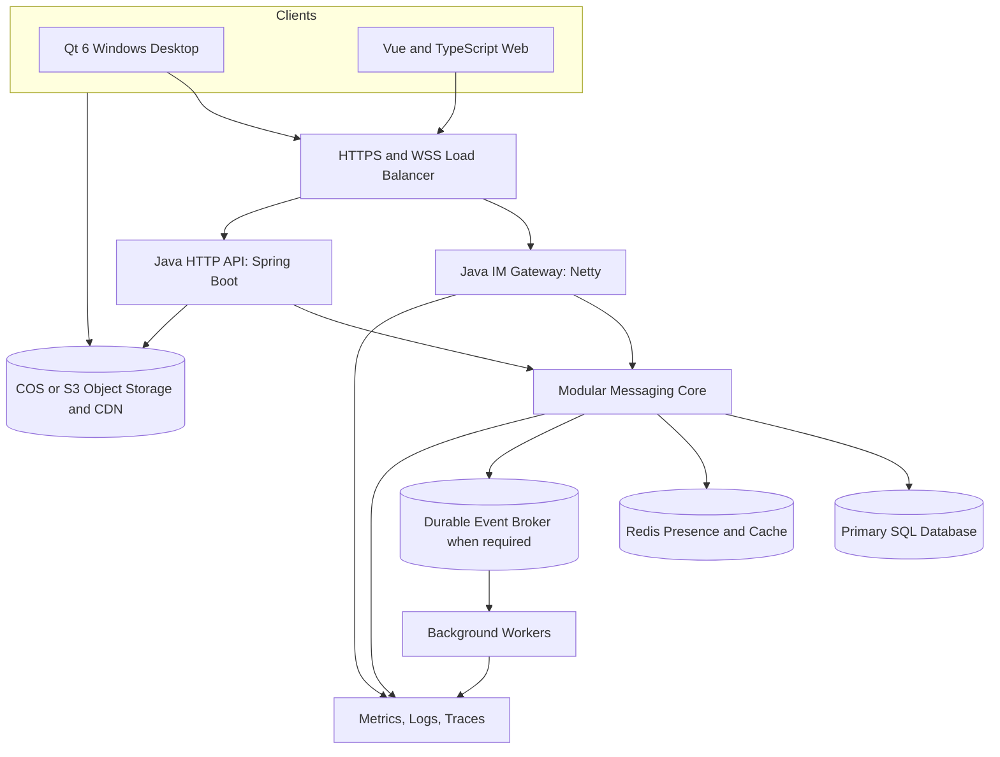
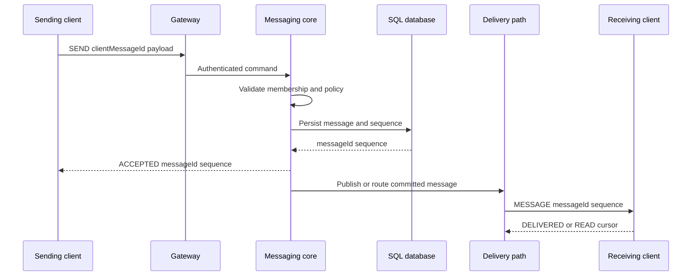

# Chat Room Target Architecture

## 1. Purpose

This document is the architectural source of truth for evolving Chat Room into a
modern instant-messaging product. It describes the desired boundaries and
invariants, not a requirement to create every component immediately.

The current committed client product scope is **Web and Windows desktop**.
macOS, Linux, Android, and iOS clients are outside the supported release scope
until a later ADR explicitly adds one of them. A platform used to develop,
compile, or test the server does not thereby become a supported client. See
[`ADR-0009`](decisions/0009-web-and-windows-product-scope.md).

For the implementation currently deployed as V1, read
[`CURRENT_SYSTEM.md`](CURRENT_SYSTEM.md),
[`../protocol/V1_PROTOCOL.md`](../protocol/V1_PROTOCOL.md), and
[`../data/V1_SQLITE_SCHEMA.md`](../data/V1_SQLITE_SCHEMA.md).

The migration must keep the product usable after every iteration. Follow
[`ROADMAP.md`](ROADMAP.md) for sequencing and use ADRs in `decisions/` for
material changes.

For current build commands and the native toolchain boundary, read
[`../BUILDING.md`](../BUILDING.md) and
[`SUPPORT_MATRIX.md`](SUPPORT_MATRIX.md). M0 acceptance evidence is stored in
[`../baselines/M0_ACCEPTANCE_2026-07-11.md`](../baselines/M0_ACCEPTANCE_2026-07-11.md).
M1 acceptance evidence is stored in
[`../baselines/M1_ACCEPTANCE_2026-08-11.md`](../baselines/M1_ACCEPTANCE_2026-08-11.md).

## 2. Architecture Principles

Prioritize qualities in this order:

1. Message correctness and recoverability.
2. Authentication, authorization, and data security.
3. Perceived client responsiveness and offline behavior.
4. Operability and diagnosability.
5. Measured performance.
6. Horizontal scalability when measurements justify it.

Apply these principles:

- Start modular; distribute only where a boundary earns operational cost.
- Prefer compatibility adapters and vertical slices to wholesale rewrites.
- Keep durable facts separate from online/ephemeral state.
- Make retries safe through idempotency.
- Design failure and reconnection paths alongside the happy path.
- Use one conceptual product model across the supported Web and Windows clients
  while respecting their presentation and operating-environment conventions.

## 3. Current Baseline

The active system is a single Qt/C++ server with three ingress paths:

- framed JSON over TCP for the Qt desktop client;
- JSON text over WebSocket for the browser;
- HTTP for file download;
- SQLite WAL for durable data;
- in-process maps for online sessions and room membership;
- local storage and optional COS integration for files.

The current implementation is a valid V1 product baseline. Its main growth
constraints are synchronous persistence on message paths, connection-per-thread
TCP handling, a main-thread WebSocket path, retained legacy Base64 compatibility
handlers, single-process presence, and the absence of durable client repositories
and delivered/read acknowledgement semantics.

## 4. Target Context


```mermaid
flowchart TB
    subgraph Clients
        Desktop[Qt 6 Windows Desktop]
        Web[Vue and TypeScript Web]
    end

    Edge[HTTPS and WSS Load Balancer]
    Gateway[Java IM Gateway: Netty]
    API[Java HTTP API: Spring Boot]
    Core[Modular Messaging Core]
    Worker[Background Workers]
    SQL[(Primary SQL Database)]
    Redis[(Redis Presence and Cache)]
    Broker[(Durable Event Broker when required)]
    Object[(COS or S3 Object Storage and CDN)]
    Observe[Metrics, Logs, Traces]

    Desktop --> Edge
    Web --> Edge
    Edge --> Gateway
    Edge --> API
    Gateway --> Core
    API --> Core
    Core --> SQL
    Core --> Redis
    Core --> Broker
    Broker --> Worker
    API --> Object
    Clients --> Object
    Gateway --> Observe
    Core --> Observe
    Worker --> Observe
```

The initial Java implementation should be a modular monolith plus an IM gateway.
Gateway and application modules may run in one deployment for development, but
their ownership and APIs must remain explicit so that the gateway can scale
independently.

## 5. Server Modules

| Module | Owns | Must not own |
|---|---|---|
| Gateway | Connections, heartbeat, envelope validation, backpressure, routing | Business authorization or SQL |
| Identity | Users, credentials, devices, tokens, session policy | Chat message persistence |
| Conversation | Direct/group conversations and membership | Transport-specific objects |
| Messaging | Message validation, idempotency, sequencing, recall, sync | File bytes |
| Contacts | Friend requests, friendships, blocks | Online socket state |
| Groups | Group profile, roles, moderation policy | Client view state |
| Attachments | Upload authorization and attachment metadata | Proxying normal file bytes through IM |
| Notification | Offline push and notification preferences | Primary message truth |
| Administration | Audit, reports, bans, operator actions | End-user authentication shortcuts |

Keep module calls in-process at first. Split a deployable service only for one of
these reasons:

- an independently measured scaling profile;
- fault or security isolation;
- a distinct availability requirement;
- a stable ownership boundary;
- a background workload that must not block messaging.

## 6. Canonical Conversation Model

Unify direct messages and rooms around conversations:

```text
Conversation
  id
  type: DIRECT | GROUP
  profile
  members
  lastSequence

Message
  id
  conversationId
  sequence
  senderId
  senderDeviceId
  clientMessageId
  type
  content
  createdAt
  recalledAt
```

Required durable concepts:

- `users` and `devices`;
- `conversations` and `conversation_members`;
- `messages` with a per-conversation sequence;
- `read_cursors` rather than one read row per group message and member;
- `attachments` containing object metadata, not file bytes;
- an `outbox` when durable asynchronous publication is introduced.

Required constraints:

- unique `(conversation_id, sequence)`;
- unique `(sender_id, client_message_id)` or an equivalent device-scoped key;
- history queries by sequence cursor, not large SQL offsets;
- all membership and permission checks executed server-side.

The primary target database is PostgreSQL. Choosing MySQL instead is acceptable
only through an ADR that validates the same sequencing, indexing, migration, and
operations needs. SQLite remains appropriate for local clients and development,
not as the long-term multi-instance server database.

The additive M3 foundation now implements the `persistence-postgres` adapter,
forward-only Flyway history, and the constrained core identity/device,
conversation, membership, and message tables described in
`docs/data/V2_POSTGRES_SCHEMA.md`. It has no repository, imported V1 data, or
traffic route yet, so V1 SQLite remains authoritative.

The fresh-login orchestration exists in the transport-independent `application`
identity package. Account lookup, dummy-capable password verification, and
device/session issuance remain outward ports.

The PostgreSQL identity adapter implements exact V1-compatible account lookup
plus transactional device/session issuance with raw-token digest-only storage.

The separate `identity-crypto` adapter verifies modern V1/libsodium Argon2id and
temporary legacy salted-SHA credentials. Correct legacy login creates a fresh
Argon2id hash and PostgreSQL applies it with compare-and-set semantics.

The V2 gateway now retains negotiated client metadata, dispatches fresh login
through a transport-independent use-case boundary, and binds only server-issued
account/device/session identity to the connection. Envelope session IDs cannot
grant identity. Its transport pipeline now provides bounded binary WebSocket
decode/encode and fixed safe close outcomes for invalid or oversized frames.
This is still an inactive foundation: the one-way V1 import, bounded worker
pool sizing, trusted-proxy policy, metrics export, resume rotation, authenticated
idle policy, hardened listener, and complete gateway wiring remain explicit
cutover blockers. Process-local account/direct-peer/gateway admission and
handshake/authentication deadlines are implemented but do not define deployment
defaults or multi-gateway protection yet. Fixed-label authentication telemetry
and sampled safe logs exist; deployment registry/scrape integration remains.

The application identity module now also owns a transport-independent session
resume command and atomic-rotation persistence port. The command destroys its
owned presented token after the use case returns and maps every persistence
denial to the same authentication rejection. No adapter or gateway route uses
this boundary yet.

## 7. Reliable Message Flow


```mermaid
sequenceDiagram
    participant C as Sending client
    participant G as Gateway
    participant M as Messaging core
    participant D as SQL database
    participant E as Delivery path
    participant R as Receiving client

    C->>G: SEND clientMessageId payload
    G->>M: Authenticated command
    M->>M: Validate membership and policy
    M->>D: Persist message and sequence
    D-->>M: messageId sequence
    M-->>C: ACCEPTED messageId sequence
    M->>E: Publish or route committed message
    E->>R: MESSAGE messageId sequence
    R-->>E: DELIVERED or READ cursor
```

Semantics:

- `ACCEPTED` means the server has durably accepted the message.
- `DELIVERED` means at least one destination device acknowledged receipt.
- `READ` advances a user's conversation read cursor.
- retries with the same `clientMessageId` return the original result.
- clients request missing messages after reconnect by last contiguous sequence.
- clients deduplicate by stable server message ID and reconcile optimistic local
  messages by `clientMessageId`.

Do not promise exactly-once transport. Provide at-least-once delivery with
idempotent processing and deterministic client reconciliation.

The current V1 bridge implements this model for room/direct text and emoji plus
upgraded Web/Windows upload-finalized attachments: `clientMessageId`, durable
send acknowledgements, per-room/per-friendship sequence, and `afterSequence`
history resume are additive fields. Legacy inline attachment retirement remains
a compatibility-window obligation and durable client outboxes begin in M2;
room/direct recall and administrative
deletion are replayable through the shared conversation cursor under ADR-0019
and ADR-0020. This compatibility slice is not the completed V2 model. Web
room/friend uploads and Windows composer uploads now use the
authorized binary HTTP bridge from ADR-0013. Upgraded Windows multi-target
forwarding submits server file identity and target conversations under
ADR-0014; old-server and old-client compatibility handlers still use legacy V1
paths. ADR-0015 closes the live delivery metadata gap: inline, HTTP-uploaded,
and forwarded attachment notifications now expose their durable conversation
sequence and database timestamp just like history rows. ADR-0016 adds explicit,
restart-safe finalization acceptance and suppresses duplicate room/friend upload
messages on identical retries. ADR-0018 makes Windows attachment downloads
HTTP-first and streams them to disk; legacy Base64/WebSocket downloads remain
compatibility fallbacks only.
ADR-0020 makes selected/predicate administrator deletion retry-safe and exposes
durable `messagesDeleted` events to upgraded Web/Windows clients after
reconnect; older clients continue to receive the existing live notification.

## 8. Protocol Strategy

Maintain two explicit generations during migration:

- V1: current JSON messages used by existing Qt and web clients;
- V2: versioned envelope and generated schemas, preferably Protobuf over binary
  WebSocket frames.

The V2 envelope should carry:

```text
protocolVersion
messageType
requestId
sessionId
clientMessageId
sentAt
payload
```

Generate Java, C++, and TypeScript bindings from one protocol source. Keep V1
translation at the gateway boundary. Never leak V1 field quirks into the V2
domain model.

## 9. Presence, Cache, and Events

Use Redis for ephemeral and reconstructable data:

- user/device to gateway routing;
- online presence with leases;
- short-lived tokens and rate limits;
- hot metadata caches.

Do not use plain Redis Pub/Sub as the only durable message path. Introduce a
durable broker only when multiple gateway/application instances or asynchronous
consumers require it. Select Kafka, RocketMQ, Pulsar, or another broker through
an ADR based on operational capability and measured workload.

When a broker is introduced, use a transactional outbox or an equivalent
recoverable publication design so a committed message cannot disappear between
the SQL transaction and event publication.

## 10. Attachment Flow

Target flow:

1. Client requests an upload authorization with name, size, MIME type, and
   conversation ID.
2. Server checks membership, quota, type, and policy.
3. Server returns a short-lived, object-scoped upload authorization.
4. Client uploads directly to COS/S3 using multipart upload where needed.
5. Client completes the upload with the server.
6. Server verifies the object and creates an attachment message.
7. Recipients download through authorized CDN/object URLs.

Virus scanning, thumbnails, media metadata, and retention should run as
asynchronous jobs. A file message may remain in a processing state until required
checks finish.

## 11. Client Architecture

### Windows desktop

Keep Qt 6 and C++ for the supported Windows desktop client. Move toward QML for
new or substantially redesigned screens after extracting application services
from the current Widgets window.

```text
QML or Widgets views
    -> View models
    -> Application services
    -> Sync engine and local repository
    -> WebSocket, HTTP, SQLite, media cache
```

Use local SQLite for conversations, messages, sync cursors, drafts, and pending
outbox commands. Keep file/media data in a bounded disk cache. Isolate Windows
tray, notification, shortcut, startup, installer, and updater behavior behind
platform interfaces. Keep the core portable where inexpensive, but do not add
macOS or Linux product work without a support-scope ADR.

The first extracted application boundary is `OutgoingMessageService` under
ADR-0025. It owns stable text/emoji submission intent, restart recovery gates,
and terminal local delivery transitions while `ChatWindow` adapts commands and
responses to the V1 transport. `ConversationSyncService` under ADR-0026 now
owns snapshot/cursor persistence and stable-key promotion. The
`V1HistoryPageAdapter` from ADR-0027 normalizes bounded legacy/sequence pages,
while the sync service stops stalled continuation loops. Restartable attachment
commands remain the next extraction and do not belong in Widgets.

### Web

Keep Vue 3 and move new code to TypeScript. Split the large chat store into
session, conversation, message, contact, transfer, and notification concerns.
Use IndexedDB for durable messages, cursors, drafts, and pending operations.
Pinia should represent live UI/application state, not be the only data store.
Responsive browser layouts may serve phones or tablets, but they do not create
native Android or iOS application support.

### Product consistency

Share these across clients:

- generated protocol schemas;
- semantic design tokens and product terminology;
- message type behavior and capability negotiation;
- test fixtures and compatibility cases.

Do not force identical window chrome, shortcuts, notifications, or navigation
behavior across the Windows desktop and browser environments.

## 12. Packaging and Distribution

| Platform | Primary artifact | Required release work |
|---|---|---|
| Windows | Signed `Setup.exe`; optional MSIX channel | `windeployqt`, runtime dependencies, Authenticode signing, timestamp, install/upgrade/uninstall tests |
| Web | Versioned static assets | CSP, cache policy, source-map policy, rollback-ready deployment |

Build and sign the Windows artifact on native Windows CI. Build the Web bundle
from its lockfile and retain a rollback-ready versioned deployment. Keep signing
credentials in the CI secret store. macOS and Linux jobs, when retained for
development or portability feedback, must not publish supported releases.

The Windows updater must use a signed manifest containing architecture, channel,
version, minimum compatible version, hash, signature, and URL. Support stable
and beta channels and preserve rollback capability. Web rollback uses immutable
asset versions and a deployment pointer or equivalent routing mechanism.

## 13. Security Baseline

The current V1 authentication risks and verified controls are tracked in
[`../security/V1_AUTHENTICATION_THREAT_MODEL.md`](../security/V1_AUTHENTICATION_THREAT_MODEL.md).

- Replace fast SHA password hashing with Argon2id, scrypt, or bcrypt through a
  migration that upgrades hashes after successful login.
- Treat room passwords as non-recoverable secrets: hash at rest, upgrade legacy
  plaintext only after successful verification, and expose status rather than
  the stored value.
- Never persist plaintext passwords in browser storage or desktop settings.
- Use short-lived access tokens, revocable refresh/device sessions, and TLS on
  every public connection.
- Validate message size, rate, membership, and content type at the server.
- Scope file authorization to one user, object, operation, and short expiry.
- Maintain audit records for administrative and moderation actions.
- Protect authentication, search, friend requests, messaging, and uploads with
  abuse controls.
- V1 bounds authentication work by connection, normalized account, direct peer,
  and single server process. Treat that state as ephemeral; future multi-gateway
  enforcement belongs in the gateway/Redis boundary.

## 14. Operations and Quality

Every critical path should expose:

- request/message correlation IDs;
- connection counts and reconnect rates;
- accepted, delivered, failed, retried, and duplicate message counters;
- persistence and delivery latency distributions;
- event-loop or executor queue saturation;
- database, Redis, broker, and object-storage errors;
- per-connection outbound queue size and slow-consumer actions.

Define performance objectives from a recorded baseline and user scenario. Track
P50/P95/P99, not averages alone. Load tests must include reconnect storms, large
groups, slow clients, database contention, and partial infrastructure failure.

## 15. Explicit Non-goals

- Do not clone the infrastructure scale of WeChat or QQ before the product has
  the workload and team to operate it.
- Do not split every domain module into a network service initially.
- Do not rewrite all clients and the server in one release.
- Do not route normal file bytes through the messaging core.
- Do not use a cache or broker as undocumented primary truth.
- Do not add macOS, Linux, Android, or iOS client release work to the current
  roadmap without an explicit support-scope ADR and an owned test/release plan.
