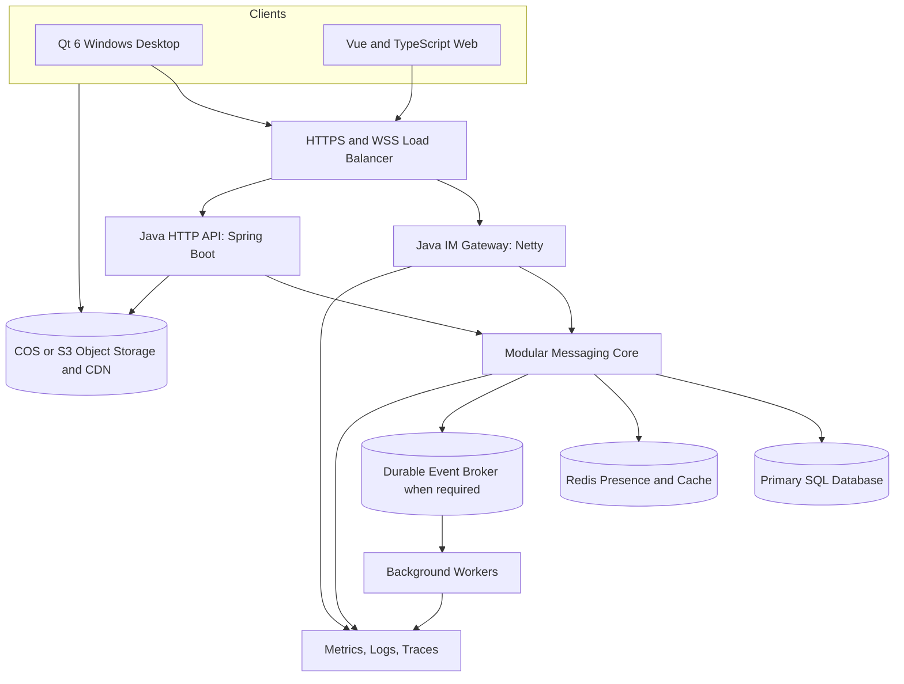
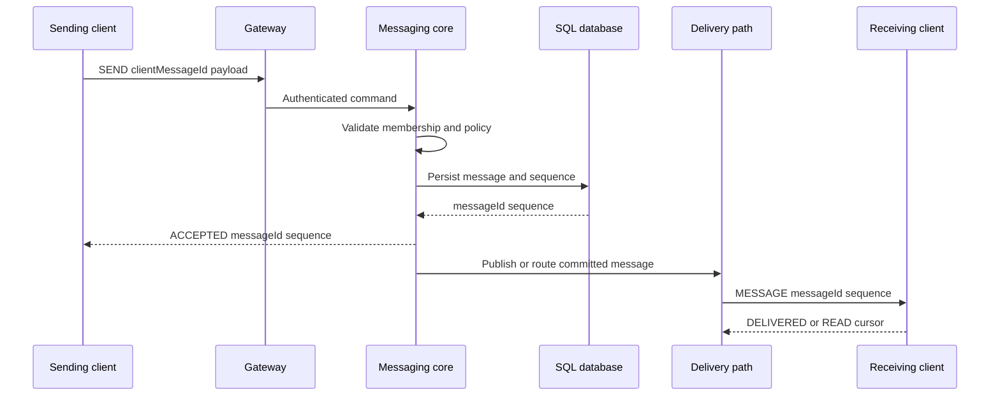

# Chat Room Target Architecture

## 1. Purpose

This document is the architectural source of truth for evolving Chat Room into a
modern instant-messaging product. It describes the desired boundaries and
invariants, not a requirement to create every component immediately.

The current committed client product scope is **Web and Windows desktop**.
macOS, Linux, Android, and iOS clients are outside the supported release scope
until a later ADR explicitly adds one of them. A platform used to develop,
compile, or test the server does not thereby become a supported client. See
[`ADR-0009`](decisions/0009-web-and-windows-product-scope.md).

For the implementation currently deployed as V1, read
[`CURRENT_SYSTEM.md`](CURRENT_SYSTEM.md),
[`../protocol/V1_PROTOCOL.md`](../protocol/V1_PROTOCOL.md), and
[`../data/V1_SQLITE_SCHEMA.md`](../data/V1_SQLITE_SCHEMA.md).

The migration must keep the product usable after every iteration. Follow
[`ROADMAP.md`](ROADMAP.md) for sequencing and use ADRs in `decisions/` for
material changes.

For current build commands and the native toolchain boundary, read
[`../BUILDING.md`](../BUILDING.md) and
[`SUPPORT_MATRIX.md`](SUPPORT_MATRIX.md). M0 acceptance evidence is stored in
[`../baselines/M0_ACCEPTANCE_2026-07-11.md`](../baselines/M0_ACCEPTANCE_2026-07-11.md).
M1 acceptance evidence is stored in
[`../baselines/M1_ACCEPTANCE_2026-08-11.md`](../baselines/M1_ACCEPTANCE_2026-08-11.md).

## 2. Architecture Principles

Prioritize qualities in this order:

1. Message correctness and recoverability.
2. Authentication, authorization, and data security.
3. Perceived client responsiveness and offline behavior.
4. Operability and diagnosability.
5. Measured performance.
6. Horizontal scalability when measurements justify it.

Apply these principles:

- Start modular; distribute only where a boundary earns operational cost.
- Prefer compatibility adapters and vertical slices to wholesale rewrites.
- Keep durable facts separate from online/ephemeral state.
- Make retries safe through idempotency.
- Design failure and reconnection paths alongside the happy path.
- Use one conceptual product model across the supported Web and Windows clients
  while respecting their presentation and operating-environment conventions.

## 3. Current Baseline

The active system is a single Qt/C++ server with three ingress paths:

- framed JSON over TCP for the Qt desktop client;
- JSON text over WebSocket for the browser;
- HTTP for file download;
- SQLite WAL for durable data;
- in-process maps for online sessions and room membership;
- local storage and optional COS integration for files.

The current implementation is a valid V1 product baseline. Its main growth
constraints are synchronous persistence on message paths, connection-per-thread
TCP handling, a main-thread WebSocket path, retained legacy Base64 compatibility
handlers, single-process presence, and the absence of durable client repositories
and delivered/read acknowledgement semantics.

## 4. Target Context


```mermaid
flowchart TB
    subgraph Clients
        Desktop[Qt 6 Windows Desktop]
        Web[Vue and TypeScript Web]
    end

    Edge[HTTPS and WSS Load Balancer]
    Gateway[Java IM Gateway: Netty]
    API[Java HTTP API: Spring Boot]
    Core[Modular Messaging Core]
    Worker[Background Workers]
    SQL[(Primary SQL Database)]
    Redis[(Redis Presence and Cache)]
    Broker[(Durable Event Broker when required)]
    Object[(COS or S3 Object Storage and CDN)]
    Observe[Metrics, Logs, Traces]

    Desktop --> Edge
    Web --> Edge
    Edge --> Gateway
    Edge --> API
    Gateway --> Core
    API --> Core
    Core --> SQL
    Core --> Redis
    Core --> Broker
    Broker --> Worker
    API --> Object
    Clients --> Object
    Gateway --> Observe
    Core --> Observe
    Worker --> Observe
```

The initial Java implementation should be a modular monolith plus an IM gateway.
Gateway and application modules may run in one deployment for development, but
their ownership and APIs must remain explicit so that the gateway can scale
independently.

## 5. Server Modules

| Module | Owns | Must not own |
|---|---|---|
| Gateway | Connections, heartbeat, envelope validation, backpressure, routing | Business authorization or SQL |
| Identity | Users, credentials, devices, tokens, session policy | Chat message persistence |
| Conversation | Direct/group conversations and membership | Transport-specific objects |
| Messaging | Message validation, idempotency, sequencing, recall, sync | File bytes |
| Contacts | Friend requests, friendships, blocks | Online socket state |
| Groups | Group profile, roles, moderation policy | Client view state |
| Attachments | Upload authorization and attachment metadata | Proxying normal file bytes through IM |
| Notification | Offline push and notification preferences | Primary message truth |
| Administration | Audit, reports, bans, operator actions | End-user authentication shortcuts |

Keep module calls in-process at first. Split a deployable service only for one of
these reasons:

- an independently measured scaling profile;
- fault or security isolation;
- a distinct availability requirement;
- a stable ownership boundary;
- a background workload that must not block messaging.

## 6. Canonical Conversation Model

Unify direct messages and rooms around conversations:

```text
Conversation
  id
  type: DIRECT | GROUP
  profile
  members
  lastSequence

Message
  id
  conversationId
  sequence
  senderId
  senderDeviceId
  clientMessageId
  type
  content
  createdAt
  recalledAt
```

Required durable concepts:

- `users` and `devices`;
- `conversations` and `conversation_members`;
- `messages` with a per-conversation sequence;
- `read_cursors` rather than one read row per group message and member;
- `attachments` containing object metadata, not file bytes;
- an `outbox` when durable asynchronous publication is introduced.

Required constraints:

- unique `(conversation_id, sequence)`;
- unique `(sender_id, client_message_id)` or an equivalent device-scoped key;
- history queries by sequence cursor, not large SQL offsets;
- all membership and permission checks executed server-side.

The primary target database is PostgreSQL. Choosing MySQL instead is acceptable
only through an ADR that validates the same sequencing, indexing, migration, and
operations needs. SQLite remains appropriate for local clients and development,
not as the long-term multi-instance server database.

The additive M3 foundation implements the `persistence-postgres` adapter,
forward-only Flyway history, and the constrained core identity/device,
conversation, membership, and message tables described in
`docs/data/V2_POSTGRES_SCHEMA.md`. It has no repository, imported V1 data, or
production traffic cutover, so V1 SQLite remains authoritative. The offline
migration path now imports identity, conversation metadata, retained messages,
recalls/deletion audit entries, and translated cursors in that explicit order;
it still grants no authority to the Java runtime.

The identity import foundation deterministically maps each positive V1 numeric
user ID to a stable V2 UUID, validates exact usernames, display bounds,
timestamps, Argon2id/legacy credential shape, duplicates, and empty input, then
produces a safe issue list and order-independent source fingerprint. It performs
WAL-aware query-only SQLite extraction now runs `quick_check`, requires the
current migrated users schema, and safely projects UTC timestamps. Verified
online backup now reconciles the copied identity plan and records source/file
hash, row count, size, and creation time without overwriting artifacts. The
PostgreSQL adapter now previews strict target conflicts, requires a reverified
source/backup proof, applies only to a dedicated compatible target in a
serialized transaction, reconciles every field, and persists a non-secret run
proof atomically. A separate offline command now creates and verifies versioned
proof files, previews without writes, and requires explicit fingerprint
confirmation for apply. The source-quiescence/final-fingerprint runbook exists,
but its manual full-server restore rehearsal remains required.

The fresh-login orchestration exists in the transport-independent `application`
identity package. Account lookup, dummy-capable password verification, and
device/session issuance remain outward ports.

The PostgreSQL identity adapter implements exact V1-compatible account lookup
plus transactional device/session issuance with raw-token digest-only storage.

The separate `identity-crypto` adapter verifies modern V1/libsodium Argon2id and
temporary legacy salted-SHA credentials. Correct legacy login creates a fresh
Argon2id hash and PostgreSQL applies it with compare-and-set semantics.

The V2 gateway now retains negotiated client metadata, dispatches fresh login
through a transport-independent use-case boundary, and binds only server-issued
account/device/session identity to the connection. Envelope session IDs cannot
grant identity. Its transport pipeline now provides bounded binary WebSocket
decode/encode and fixed safe close outcomes for invalid or oversized frames.
The deterministic post-upgrade composition now installs bounded frame handling,
phase deadlines, negotiation, authentication/resume, authenticated writer-idle
Ping, and reader-idle closure, and both endpoints require the fixed `chat.v2` WebSocket
subprotocol. The WSS component composes mandatory TLS,
bounded HTTP/WebSocket parsing, Host/proxy/endpoint policies, connection and
write-buffer limits, the post-upgrade application pipeline, and deterministic
shutdown. `GatewayMain` now validates and owns PostgreSQL, identity cryptography,
bounded workers, admin readiness/metrics, WSS, and reverse shutdown. Operator
restore rehearsal, conversation discovery, and supported-client V2 adoption
remain explicit cutover blockers. Process-local account/direct-peer/gateway
admission and
handshake/authentication deadlines are implemented but do not define deployment
defaults or multi-gateway protection yet. Fixed-label authentication telemetry
and sampled safe logs now have an exact-path, GET-only loopback health/metrics
server with explicit readiness and bounded workers. Runtime composition starts
it and installs the reusable pre-upgrade handler that freezes the
bounded trusted-CIDR/right-to-left forwarding result for authentication
admission in the required order. The endpoint policy now reserves exact Web/Windows paths, requires an
HTTPS allowlist for Web Origin, forbids Origin on the Windows route, and binds
that choice to the later `ClientHello.platform`. A separate exact Host authority allowlist protects both
endpoints, including Windows requests that carry no browser Origin.
The `im-gateway` runtime package now centralizes strict environment parsing with
numeric listener addresses, loopback-only administration, required TLS/database
material, bounded workers/queues/timeouts/connections/write buffers, and no
secret-bearing string form. Its PostgreSQL boundary now requires verified remote
TLS and defines a bounded fail-fast HikariCP pool. `GatewayMain` can now construct
the pool and bind when an operator supplies the complete strict environment, but
no product traffic is routed to it.

The application core and PostgreSQL adapter now also implement an inactive
durable-message boundary: authorized append atomically allocates a conversation
sequence, exact concurrent retries return one stable database-timestamped
outcome, conflicting idempotency reuse is denied, and active members can read
bounded ascending sequence pages. Permanent bounded V2 types 100..104 now cover
submit/accepted/history/page plus a server live-message event using the same
record projection, with generated Java/C++/TypeScript compatibility. A shared
single-gateway router now establishes one active subscription only through the
final authorized history page, publishes non-duplicate durable acceptance, and
closes unwritable subscribers for reconnect repair. The Web client validates,
merges, and history-repairs the event without skipping its contiguous cursor.
Authenticated gateway connections now dispatch registered UTF-8 text submission
and sequence-history reads through this boundary outside the Netty event loop,
using only server-bound identity and preserving per-connection command order.
Message database work and authentication now use independently configured
bounded worker pools so a message burst cannot consume password/session
execution slots; both pools still share bounded PostgreSQL connections.
The loopback metrics endpoint exposes fixed message outcome counters and current
message-worker active/queue gauges without identity or conversation labels.
The application/PostgreSQL boundary now also provides a bounded, descending
composite-cursor directory of only the authenticated account's active
conversations, including canonical kind, direct-peer or group display name,
role, sequence high watermark, and read cursor.
The authenticated gateway now dispatches that directory through the same
connection-local serial queue and isolated worker pool as message append/history,
using only server-bound account identity and a fixed outcome counter.
This remains a pre-cutover path: live fan-out is process-local and active-
conversation-only, while delivery/read state, multi-gateway routing, membership
invalidation, broader conversation discovery, and supported-client cutover are
still absent.

The application identity module now also owns a transport-independent session
resume command and atomic-rotation persistence port. The command destroys its
owned presented token after the use case returns and maps every persistence
denial to the same authentication rejection. PostgreSQL now implements that
port with digest-only verification, transactional row locking, fresh proof
rotation, device binding, and replay/expiry/revocation denial. The bounded V2
gateway resume path invokes it and binds only the returned server identity;
the runnable pre-cutover listener uses the path, but no production route does.

## 7. Reliable Message Flow


```mermaid
sequenceDiagram
    participant C as Sending client
    participant G as Gateway
    participant M as Messaging core
    participant D as SQL database
    participant E as Delivery path
    participant R as Receiving client

    C->>G: SEND clientMessageId payload
    G->>M: Authenticated command
    M->>M: Validate membership and policy
    M->>D: Persist message and sequence
    D-->>M: messageId sequence
    M-->>C: ACCEPTED messageId sequence
    M->>E: Publish or route committed message
    E->>R: MESSAGE messageId sequence
    R-->>E: DELIVERED or READ cursor
```

Semantics:

- `ACCEPTED` means the server has durably accepted the message.
- `DELIVERED` means at least one destination device acknowledged receipt.
- `READ` advances a user's conversation read cursor.
- retries with the same `clientMessageId` return the original result.
- clients request missing messages after reconnect by last contiguous sequence.
- clients deduplicate by stable server message ID and reconcile optimistic local
  messages by `clientMessageId`.

Do not promise exactly-once transport. Provide at-least-once delivery with
idempotent processing and deterministic client reconciliation.

The current V1 bridge implements this model for room/direct text and emoji plus
upgraded Web/Windows upload-finalized attachments: `clientMessageId`, durable
send acknowledgements, per-room/per-friendship sequence, and `afterSequence`
history resume are additive fields. Legacy inline attachment retirement remains
a compatibility-window obligation and durable client outboxes begin in M2;
room/direct recall and administrative
deletion are replayable through the shared conversation cursor under ADR-0019
and ADR-0020. This compatibility slice is not the completed V2 model. Web
room/friend uploads and Windows composer uploads now use the
authorized binary HTTP bridge from ADR-0013. Upgraded Windows multi-target
forwarding submits server file identity and target conversations under
ADR-0014; old-server and old-client compatibility handlers still use legacy V1
paths. ADR-0015 closes the live delivery metadata gap: inline, HTTP-uploaded,
and forwarded attachment notifications now expose their durable conversation
sequence and database timestamp just like history rows. ADR-0016 adds explicit,
restart-safe finalization acceptance and suppresses duplicate room/friend upload
messages on identical retries. ADR-0018 makes Windows attachment downloads
HTTP-first and streams them to disk; legacy Base64/WebSocket downloads remain
compatibility fallbacks only.
ADR-0020 makes selected/predicate administrator deletion retry-safe and exposes
durable `messagesDeleted` events to upgraded Web/Windows clients after
reconnect; older clients continue to receive the existing live notification.

## 8. Protocol Strategy

Maintain two explicit generations during migration:

- V1: current JSON messages used by existing Qt and web clients;
- V2: versioned envelope and generated schemas, preferably Protobuf over binary
  WebSocket frames.

The V2 envelope should carry:

```text
protocolVersion
messageType
requestId
sessionId
clientMessageId
sentAt
payload
```

Generate Java, C++, and TypeScript bindings from one protocol source. Keep V1
translation at the gateway boundary. Never leak V1 field quirks into the V2
domain model.

## 9. Presence, Cache, and Events

Use Redis for ephemeral and reconstructable data:

- user/device to gateway routing;
- online presence with leases;
- short-lived tokens and rate limits;
- hot metadata caches.

Do not use plain Redis Pub/Sub as the only durable message path. Introduce a
durable broker only when multiple gateway/application instances or asynchronous
consumers require it. Select Kafka, RocketMQ, Pulsar, or another broker through
an ADR based on operational capability and measured workload.

When a broker is introduced, use a transactional outbox or an equivalent
recoverable publication design so a committed message cannot disappear between
the SQL transaction and event publication.

## 10. Attachment Flow

Target flow:

1. Client requests an upload authorization with name, size, MIME type, and
   conversation ID.
2. Server checks membership, quota, type, and policy.
3. Server returns a short-lived, object-scoped upload authorization.
4. Client uploads directly to COS/S3 using multipart upload where needed.
5. Client completes the upload with the server.
6. Server verifies the object and creates an attachment message.
7. Recipients download through authorized CDN/object URLs.

Virus scanning, thumbnails, media metadata, and retention should run as
asynchronous jobs. A file message may remain in a processing state until required
checks finish.

ADR-0099 adds an inactive `object-storage-s3` simple-PUT adapter. It signs exact
create-only, length, type, and SHA-256 constraints and reads checksum-enabled
HEAD metadata without putting provider types in the application core. It rejects
objects above 5 GiB until a restartable multipart design exists. COS/S3-compatible
deployment still requires real-bucket capability and Web CORS acceptance; SDK
compatibility or a mocked unit test is not release evidence.

The inactive cleanup path now persists revocation before external deletion,
uses an indexed retry set, deletes only server-owned `attachments/` keys, and
confirms deletion afterward. PostgreSQL uses bounded `SKIP LOCKED` selection so
multiple future workers do not revoke the same pending row; repeated deletion of
an already-revoked object remains safe after process or database failure.

ADR-0103 adds a manually activated, single-process non-overlapping cleanup loop
with bounded exponential dependency backoff and fixed-cardinality Prometheus
metrics. The admin endpoint exports this metric family, but `GatewayRuntime`
does not construct or start the loop, so no cloud credential, provider request,
or cleanup side effect is introduced before real-bucket acceptance.

ADR-0104 adds an explicitly confirmed, operator-only real-provider probe for
create-only replay rejection, checksum HEAD, Web CORS, and delete-after-failure.
It creates only a random object in the dedicated capability-probe prefix, never
creates durable attachment metadata, and always verifies cleanup. The command is
not part of startup or ordinary verification. A PASS does not cover signed-URL
expiry, policy review, lifecycle safety, or capacity and therefore does not by
itself authorize runtime composition.

ADR-0105 permanently allocates inactive V2 attachment register, upload-
authorization, and completion messages. Account/device authority remains bound
to the authenticated connection, file bytes remain outside Protobuf, and signed
URLs are transient response data that clients must not persist or log. The
gateway still rejects these types until provider acceptance and a later handler
slice explicitly activate them.

ADR-0106 maps those commands to the existing application boundaries in a
separate inactive Netty handler. It uses only server-bound account/device
identity, bounded serialized off-event-loop work, non-enumerating denials,
redacted dependency failures, deterministic grant headers, and fixed-cardinality
telemetry. The handler is deliberately absent from the runnable pipeline until
real-provider evidence and supported-client rollout gates are satisfied.

ADR-0107 implements the matching inactive Web application service and protocol
transport. It keeps file bytes, SHA-256, and signed authorization in one
cancelable memory-only call, performs direct credential-free PUT, refreshes a
near-expiry grant, correlates each stage by exact request ID with bounded
cancellation tombstones, and completes only matching stable attachment identity. The
whole-buffer simple-PUT preview is capped at 100 MiB pending a restartable
multipart/incremental-hash design; it is not connected to Vue routes or durable
storage and does not change the default-off V2 runtime.

## 11. Client Architecture

### Windows desktop

Keep Qt 6 and C++ for the supported Windows desktop client. Move toward QML for
new or substantially redesigned screens after extracting application services
from the current Widgets window.

```text
QML or Widgets views
    -> View models
    -> Application services
    -> Sync engine and local repository
    -> WebSocket, HTTP, SQLite, media cache
```

Use local SQLite for conversations, messages, sync cursors, drafts, and pending
outbox commands. Keep file/media data in a bounded disk cache. Isolate Windows
tray, notification, shortcut, startup, installer, and updater behavior behind
platform interfaces. Keep the core portable where inexpensive, but do not add
macOS or Linux product work without a support-scope ADR.

The first extracted application boundary is `OutgoingMessageService` under
ADR-0025. It owns stable text/emoji submission intent, restart recovery gates,
and terminal local delivery transitions while `ChatWindow` adapts commands and
responses to the V1 transport. `ConversationSyncService` under ADR-0026 now
owns snapshot/cursor persistence and stable-key promotion. The
`V1HistoryPageAdapter` from ADR-0027 normalizes bounded legacy/sequence pages,
while the sync service stops stalled continuation loops. Restartable attachment
commands remain the next extraction and do not belong in Widgets.

### Web

Keep Vue 3 and move new code to TypeScript. Split the large chat store into
session, conversation, message, contact, transfer, and notification concerns.
Use IndexedDB for durable messages, cursors, drafts, and pending operations.
Pinia should represent live UI/application state, not be the only data store.
Responsive browser layouts may serve phones or tablets, but they do not create
native Android or iOS application support.

The pinned V2 generator now publishes reviewed TypeScript bindings directly to
the Web source tree, and the protocol gate rejects stale committed output. An
additive TypeScript protocol/session state machine now validates negotiation,
authentication, request correlation, server-bound sessions, directory/history
pages, and idempotent text submissions without changing the live V1 path. Live
Web traffic remains on V1. The V2 WebSocket adapter now fixes the
secure endpoint/subprotocol, bounds connection phases, rejects non-binary data,
clears per-connection protocol state, and performs cancellable jittered
reconnects. Browser network events now pause futile attempts while offline and
trigger an immediate ordinary handshake on recovery; the signal is not treated
as gateway reachability proof. Production rollback rehearsal still requires
verification before any cutover. The protocol
and transport boundaries can now send an explicitly supplied resume proof and
accept its rotated session result. The transport retains only the latest rotated
proof in page memory, redacts it from application observers, automatically
resumes after transient reconnect, and clears it on rejection or explicit stop.
No proof is persisted across a reload.

The additive V2 cache uses a separate `chat-room-client-v2` IndexedDB database
instead of upgrading the live V1 database. It partitions snapshots by V2 account
and conversation UUID, stores bounded text metadata only, and encodes exact
server sequences as canonical decimal strings so values above JavaScript's safe
integer range are not rounded. Removing the V2 code leaves the V1 database and
rollback path untouched.

An unconnected `V2WebChatApplication` now sits above those protocol, transport,
and cache ports. It loads cached messages before requesting sequence history,
owns bounded directory/history pagination, creates idempotent optimistic text
messages, maps ACK/errors by validated correlation metadata, and deduplicates a
later at-least-once history replay. ACK alone never advances the last contiguous
history cursor. The application exposes immutable view snapshots but is not yet
wired into Pinia or the supported V1 screens.

After authentication or same-session resume, the coordinator waits for the
active conversation's history to reach its current page boundary before
replaying cached `sending` commands. Replay is strictly one-at-a-time and uses
the original client message ID; a history copy suppresses an ACK-lost retry.
Errors stop the automatic queue and expose explicit failed states. Local V2
retention is bounded to 500 accepted plus 100 unresolved messages.

The Web entry point now exposes that stack through a default-off Vue composition
boundary. Only an exact `VITE_CHAT_V2_PREVIEW=true` build with a valid WSS route
and bounded app version dynamically loads the separate V2 chunk; an ordinary
build retains the V1 initial asset graph. Composition creates no connection by
itself. The build-gated `/preview/v2` screen explicitly starts and authenticates
the route-owned connection, and stops it on route exit. It renders the current
directory, cache-first history, optimistic text, acceptance, and retry slice;
V1-only registration, attachments, administration, and other missing behavior
remain visible cutover blockers. A stable random device hint may use the isolated
`chat.v2.device-id` browser key, while credentials and resume proofs remain in
memory. Deployment and rollback rules are in
[`WEB_V2_PREVIEW.md`](../deployment/WEB_V2_PREVIEW.md).

### Product consistency

Share these across clients:

- generated protocol schemas;
- semantic design tokens and product terminology;
- message type behavior and capability negotiation;
- test fixtures and compatibility cases.

Do not force identical window chrome, shortcuts, notifications, or navigation
behavior across the Windows desktop and browser environments.

## 12. Packaging and Distribution

| Platform | Primary artifact | Required release work |
|---|---|---|
| Windows | Signed `Setup.exe`; optional MSIX channel | `windeployqt`, runtime dependencies, Authenticode signing, timestamp, install/upgrade/uninstall tests |
| Web | Versioned static assets | CSP, cache policy, source-map policy, rollback-ready deployment |

Build and sign the Windows artifact on native Windows CI. Build the Web bundle
from its lockfile and retain a rollback-ready versioned deployment. Keep signing
credentials in the CI secret store. macOS and Linux jobs, when retained for
development or portability feedback, must not publish supported releases.

ADR-0108 establishes the pre-installer boundary: root `VERSION` is the Windows
desktop version source, native CI uploads only the `windeployqt` client payload,
and deterministic JSON/SHA-256 metadata binds every file to the exact source
revision and toolchain. The metadata is deliberately labeled
`unsigned-verification-only`; it is integrity and traceability evidence, not
publisher authentication or installation evidence.

ADR-0110 adds the next Windows delivery boundary: pinned NSIS compiles a
per-user, client-only Setup/uninstaller from that verified payload. Native CI
checks silent install, canonical executable/version/SQLite runtime and HKCU
uninstall metadata, then silent uninstall while account-local data survives.
The artifact remains named and manifested as unsigned verification output;
Windows 10/11 launch/upgrade, Authenticode/RFC 3161 timestamping, updater, and
rollback remain release gates.

ADR-0116 strengthens the unsigned installer upgrade boundary. An owned marker
guards recursive program-directory operations; the complete new payload is
validated in a sibling staging directory, the old tree is renamed to backup,
and activation failure restores it. Native CI is configured for a synthetic
0.9.0-to-current transition that removes stale program files while retaining
AppData, then rejects a direct older-Setup downgrade without mutation. This does
not replace real old-binary, locked-process, signing, or Windows 10/11 release
evidence.

ADR-0117 defines the default-off signed update protocol: canonical JSON plus a
dedicated detached Ed25519 signature binds channel, monotonic sequence, expiry,
rollout, source, exact production Setup bytes, and expected Authenticode signer.
Ephemeral keys prove signing, verification, and tamper rejection, but no product
public/private key is committed and no client update path is active.

ADR-0118 compiles the corresponding default-deny verifier into the Qt client.
It requires exact canonical bytes and an injected key-ID ring, rejects empty or
unknown trust, and packages the pinned libsodium runtime on Windows. No key is
embedded and no network/update action calls the verifier, so activation remains
an explicit future release decision.

ADR-0119 adds the inactive application decision boundary after verification. It
requires the exact `x86_64` schema and UTC window, monotonic per-channel replay
state across key rotations, numeric Windows versions, deterministic cross-client
rollout, and bounded HTTPS installer metadata. It performs no persistence,
network I/O, Authenticode validation, launch, or UI action.

ADR-0120 adds the inactive payload trust boundary. Exact local-file size and
SHA-256 are portable; Windows additionally locks the regular file against
replacement, asks WinTrust for the Authenticode chain with revocation policy,
requires a validated counter-signature, and matches the leaf certificate's
SHA-256 thumbprint to signed metadata. No downloader or launcher calls it.

ADR-0121 adds inactive durable update state outside chat/account data. One
owner-only UUIDv4 keeps staged rollout stable across launches, while atomic,
locked stable/beta sequence-plus-digest watermarks reject rollback and
equivocation across signing-key rotations. Malformed state fails closed; no
application path creates it yet.

ADR-0122 makes the trust order non-bypassable behind one inactive application
service: canonical signature verification precedes state load and semantic
decision, which precede atomic replay acceptance. Invalid trust creates no
state. The service still has no configured product key/path, network, UI, or
installer action.

ADR-0123 adds a separate inactive installer transport rather than reusing chat
attachment downloads. It accepts credential-free HTTPS only, never follows a
redirect, shares a 2 GiB signed bound with authoring/decision code, uses bounded
streaming plus timeout/cancel, and removes every failed partial. Successful
bytes still require ADR-0120 trust verification before any use.

ADR-0124 composes signed eligibility, bounded download, and installer trust into
one inactive preparation service. Non-eligible policy never reaches the network;
WinTrust runs off the UI thread; and rejected, cancelled, exceptional, or
destroyed work deletes its file. Only verified bytes can become `Ready`, but no
product key/configuration, discovery, UI, or installer launch exists.

ADR-0125 closes the known running-client directory-lock path. The Windows client
holds a session-local liveness mutex and becomes single-instance; NSIS probes the
same name in `.onInit` and rejects interactive or silent install before mutation.
It never kills the app. Graceful consent, shutdown/wait, verified Setup launch,
and post-install restart remain separate boundaries.

ADR-0126 adds the inactive update-discovery transport. It fetches only an exact
credential-free HTTPS `manifest.json` and same-origin `manifest.json.sig` pair,
never follows redirects, bounds the responses at 64 KiB and exactly 64 bytes,
and discards both after any failure or cancellation. The returned bytes remain
untrusted until ADR-0122 verifies and accepts them; no product origin, key,
scheduler, UI, or product invocation is configured.

ADR-0127 makes the complete pre-launch trust order non-bypassable behind one
inactive check service: bounded discovery precedes ADR-0122 acceptance, and only
signed `Eligible` policy reaches ADR-0124 download and background installer
trust. Invalid signatures and deferred rollout never request Setup bytes. The
service exposes explicit product-facing outcomes but still has no production
configuration, scheduler, consent UI, launcher, or restart behavior.

ADR-0128 closes the verified-path replacement gap at the final process boundary.
The Windows verifier can re-open Setup read-only without write/delete sharing,
repeat integrity and Authenticode/timestamp/publisher checks on that locked file,
and retain the handle through `CreateProcessW`. It launches only NSIS silent
mode, waits with a fixed caller bound, and returns the real exit code. No client
product path invokes the helper that owns this primitive yet.

ADR-0129 adds that independently built helper to the Windows payload. A strict
UUID-bound command names the live parent, exact signed installer metadata,
restart executable, new result path, and one-shot ready event. The helper opens
the parent before signaling readiness, waits up to two minutes for normal exit,
uses ADR-0128, atomically records the result, deletes Setup only when no process
can still use it, and restarts only after exit code zero. The client does not yet
copy or invoke the helper, so updates remain inactive.

ADR-0130 replaces the path-only `Ready` payload with a typed prepared-installer
handoff carrying the exact signed size, SHA-256, and publisher thumbprint that
passed background trust. The complete check service preserves those bytes with
the target version, allowing the future helper adapter to repeat ADR-0128
without reconstructing or weakening manifest evidence.

ADR-0131 adds the inactive client-side handoff. After background trust, the
`.exe.part` file is atomically activated to a random `.exe`; a worker copies the
installed helper and matching `Qt6Core.dll` to an owner-only run directory
outside the program tree, builds the UUID command from `PreparedInstaller`, and
waits up to 15 seconds for the helper's parent-handle handshake. Only that
success returns `readyToQuit`; no product UI calls the service yet.

ADR-0132 defines the inactive result-consumption boundary. The client accepts
only the exact schema-1 launcher fields, the pending request UUID, coherent
outcome/exit-code pairs, and a bounded UTC timestamp; unknown or contradictory
records fail closed before they can become product state.

ADR-0133 adds the inactive durable lifecycle around that parser. One atomic
pending UUID/version/time record binds the derived result and run names across
client exit and restart; valid evidence is consumed once, while missing or
invalid evidence is never promoted to success.

ADR-0134 combines handoff and persistence behind one inactive coordinator. It
authorizes normal client quit only after both the helper owns the parent wait
and the exact pending UUID/version/time is durable; persistence failure leaves
the client running.

ADR-0137 closes the pre-UI persistence race by making handoff two-phase. The
helper reports that it owns the parent wait, but cannot proceed until the client
atomically persists pending UUID/version/time and signals a second UUID commit
event. Missing commit produces `handoff-aborted` without starting Setup; only
ready, durable persistence, and commit together authorize normal client exit.

ADR-0135 activates only the post-restart product boundary. Windows derives
owner-local update paths, consumes the UUID-bound result before login, reconciles
reported success with the running binary version, and presents a friendly
success/failure warning. A recent missing result exits before login so a manual
launch cannot reacquire the client mutex and obstruct Setup; stale pending state
warns without permanently locking the user out. Discovery and installation
remain default-off.

ADR-0136 adds the explicit release-trust activation boundary. Ordinary builds
remain disabled; an enabled build must compile a canonical stable/beta HTTPS
manifest URL and one or two reviewed Ed25519 public-key IDs into the client.
Writable user settings cannot select update trust, and no private key is an
accepted build input.

ADR-0138 instantiates the complete product flow only for those explicitly
configured Windows builds. One automatic check follows the first login and a
visible Help action supports manual checks. Signed eligibility alone may reach
bounded download and Authenticode verification; installation remains default-No
user consent. Decline/failure deletes prepared Setup, while successful
two-phase handoff requests the chat window's existing draft-flush, disconnect,
and normal quit path. Production trust values and native signed install/restart
evidence remain M4 release gates.

ADR-0139, as amended by ADR-0167, defines the provider-neutral post-signing
release boundary. A protected release job must present the exact client, update
helper, standalone uninstaller, and canonical Setup; all four need valid
Authenticode, the reviewed publisher-certificate SHA-256, and a timestamp
certificate before atomic schema-2 evidence is written. The
verifier accepts no private material. Current native CI proves only that renamed
unsigned verification artifacts are rejected without evidence; positive
signing, timestamping, and Windows 10/11 installation remain M4 gates.

ADR-0140 independently consumes that Windows evidence in Python before future
publication. It enforces the closed schema, release identity and freshness,
rejects links, and recomputes the size/SHA-256 of the exact client, helper,
uninstaller, and Setup paths. The protected release order is therefore Windows trust observation,
independent final-byte verification, then publication; fixture JSON is never
treated as positive signature evidence.

ADR-0141 makes the full deployed runtime the release unit. Only fresh evidence
and a complete Qt/SQLite/libsodium payload can be copied into an immutable
stable/beta candidate; server binaries, debug/build outputs, environment files,
keys, links, undeclared files, and later byte changes fail validation. The
candidate is assembled in a temporary sibling, reverified after copy, and
atomically renamed. Its Setup is the only byte source allowed for later update-
manifest signing, but clean-host and publication gates remain outstanding.

ADR-0109 establishes the corresponding pre-deployment Web boundary without
coupling Web and Windows release cadence. Matching Web package/lock versions,
the exact Git revision, every built file's SHA-256/size, local hashed entrypoint
references, absence of map files/trailing map directives, and intended
no-store/immutable cache class
are captured in an explicitly `not-deployed` verification artifact. Hosting,
CSP/HSTS, browser compatibility, rollout health, and rollback are still
separate acceptance gates.

ADR-0111 establishes the production network boundary needed by those gates.
The V1 Web client now resolves WebSocket `/ws` and HTTP `/api/` on the exact
HTTPS page origin, removes legacy persisted server overrides, and reserves
direct port 9528 only for loopback development. A deployment must provide those
same-origin reverse-proxy routes before activation. This permits a narrow
`connect-src 'self'` policy but does not claim the headers are deployed yet.

ADR-0112 binds the exact provider-neutral CSP/HSTS/cache/source-map and release-
identity response contract into schema-2 Web artifact metadata. The policy
keeps scripts and connections self-only, exposes active version/source headers,
and documents the current inline-style exception. Artifact verification labels
the policy `required-not-observed`; isolated deployment and live header
observation are still required before a release claim.

ADR-0113 adds immutable `version-sourceRevision` release directories and an
atomically replaced active-release pointer. The integrity-aware status command
and isolated tests rehearse A-to-B activation and rollback to the unchanged A
bytes without rebuilding. A provider adapter must still apply and observe the
bound headers and probe HTTPS, `/ws`, and `/api/` before public promotion.

ADR-0114 adds the external HTTPS half of that gate. It verifies certificate
trust, forbids redirects, fetches every declared static file, compares immutable
bytes, and observes exact security/cache/release-identity headers. CI runs it
against an ephemeral trusted localhost server; production DNS/certificates,
provider routing, backend path health, staged traffic, and browsers remain open.

ADR-0142 turns those observations into closed, write-once release records bound
to the exact artifact-manifest bytes. A record can be independently reread and
reprobed against the same HTTPS origin. Rollback evidence binds the hashes and
strict time order of prior A, current B, and restored A observations, requiring
the restored bytes, response policy, paths, and identity to match the originally
verified A. This proves the release mechanism in isolation; public provider
promotion, `/ws` and `/api/` health, branded browsers, and real incident rollback
remain M4 gates.

ADR-0143 adds the credential-free application-routing half of the Web release
gate. Exact query-free `GET /api/health` returns only canonical V1 process/route
identity with no-store and nosniff headers; it performs no database work and
exposes no readiness, user, file, build, or dependency detail. Path variants,
queries, and non-GET methods fail closed. The public HTTPS probe still needs to
consume this contract and verify the `/ws` upgrade before promotion.

ADR-0144 implements that public-boundary observation without mixing it into the
static byte result. One trusted HTTPS origin must return the exact V1 health
contract and a valid random-challenge RFC 6455 upgrade on the reviewed
same-origin paths. Redirects, unsafe paths, untrusted TLS, wrong response bytes
or headers, cookies, wildcard CORS, duplicate critical headers, and malformed or
oversized upgrade responses fail. This proves routing and upgrade reachability,
not authenticated chat, storage health, file access, load, or availability.

ADR-0145 adds the fail-closed join between those independent gates. A technical
promotion record binds a fresh candidate static observation, a fresh same-origin
route observation, the exact immutable candidate, and a different retained
rollback artifact plus its prior observation. Candidate observations share a
bounded promotion window; all input JSON hashes and artifact-manifest identities
are retained and independently reconstructable. Its status is explicitly
`technical-gates-observed-not-published`: provider mutation, staged traffic,
branded browsers, monitoring, business authorization, and bootstrap of the first
release remain outside the record.

ADR-0146 starts the Qt build migration at a deliberately narrow boundary. The
root CMake project compiles the exact V1 HeadlessServer production sources with
Qt 6, libsodium, C++17, and AUTOMOC, and the unified verifier starts that binary
for a real HTTP health test. At that migration slice qmake remained authoritative
for the Windows client, updater, installer payload, and Qt unit tests; ADR-0159
later promotes the native-equivalent CMake payload while retaining qmake as a
temporary fallback.

ADR-0147 makes that CMake seam reusable without changing runtime ownership.
`chatroom_v1_persistence` contains the existing `DatabaseManager` and
`PasswordHasher`; `chatroom_v1_server_core` consumes it, and the executable is a
thin `main.cpp`. The unchanged SQLite schema test now links only persistence and
runs through CTest, covering clean/restart identity, required columns, integrity,
and indexed query plans. SQL remains inside the V1 manager; these build targets
do not pretend the legacy class is already the target Java repository model.
The same persistence target now runs the unchanged password migration suite,
covering modern hashes, legacy SHA upgrade after successful authentication,
wrong-password denial, password change, room-password migration, and restart.

ADR-0148 establishes the matching non-UI Windows client CMake boundary without
touching Widgets or packaging. Shared V1 message types compile once in
`chatroom_v1_common`; message projection, local SQLite, outgoing commands,
conversation synchronization, attachment outbox, and history normalization form
`chatroom_client_local_data`. Six unchanged focused suites now join schema and
password coverage under the executed `v1_*` CTest gate. This changes neither the
client database format nor supported platforms.

ADR-0149 establishes the next Windows client layer as
`chatroom_client_transport`: V1 TCP/session lifecycle plus raw HTTP upload and
download, depending only on Qt Core/Network and shared V1 types. Existing tests
now execute exact upload bytes/token paths, streamed download and denial
cleanup, and three-connection memory-only session restoration with rejected-
restore clearing.

ADR-0150 closes the optional TLS path's legacy trust defect. TLS now requires
peer-chain and exact-host verification, and the application sees `connected`
only after `QSslSocket::encrypted`, never after the underlying TCP handshake.
Runtime negative/positive fixtures prove an untrusted certificate is rejected
while the same hostname-valid certificate succeeds when explicitly installed
only into the test process's CA set. The current Qt V1 server still does not
provide public TLS; endpoint/proxy deployment remains a release gate.

ADR-0151 establishes the updater's portable CMake root of trust without pulling
in network or platform mutation. `chatroom_windows_update_trust_core` owns
canonical Ed25519 verification, semantic update decisions, atomic device/channel
high-watermarks, and their enforced application order. Four unchanged focused
suites run as `m4_update_*` beside the V1 gates. No product key, channel,
download, WinTrust call, process launch, or UI is introduced by this boundary.

ADR-0152 adds two adjacent but separate CMake boundaries. Update transport owns
credential-free bounded HTTPS fetch/staging and exposes only untrusted results;
installer trust owns exact integrity plus Windows Authenticode/timestamp/
publisher verification and locked launch. Off Windows, tests require explicit
`UnsupportedPlatform` rather than manufacturing positive trust. Native Windows
signing and clean-host results remain the only product evidence for those paths.

ADR-0153 composes those boundaries without collapsing them. The CMake
`chatroom_windows_update_orchestration` target owns preparation and complete
check sequencing: untrusted discovery must pass manifest signature, semantic
decision, and atomic replay acceptance before installer download; downloaded
bytes must pass background installer trust before a typed `PreparedInstaller`
is exposed. Focused tests also prove zero-rollout and invalid-signature paths do
not download, parallel preparation is refused, and cancellation/destruction
cleans staging. The target contains no UI, product key, process launch, or
positive non-Windows Authenticode shortcut.

ADR-0154 adds the post-preparation boundaries without merging process mutation
into durable state. `chatroom_windows_update_lifecycle` owns the closed launcher
result parser, atomic pending state, one-time evidence consumption, runtime
paths, and startup reconciliation. `chatroom_update_launcher_protocol` owns the
strict one-shot helper command. `chatroom_windows_update_handoff` stages the
helper runtime and coordinates ready, durable pending-state authorization, then
commit. Tests require persistence before normal quit and retain invalid evidence
for diagnosis instead of treating it as success. Injected handshakes exercise
the portable two-phase protocol; actual Windows event/process behavior remains
a native product gate.

ADR-0155 assembles those libraries into Windows-only CMake verification
executables for `ChatClient` and `ChatRoomUpdateLauncher`. The graph uses the
canonical repository version for compiled PE metadata and icon resources, and a
source-parity policy prevents the qmake fallback and CMake target from silently
drifting. Native MSVC CI builds both targets with product updates disabled.
Packaging intentionally continues to consume the exercised qmake payload until
the CMake `windeployqt`, runtime inventory, installer, and unsigned-rejection
evidence is equivalent; this keeps the migration reversible.

ADR-0156 establishes that first deployment-equivalence gate. Native Windows CI
deploys the CMake executables into a separate directory and compares it with the
qmake payload. The two executable byte streams may differ by build system, but
the relative file inventory and every Qt/SQLite/libsodium runtime size and
SHA-256 must match exactly. Closed evidence records both inventories and is
itself hashed into the uploaded unsigned artifact manifest. The NSIS input still
remains qmake until native installer and helper-negative paths exercise the
CMake payload directly.

ADR-0157 adds that first executable-behavior gate without changing the uploaded
installer. A separate temporary NSIS is compiled from the CMake payload on the
native Windows runner, installed into an isolated root, and checked for
canonical PE versions, SQLite/libsodium presence, and a client process that
remains alive. Its CMake helper must complete the ready/commit parent handshake,
reject and delete an unsigned Setup with closed UUID-bound evidence, and the
installer must uninstall program files while preserving account-local data.
Upgrade/downgrade equivalence and the canonical packaging switch remain later
gates.

ADR-0158 completes installer-mechanics parity before the packaging switch. The
CMake gate now first installs a synthetic `0.9.0` predecessor, upgrades it to
canonical `VERSION`, proves stale program and transaction files are removed,
and validates source/version/install registration while preserving account
data. With the CMake client running, the same installer must return the locked-
client refusal code without mutation; the predecessor must then fail to
downgrade the current installation. This remains synthetic installer evidence,
not proof that a real historical binary/database can upgrade.

ADR-0159 performs the reversible packaging switch. qmake still compiles and
deploys into a fallback directory for byte/inventory comparison, but the
canonical artifact and NSIS input are copied from the already parity-checked and
fully exercised CMake directory. Artifact-manifest schema 4 records
`buildSystem: cmake`, hashes the parity evidence, and independently requires its
CMake candidate inventory to equal the final canonical payload. Signing,
timestamping, and protected release publication remain separate gates.

ADR-0160 restores the reviewed public update-configuration seam on the canonical
CMake client. Configuration remains default-off and rejects any channel/URL/key
residue unless explicitly enabled. Enabled builds accept only stable/beta, a
restricted HTTPS manifest literal, one required lowercase-ID/32-byte Ed25519
public key, and an optional complete secondary pair. CMake emits the same runtime
macros already validated by `WindowsUpdateProductConfiguration`; disabled and
enabled fixtures now run as the 28th and 29th CTests. No private key or production
endpoint enters the repository.

ADR-0161 separates ordinary build infrastructure from future protected signing.
`verify_windows_unsigned_artifact.py` independently reopens the uploaded schema-4
artifact and requires exact version/revision/Qt/CMake identity, sorted closed
payload declarations, client/helper/Qt/SQLite/libsodium runtimes, unsigned Setup
identity, parity-evidence metadata, matching `SHA256SUMS`, exact bytes, no links,
and no undeclared files. A signing runner may consume only an artifact that
passes this gate; native Authenticode absence is checked separately on Windows.

ADR-0162 makes environment approval concrete through a closed protected-signing
intent. It binds the canonical version/commit, exact unsigned artifact run/name,
stable/beta channel, certificate-store SHA-1 selector, expected certificate
SHA-256 identity, credential-free HTTPS RFC 3161 URL, fixed protected environment
and runner class, and a two-hour-bounded UTC record. It contains no certificate,
private key, password, token, or publication authorization. A future signing
workflow must verify it again and bind it into candidate evidence.

ADR-0163 completes that binding; ADR-0167 advanced the candidate to schema 3 so
the externally signed uninstaller is also a closed candidate file. It requires
`evidence/protected-signing-intent.json`; assembly verifies it before copying,
hashes it into the sorted candidate file list and `SHA256SUMS`, and candidate
verification revalidates both final bytes and intent semantics. Rewriting the
intent plus candidate hashes cannot turn an unprotected environment, different
artifact, stale approval, channel, revision, or signer into an acceptable
candidate.

ADR-0164 makes the signed installer filename an explicit packaging mode rather
than a post-build rename. The shared NSIS policy emits
`ChatRoom-<version>-Setup.exe` only with `RELEASE_BUILD`; ordinary builds retain
the `unsigned-verification` identity. NSIS still contains no finalize/signing
command, certificate, credential, or provider logic. A protected workflow must
sign the client/helper first, compile release-mode Setup from those final payload
bytes, and then sign/timestamp Setup explicitly.

ADR-0166 amends only ADR-0164's uninstaller-finalization rule. NSIS release mode
now supports a two-pass external-signing boundary: an export build uses
`!uninstfinalize` only to copy the generated PE through a fail-closed Python
tool, the protected layer signs that standalone `Uninstall.exe`, and an import
build embeds those exact bytes instead of generating another uninstaller. NSIS
still receives no certificate, key, password, timestamp URL, or signing command.
Ordinary CI behavior is unchanged. The boundary compiles on the macOS
development host, but protected-workflow integration, four-subject evidence,
and native installed-signature proof remain unfinished M4 gates.

ADR-0165 added that protected execution boundary without declaring a release.
The manual workflow has read-only repository/artifact permissions, serializes
signing, requires the `windows-production-signing` environment and a dedicated
`self-hosted-windows-signing` Windows/x64 runner, and never installs build
dependencies. It validates dispatch strings through environment variables,
now downloads the exact channel-specific product-trust artifact, reruns required-
trust intake verification, and requires all three intake subjects to be
`NotSigned`. A unique valid
code-signing certificate with private key is selected only from
`LocalMachine\My`, bound by SHA-1 selector and SHA-256 identity; `signtool` uses
SHA-256 and a reviewed HTTPS RFC 3161 timestamp endpoint. The client/helper are
signed before NSIS exports the uninstaller; that PE is signed and imported into
release-mode Setup before Setup is signed. Provider-neutral evidence
and the current schema-6 candidate are independently verified. Only a seven-day
`signed-not-published` workflow artifact is uploaded. The repository contains no
positive execution evidence yet, so signed Windows support and publication
remain M4 gates.

ADR-0167 connects the two-pass uninstaller boundary to protected signing. The
workflow exports the generated PE, signs it explicitly, imports those final
bytes into Setup, signs Setup, then records client/helper/uninstaller/Setup in
closed schema-2 signature evidence. ADR-0167's schema-5 candidate retained the standalone
signed uninstaller beside Setup and independently revalidates all four hashes,
signer identities, timestamps, intent, native install evidence, and final bytes.
ADR-0190 advances the current candidate to schema 6 without weakening that rule.

ADR-0168 adds the native install/uninstall acceptance boundary. On the dedicated
protected runner, signed Setup must install into a previously absent absolute
path with no existing product registration. The installed client, helper, and
`Uninstall.exe` must match the signed sources byte-for-byte, retain valid
timestamped Authenticode from the reviewed publisher, and register the exact
version/revision/location. The signed uninstaller must then return success and
remove both program directory and registration. Closed schema-1 evidence is
independently rebound to all four source files and retained by candidate schema
5. Static tests exist, but no repository evidence claims this native run has
already succeeded.

ADR-0169 separates operational freshness from durable audit verification.
Assembly still validates the protected intent and native observations against
the current UTC second, then records an immutable `assembledAt`. Later candidate
verification replays inner freshness checks against that assembly instant while
rejecting a candidate assembled in the verifier's future. Consequently an
unchanged retained candidate remains verifiable after two or 24 hours without
weakening the live signing boundary. The CLI also normalizes its current clock
to whole UTC seconds, matching the intent contract used in real workflow runs.

ADR-0170 separates technical readiness from production mutation for Web. A
write-once authorization is created only after independently reconstructing the
candidate/route/rollback technical promotion. It binds the exact production
origin, candidate and rollback release IDs, source identity, and promotion-file
SHA-256 to the fixed `web-production` environment for 60–900 seconds. Technical
approval may itself be no more than 15 minutes old. The record contains no
provider credential or command and is explicitly `approved-not-executed`;
provider execution and post-switch observation remain the next M4 boundary.

ADR-0171 provides the first authorization consumer for pointer-based Web
hosting. It requires the active pointer to be the authorized rollback target,
persists a non-replay marker before mutation, switches atomically to the already
staged candidate, verifies local status, and restores the old pointer if status
or evidence persistence fails. Its write-once result is explicitly
`pointer-switched-awaiting-external-observation`; CDN/public HTTPS and
application-route probes must still bind what users actually received.

ADR-0172 closes that post-switch evidence gap. Fresh static and route
observations must identify the authorized origin and candidate, occur after the
pointer execution, finish within a bounded ten-minute window, and remain within
five minutes of one another. The write-once completion record binds execution
and both observations by SHA-256 and is durably reconstructed at its recorded
completion instant. It is point-in-time production delivery evidence, not a
claim of continuous availability or branded-browser compatibility.

ADR-0173 defines the incident rollback consumer. Durable execution evidence,
not a new arbitrary version input, pre-authorizes the exact B→A transition. The
adapter requires B to be active, persists a non-replay marker, and atomically
restores A. It never switches back to B when rollback evidence persistence
fails. The result remains pending until external probes observe restored A and
the existing A-before/B/A-restored rollback record is completed.

ADR-0174 hardens the still-offline Windows update-manifest authoring boundary.
Strict JSON parsing now rejects duplicate keys before canonical comparison, and
detached Ed25519 signature output is write-once with link/unsafe-directory
rejection. The existing fixture PEM flow remains test-only/offline; production
update-key custody and protected execution are still separate M4 work.

ADR-0175 adds the production-compatible private-key operation boundary without
provisioning a key. The PowerShell adapter accepts only a credential-free
PKCS#11 object URI from protected runner configuration, preinstalled OpenSSL 3,
and a reviewed public PEM/key ID/file digest. It accepts no PEM private key, PIN,
password, provider installation, or secret workflow input; HSM authentication
is owned out of band by the runner service. The detached signature is verified
immediately and created once. Workflow orchestration, product public trust, and
channel publication remain separate gates.

ADR-0176 closes the handoff between the two independent Windows trust domains.
One immutable unpublished candidate now contains the complete schema-6
Authenticode-accepted Windows candidate, canonical Ed25519 update manifest,
detached signature, and reviewed public PEM. Independent verification requires
the manifest to authorize the exact inner Setup bytes, publisher, version,
revision, and channel, and rejects any undeclared material. Its assembly instant
supports durable audit after manifest expiry; it contains no private key and
does not provision client trust, upload bytes, or mutate stable/beta state.

ADR-0177 orchestrates that boundary in a second protected trust domain. A
manual, read-only workflow downloads exactly one candidate from the prior
Authenticode workflow, revalidates it, authors a seven-day manifest, invokes
only the runner-configured non-exportable PKCS#11 key, and emits one closed
unpublished candidate. The update-signing environment and runner class are
distinct from Authenticode signing. Public endpoint/rollout inputs remain
reviewable, while key URI and public PEM location never become dispatch inputs.
There is still no product trust provisioning or stable/beta publication.

ADR-0178 adds the separate operational authorization boundary for an existing
stable or beta channel. It reconstructs a fresh signed candidate and derives
the exact expected-current sequence/digest from a canonical manifest snapshot,
then grants only 60–900 seconds for a compare-and-swap execution. The target
must strictly advance and the candidate may be no more than 24 hours old. The
authorization has no provider or network capability; a live endpoint check and
atomic mutation remain the next boundary, and empty-channel bootstrap remains
explicitly unsupported here.

ADR-0179 adds the immutable prepublication store. A complete update candidate
is copied, revalidated, and atomically renamed under its manifest SHA-256;
identical staging is idempotent and changed content fails. The store has no
active pointer or network client, keeping prepositioning separate from the
short-lived authorization consumer and externally observed channel switch.

ADR-0180 consumes the authorization exactly once. It reconstructs both complete
immutable releases, requires the active manifest digest/sequence to equal the
approved current snapshot, persists consumption before mutation, and atomically
switches one pointer. Failure after switching restores the old pointer while
keeping the authorization spent. Result evidence remains pending until public
HTTPS proves the manifest, detached signature, and Setup bytes users receive.

ADR-0181 defines that independent observation. A trusted-TLS probe fetches the
co-located manifest, detached signature, and Setup without redirects or content
transformation, requires deliberate security/type/cache headers, and compares
all bytes with the signed candidate. Its write-once record is point-in-time
client-visible evidence; it neither mutates the provider nor claims continuous
or geographically complete availability.

ADR-0182 closes the point-in-time promotion chain. It reconstructs execution
and HTTPS observation, requires exact release/sequence/version/revision identity
and a bounded post-switch window, then binds both evidence files by SHA-256 in
an immutable `production-update-promotion-observed` record. Client install
success, rollout health, continuous availability, and global convergence remain
separate operational gates.

ADR-0183 adds the incident rollout halt. Completion evidence uniquely derives
B→A, B must still be active, A must retain a currently valid signed manifest,
and consumption precedes atomic restoration. Evidence-write failure never
reactivates failed B. This stops new exposure but intentionally does not bypass
client replay watermarks or installer downgrade protection; devices already on
B need a forward corrective release with a higher signed sequence/version.

ADR-0184 closes the incident's point-in-time delivery evidence. A second strict
HTTPS observation must identify restored A and occur within a bounded window
after rollback; completion binds both records by SHA-256 and exact release
identity. It proves that further rollout was halted at the observed endpoint,
not that B devices downgraded or every CDN region converged continuously.

ADR-0185 begins actual client trust provisioning without weakening default-off
builds. A short-lived reviewed intent binds exact source/version/channel/URL and
extracts one or two canonical Ed25519 raw public keys from PEM, retaining key
IDs and PEM digests for audit. It has no private material or build authority;
the next protected native build must consume and preserve it before signing.

ADR-0186 makes that preservation observable in the final PE rather than inferred
from build arguments. A side-effect-free pre-UI command prints the exact public
configuration returned by the production code path. Ordinary CI proves
disabled/empty output; a future protected build must prove exact ADR-0185
equality before packaging and Authenticode signing.

ADR-0187 closes that final unsigned-binary claim. It strictly compares the
diagnostic with the live trust intent and binds client/intent/diagnostic SHA-256,
source identity, keys, URL, and capture time. Later audit uses the immutable
capture instant; no arbitrary CMake argument or loose stdout can stand in for
the final PE. Authenticode remains a subsequent independent trust boundary.

ADR-0188 advances the unsigned artifact contract to schema 4. Ordinary CI is
explicitly `productUpdateTrust: null`; a release-intended artifact instead
closes the intent, final diagnostic/evidence, and public PEM files against the
exact PE. Signing intake can now fail closed with
`--require-product-update-trust`; schema 3 remains historical evidence only.

ADR-0189 provides the protected native producer for that release-intended
artifact. It consumes one exact ordinary null-trust artifact, rebuilds only the
canonical CMake client with reviewed public trust, requires runtime/update-
helper byte parity and installed diagnostic parity, then emits a short-lived
unsigned/unpublished schema-4 trust artifact. Signing keys and channel mutation
remain outside this environment, and a successful native run is not yet claimed.

ADR-0190 makes protected Authenticode consume that artifact rather than the
ordinary null-trust build. The workflow re-attests exact public trust from the
signed client, and candidate schema 6 closes its intent, signed-PE diagnostic,
evidence, and public PEMs alongside publisher and native-install evidence.
Downstream update signing therefore rejects historical schema 5 and any signed
client whose compiled stable/beta trust cannot be reconstructed.

ADR-0115 establishes the first real browser-engine gate: pinned Playwright 1.62.0
runs the production build in Chromium 151 and Firefox 153, checks login startup,
required browser storage/network primitives, hostile endpoint override removal,
and narrow layout. These patched engines are engineering evidence, not proof of
branded Chrome/Edge/Firefox or Safari support; the release-time branded matrix
remains an M4 gate.

The Windows updater must use a signed manifest containing architecture, channel,
version, minimum compatible version, hash, signature, and URL. Support stable
and beta channels and preserve rollback capability. Web rollback uses immutable
asset versions and a deployment pointer or equivalent routing mechanism.

## 13. Security Baseline

The current V1 authentication risks and verified controls are tracked in
[`../security/V1_AUTHENTICATION_THREAT_MODEL.md`](../security/V1_AUTHENTICATION_THREAT_MODEL.md).

- Replace fast SHA password hashing with Argon2id, scrypt, or bcrypt through a
  migration that upgrades hashes after successful login.
- Treat room passwords as non-recoverable secrets: hash at rest, upgrade legacy
  plaintext only after successful verification, and expose status rather than
  the stored value.
- Never persist plaintext passwords in browser storage or desktop settings.
- Use short-lived access tokens, revocable refresh/device sessions, and TLS on
  every public connection.
- Validate message size, rate, membership, and content type at the server.
- Scope file authorization to one user, object, operation, and short expiry.
- Maintain audit records for administrative and moderation actions.
- Protect authentication, search, friend requests, messaging, and uploads with
  abuse controls.
- V1 bounds authentication work by connection, normalized account, direct peer,
  and single server process. Treat that state as ephemeral; future multi-gateway
  enforcement belongs in the gateway/Redis boundary.

## 14. Operations and Quality

Every critical path should expose:

- request/message correlation IDs;
- connection counts and reconnect rates;
- accepted, delivered, failed, retried, and duplicate message counters;
- persistence and delivery latency distributions;
- event-loop or executor queue saturation;
- database, Redis, broker, and object-storage errors;
- per-connection outbound queue size and slow-consumer actions.

Define performance objectives from a recorded baseline and user scenario. Track
P50/P95/P99, not averages alone. Load tests must include reconnect storms, large
groups, slow clients, database contention, and partial infrastructure failure.

## 15. Explicit Non-goals

- Do not clone the infrastructure scale of WeChat or QQ before the product has
  the workload and team to operate it.
- Do not split every domain module into a network service initially.
- Do not rewrite all clients and the server in one release.
- Do not route normal file bytes through the messaging core.
- Do not use a cache or broker as undocumented primary truth.
- Do not add macOS, Linux, Android, or iOS client release work to the current
  roadmap without an explicit support-scope ADR and an owned test/release plan.
