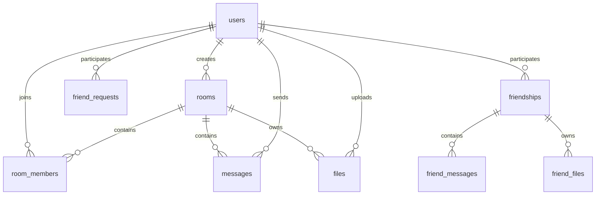

# V1 SQLite Schema Baseline

Status: active server schema created in `DatabaseManager::initialize()`.

Database path defaults to `chatroom.db` beside the server executable and can be
overridden with `CHATROOM_DB_PATH`. Each Qt SQL connection enables WAL and
foreign keys.

Run `python3 tools/m0_inventory.py --check` to detect table/index inventory drift.

## Tables

### Identity

`users`

- `id` integer primary key;
- unique `username` used as current unique ID;
- `display_name` added by startup migration;
- `password_hash` stores a self-describing libsodium Argon2id string for new or
  upgraded accounts; legacy rows contain a 64-character SHA-256 digest;
- `salt` is retained only for legacy SHA-256 verification and is empty after an
  Argon2id write;
- `created_at`, `last_login`, `last_uid_change`.

`user_avatars`

- one BLOB avatar per user;
- cascades on user deletion.

### Rooms

`rooms`

- room ID, name, creator ID;
- plaintext optional room password;
- creation time.

`room_members`

- composite primary key `(room_id, user_id)`;
- join time;
- `last_read_msg_id` added by startup migration.

`room_admins`

- composite primary key `(room_id, user_id)`.

`room_settings`

- one row per room;
- maximum file size and total file space default to 10 GiB;
- maximum file count defaults to 1500;
- maximum members defaults to 50.

`room_avatars`

- one BLOB avatar per room.

### Room messages and files

`messages`

- integer ID, room ID, sender user ID;
- content and string `content_type`;
- file name, size, and file ID;
- `file_cleared` and `clear_reason`;
- recall flag and Base64/string thumbnail;
- creation timestamp.

`files`

- room and uploader IDs;
- name, local path, and size;
- cleared state, reason, and timestamp;
- `cos_url` added by migration;
- creation timestamp.

### Contacts and direct messages

`friend_requests`

- sender, recipient, status, and creation timestamp.

`friendships`

- normalized pair `user_id1`, `user_id2` with a unique constraint;
- per-user last-read message columns are intended to be added by migration.

`friend_messages`

- friendship ID and sender ID;
- content and string content type;
- file metadata and recall state;
- file-cleared state and reason;
- thumbnail and creation timestamp.

`friend_files`

- friendship and uploader IDs;
- name, local path, size, cleared state, optional COS URL, and timestamps.

## Declared Explicit Indexes

- `idx_msg_room_time` on `messages(room_id, created_at)`;
- `idx_friend_msg_time` on `friend_messages(friendship_id, created_at)`.

SQLite also creates indexes for primary-key and unique constraints. M0 has not
yet captured `EXPLAIN QUERY PLAN` output for all application queries.

## Relationships

Foreign keys generally cascade relationship/message/file metadata when a parent
user, room, or friendship is deleted. Physical local/COS object deletion requires
application handling and is not performed by SQLite foreign keys.

## Startup Migration Behavior

V1 uses `CREATE TABLE IF NOT EXISTS`, unconditional `ALTER TABLE ADD COLUMN`, and
targeted `PRAGMA table_info` checks rather than numbered migrations.

Observed order:

1. create users, rooms, room members, room messages, files, administrators,
   settings, and avatar tables;
2. execute several additive alters and default-value backfills;
3. add the room read pointer;
4. create friend request, friendship, direct-message, and friend-file tables;
5. add friendship read pointers after the friendship table exists;
6. expire old files;
7. mark the manager initialized after the full schema path completes.

`Tests/DatabaseSchemaTest.cpp` verifies that a clean first initialization has all
required migrated columns, passes `PRAGMA integrity_check`, and produces the same
schema after a simulated restart.

## Retention

Room and friend files older than seven days are marked cleared by the current
expiry process. Associated messages retain metadata with `file_cleared` and a
reason. Local files are removed and COS URLs are returned to the caller for
object deletion.

## Migration Risks

- no durable schema version or migration history;
- migration errors are not consistently distinguished from expected duplicate
  column errors;
- schema initialization and retention side effects share one startup function;
- no automated clean-create versus upgraded-schema equivalence test;
- no documented backup/restore verification before migration;
- limited explicit query indexes;
- primary server storage is a single SQLite file.

## M0 Follow-up Verification

Schema verification currently covers:

1. clean first initialization;
2. second initialization/restart;
3. required migrated columns;
4. `PRAGMA integrity_check`.

Remaining follow-up should cover an older-schema upgrade fixture, foreign-key
cascades, and read/unread/history query plans before Java/PostgreSQL migration.
